# 计算机网络概述

## 杂谈

> 五层协议杂谈

- 物理层：将媒体机上传输和接收电磁波信号、光信号，把链路层来的`0101..`的数据转化为电磁波信号、光信号，负责发送、接收、转化等工作
- 链路层：负责相邻的两个节点（同一个交换机）之间数据传输，传输以帧为单位的数据，解决了点到点的问题
- 网络层：在链路层点到点的基础上，实现了源主机到目标主机之间的传输，扩展了数据链路的功能，提供端到端的传输（但是传输比较糙，不好直接使用，并且也不可靠，尽力而为，可能会丢、出错、乱序）
- 传输层：在网络层的基础上，加强它的服务，把网络通信从主机到主机的传输变成了（进程到进程之间的通信），提供了可靠的传输协议，传输指标（BPS，每秒传输的位）
- 应用层：在传输层的基础上，应用层可以按照应用层协议，实现各种各样的应用

除了互联网还有很大其它网络，各种专用网络...，互联网仅仅只是其中一种，只是比较普及而已、

## 什么是Internet

### 从具体构成角度

> 节点

- 主机节点：主机及其上运行的应用程序（笔记本、平板、联网的机顶盒）
- 数据节点：路由器、交换机等网络交换设备，既不是源也不是目标，（交换机工作在链路层、路由器工作在网络层、负载均衡设备更高层）

> 边：通信链路

- 接入网链路：主机连接到互联网的链路
- 主干链路：路由器间的链路

> 协议：对等层实体在通信过程中应该遵循的规则集合

> 数以亿计的、互联的计算设备: 

- 主机 = 端系统（end system、host）
- 运行网络应用程序

> 通信链路

- 光纤、同轴电缆、无线电 、卫星
- 传输速率 = 带宽（bps）

> 分组交换设备：转发分组 (packets) 

- 路由器和交换机

- **协议**控制发送、接收消息
  - 如TCP、IP、HTTP、FTP、 PPP
- **Internet：“网络的网络”**
  - 松散的层次结构，互连的ISP
  - 公共Internet vs. 专用intranet
- Internet标准
  - RFC: Request for comments
  - IETF: Internet Engineering Task Force

### 什么是协议

网络协议: 

- 类似人类协议
- 机器之间的协议而非人与人之间的协议 
- Internet 中所有的通信行为都受协议制约 

协议定义了在两个或多个通信实体之间交换的报文格式和次序，以及在报文传输和/或接收或其他事件方面所采取的动作

### 从服务角度

- **使用通信设施进行通信的分布式应用**
  - Web、VoIP、email、分布式 游戏、电子商务、社交网络 …...
- **通信基础设施为apps提供编程接口（通信服务）**
  - 将发送和接收数据的apps与互联网连接起来 
  - 为app应用提供服务选择，类似于邮政服务：
    - 无连接不可靠服务
    - 面向连接的可靠服务

## 网络结构

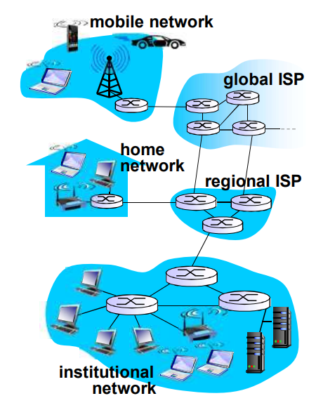

- **网络边缘**：
  - 主机
  - 应用程序（客户端和服务 器）
- **网络核心**（数据交换的作用）：
  - 互连着的路由器
  - 网络的网络
- **接入网、物理媒体**：
  - 有线或者无线通信链路

总结：边缘、核心、接入

### 网络边缘

- **端系统（主机）**
  - 运行应用程序
  - 如Web、email
  - 在 “网络的边缘”
- **客户/服务器模式**
  - 客户端向服务器请求、接收服务
  - 如Web浏览器/服务器；email 客户端/服务器
- **对等（peer-peer ）模式**
  - 很少（甚至没有）专门的服务器
  - 如 Gnutella、KaZaA、Emule

> TCP特性
>
> - 可靠地、按顺序地传送数据
>   - 确认和重传
> - 流量控制
>   - 发送方不会淹没接收方
> - 拥塞控制
>   - 当网络拥塞时，发送方降低发送速率

- 可靠的，面向连接，传输数据（不多不少、不错原序）

- 流量控制：比如服务器性能很高，客户端性能很低，则需要控制传输速率（协调双方的网络处理能力）
- 拥塞控制：比如传输的链路出现阻塞，则发送速率也不能太快（考虑实时的链路状态）

> UDP特性
>
> - 无连接
> - 不可靠数据传输
> - 无流量控制
> - 无拥塞控制

qq的oicq就是基于UDP协议改造的

## 网络核心

- 网络核心：路由器的网状网络

- 基本问题：数据怎样通过网络进行传输？
  - 电路交换：为每个呼叫预留一条 专有电路：如电话网
  - 分组交换：
    - 将要传送的数据分成一个个单位： 分组
    - 将分组从一个路由器传到相邻路由器（hop），一段段最终从源端传到目标端
    - 每段：采用链路的最大传输能力（ 带宽）

### 电路交换

> 端到端的资源被分配给从源端 到目标端的呼叫 “call”：

- 图中，每段链路有4条线路：
  - 该呼叫采用了上面链路的第2 个线路，右边链路的第1个线 路（piece）
- 独享资源：不同享
  - 每个呼叫一旦建立起来就能够保证性能
- 如果呼叫没有数据发送，被分配的资源就会被浪费 (no sharing)
- 通常被传统电话网络采用

> 为呼叫预留端-端资源

- 链路带宽、交换能力
- 专用资源：不共享
- 保证性能
- 要求建立呼叫连接

网络资源（如带宽）被分成片

- 为呼叫分配片
- 如果某个呼叫没有数据， 则其资源片处于**空闲状态** （不共享）

- 网络资源（如带宽）被分成片
- 将带宽分成片
  - 频分(Frequencydivision multiplexing)
  - 时分(Time-division  multiplexing)
  - 波分(Wave-division  multiplexing

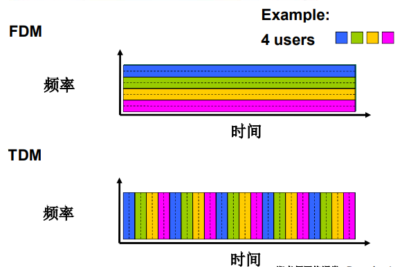

#### 计算举例

> 在一个电路交换网络上，从主机A到主机B发送 一个640,000比特的文件需要多长时间？ 
>
> - 所有的链路速率为1.536 Mbps
> - 每条链路使用时隙数为24的TDM
> - 建立端-端的电路需500 ms(传输过程就类似平行四边形，斜边就是延时的500ms)
>
> 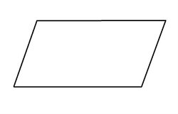

每条链路的速率（一个时间片）：1.536Mbps/24 = 64kbps 

传输时间：640kb/64kps = 10s

共用时间：传输时间+建立链路时间=10s + 500ms = 10.5s

#### 电路交换不适合计算机之间的通信

- 连接建立时间长
- 计算机之间的通信有突发性，如果使用线路交 换，则浪费的片较多
  - 即使这个呼叫没有数据传递，其所占据的片也不能 够被别的呼叫使用
- 可靠性不高？

### 分组交换

#### 存储转发

- 被传输到下一个链路之前， 整个分组必须到达路由器： **存储-转发**
- 在一个速率为R bps的链路 ，一个长度为L bits 的分组 的存储转发延时： L/R s

例子：

- L = 7.5 Mbits
- R = 1.5 Mbps
- 3次存储转发的延时 = 15 s

缺点：存储是有上限的，高峰期就会造成拥塞问题

#### 排队和延迟和丢失

- 如果到达速率>链路的输出速率: 
  - 分组将会排队，等待传输
  - 如果路由器的缓存用完了，分组将会被抛弃

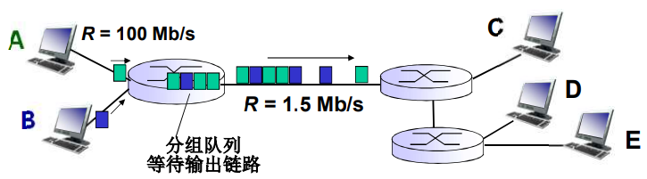

#### 关键功能

**路由**: 决定分组采用的源到 目标的路径

- 路由算法

**转发**: 将分组从路由器的输入链路转移到输出链路

#### 统计多路复用

A&B 时分复用链路资源

A&B 分组没有固定的模式：统计多路复用（特殊的时分，没有固定的时间片划分）

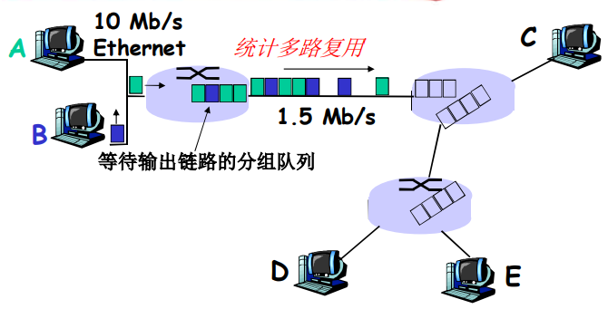

### 分组交换 vs. 电路交换

**同样的网络资源，分组交换允许更多用户使用网络！**

- 1 Mb/s 链路
- 每个用户：
  - 活动时100 kb/s
  - 10% 的时间是活动的

- 电路交换：

  - 10 用户

- 分组交换：

  - 35 用户时`>=` 10个用户活动的概率为 0.0004（超过10个用户活动就会发生丢包情况）

  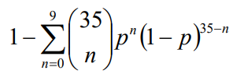

Q: 预约服务（线路交换）对比按需服务（分组交换）的例子?

### 分组交换网络：存储-转发

分组交换: 分组的存储转发一段一段从源端传到目标端 ，按照有无网络层的连接，分成： 

- 数据报网络：
  - 分组的目标地址决定下一跳
  - 在不同的阶段，路由可以改变
  - 类似：问路
  - Internent
- 虚电路网络：
  - 每个分组都带标签（虚电路标识 VC ID），标签决定下一跳
  - 在呼叫建立时决定路径，在整个呼叫中路径保持不变
  - 路由器维持每个呼叫的状态信息
  - X.25 和ATM

中间路由器不维护它们间的状态 --- 面向连接

### 数据报(datagram) 的工作原理

- 在通信之前,无须建立起一个连接,有数据就传输
- 每一个分组都独立路由(路径不一样,可能会失序)
- 路由器根据分组的目标地址进行路由

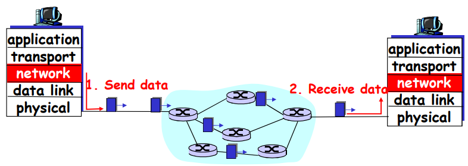

### 虚电路(virtual circuit)的工作原理

每个虚电路表都有输入和输出

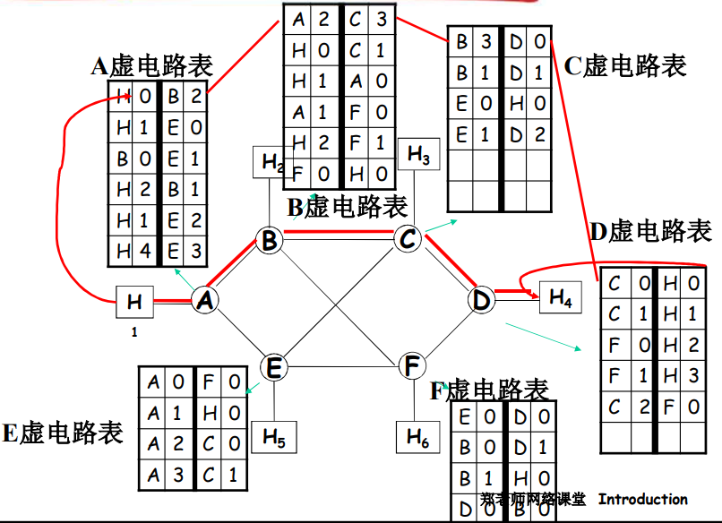

### 网络分类

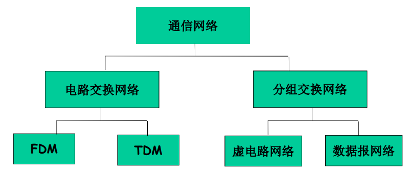

## 接入网络和物理媒体

Q: 怎样将端系统和边缘路由器连接？

- 住宅接入网络
- 单位接入网络 （学校、公 司）
- 无线接入网络

注意：

- 接入网络的带宽 (bits per  second) ？
- 共享/专用？

### 住宅接入

#### 住宅接入：modem

在传输音频数据的链路上传输数据（网上冲浪...）

- 将上网数据**调制**加载音频信号上， 在电话线上传输，在局端将其中的数据**解调**出来；反之亦然
  - 调频
  - 调幅
  - 调相位
  - 综合调制
- **拨号调制解调器**
  - 56Kbps 的速率直接接入路由器 (通常更低)
  - 不能同时上网和打电话：不能总是在线

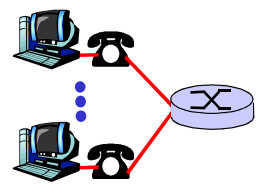

#### 接入网：digital subscriber line (DSL)

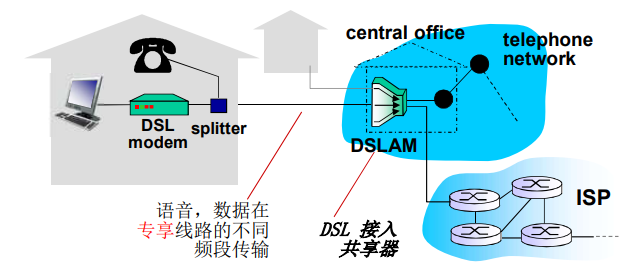

- 采用现存的到交换局DSLAM的电话线

  - DSL线路上的数据被传到互联网

  - DSL线路上的语音被传到电话网

- < 2.5 Mbps上行传输速率(typically < 1 Mbps) 
- < 24 Mbps下行传输速率(typically < 10 Mbps)

#### 接入网：线缆网络

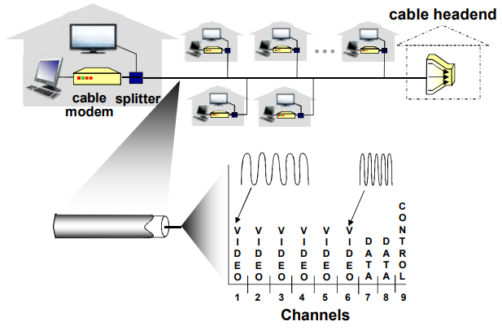

有线电视信号线缆双向改造

**FDM**: 在不同频段传输不同信道的数据， 数字电视和上网数据（上下行）

杂谈：可以通过电网传输网络数据，在电路端点加上power电路解调器，用电力线传输数据，在国外有使用这种方式的

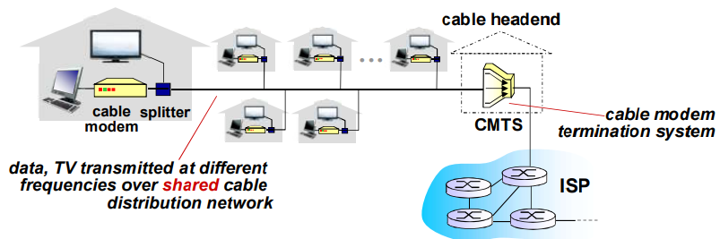

- **HFC: hybrid fiber coax**
  - 非对称: 最高30Mbps的下行传输速率, 2 Mbps 上行传输 速率
- **线缆和光纤网络**将个家庭用户接入到 ISP 路由器
- 各用户**共享**到线缆头端的接入网络
  - 与DSL不同, DSL每个用户一个专用线路到CO（central  office）

#### 住宅接入：电缆模式

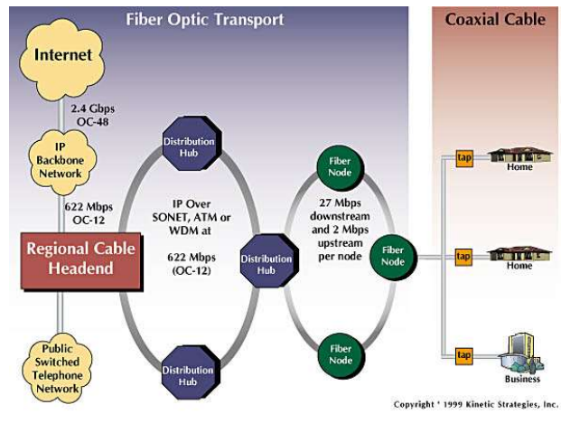

这种方式已经主键淘汰了......

### 家庭网络

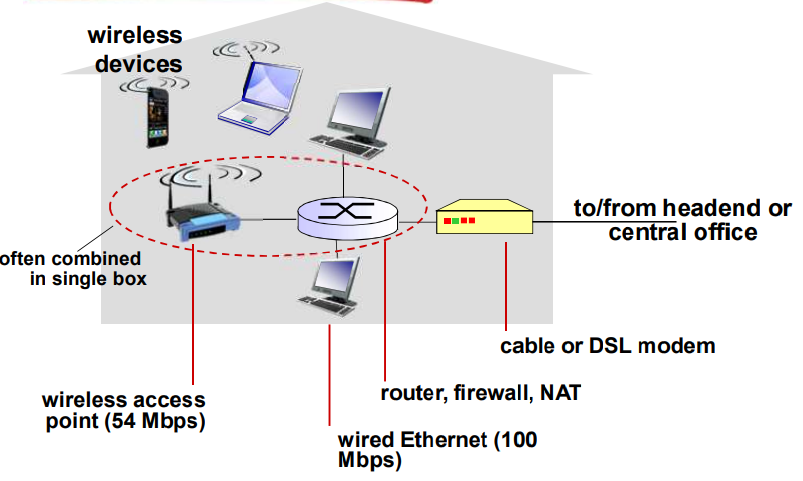

### 企业接入网络(Ethernet)

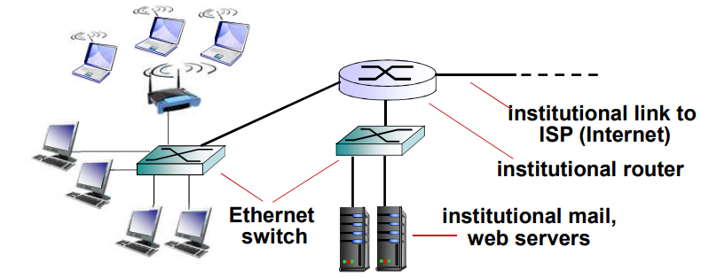

- 经常被企业或者大学等机构采用
- 10 Mbps, 100Mbps, 1Gbps, 10Gbps传输率
- 现在，端系统经常直接接到以太网络交换机上

### 无线接入网络

各无线端系统共享无线接入网络（端系统到无线路由器）

- 通过基站或者叫接入点

**无线LANs**

- 建筑物内部 (100 ft)
- 802.11b/g (WiFi): 11, 54  Mbps 传输速率

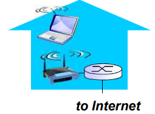

**广域无线接入**

- 由电信运营商提供 (cellular) ,  10’s km
- 1 到 10 Mbps
- 3G, 4G: LTE

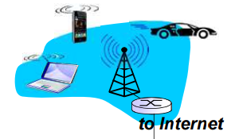

### 物理媒体

- **Bit**: 在发送-接收对间传播
- **物理链路**：连接每个发送-接 收对之间的物理媒体
- **导引型媒体**: 
  - 信号沿着固体媒介被导引：同 轴电缆、光纤、 双绞线
- **非导引型媒体**：
  - 开放的空间传输电磁波或者光 信号，在电磁或者光信号中承载数字数据

- 双绞线 (TP)
  - 两根绝缘铜导线拧合
    - 5类：100Mbps 以太网 ，Gbps 千兆位以太网
    - 6类：10Gbps万兆以太网

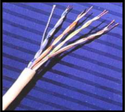

- **同轴电缆：**
  - 两根同轴的铜导线
  - 双向
  - 基带电缆： 
    - 电缆上一个单个信道
    - Ethernet
  - 宽带电缆：
    - 电缆上有多个信道
    - HFC

- **光纤和光缆：**（正因为高锟先生没有申请专利，今天的网络才如此普及）
  - 光脉冲，每个脉冲表示一个 bit，在玻璃纤维中传输
  - 高速：
    - 点到点的高速传输（如10  Gps-100Gbps传输速率 ）
  - 低误码率：在两个中继器之 间可以有很长的距离，不受 电磁噪声的干扰
  - 安全

### 无线链路

- 开放空间传输电磁波，携 带要传输的数据
- 无需物理“线缆”
- 双向
- 传播环境效应：
  - 反射
  - 吸收
  - 干扰

> 无线链路类型:

- 地面微波
  - e.g. up to 45 Mbps channels
- LAN (e.g., WiFi)
  - 11Mbps, 54 Mbps,540Mbps…
- wide-area (e.g., 蜂窝)
  - 3G cellular: ~ 几Mbps
  - 4G 10Mbps
  - 5G 数Gbps
- 卫星
  - 每个信道Kbps 到45Mbps (或者 多个聚集信道)
  - 270 msec端到端延迟
  - 同步静止卫星和低轨卫星

马斯克的“星链计划”

## Internet结构和ISP

### 互联网络结构：网络的网络

- 端系统通过接入**ISPs** (Internet Service Providers)连 接到互联网
  - 住宅，公司和大学的ISPs
- 接入ISPs相应的必须是互联的
  - 因此任何2个端系统可相互发送分组到对方
- 导致的“网络的网络”非常复杂
  - 发展和演化是通过**经济的和国家的政策**来驱动的
- 让我们采用渐进方法来描述当前互联网的结构

> 问题: 给定数百万接入ISPs，如何将它们互联到一起

如果使用全连接，代价为O(n^2)

选项: 将每个接入ISP都连接到**全局ISP**（全局范围内覆盖）？ **客户ISPs**和**提供者ISPs**有经济合约

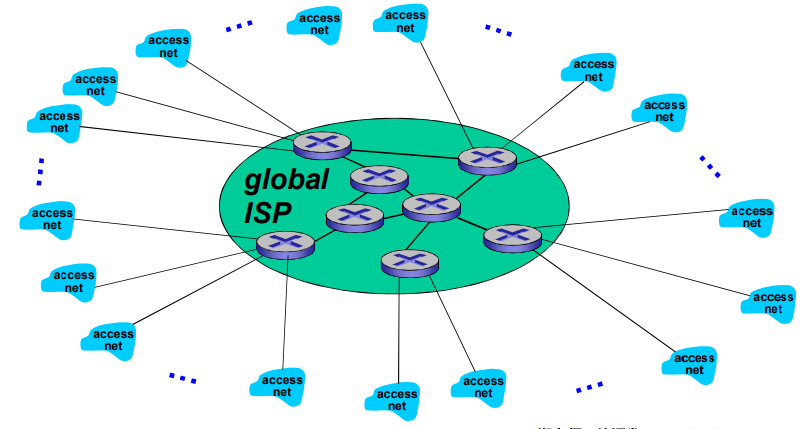

但是，如果全局ISP是可行的业务，那会有竞争者 有利可图，一定会有竞争

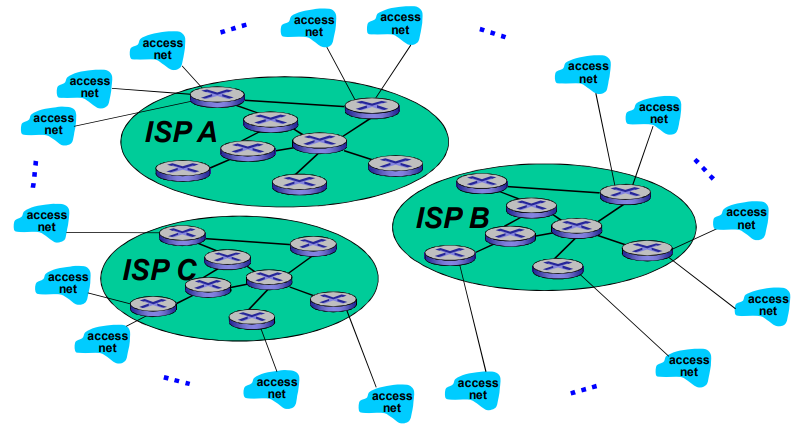

**竞争**：但如果全局ISP是有利可为的业务，那会有竞争者

**合作**：通过ISP之间的合作可以完成业务的扩展，肯定会有互 联，对等互联的结算关系

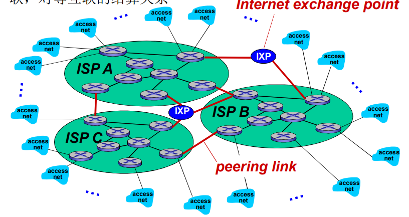

然后业务会细分（全球接入和区域接入），区域网络将出 现，用与将接入ISPs连接到全局ISPs

**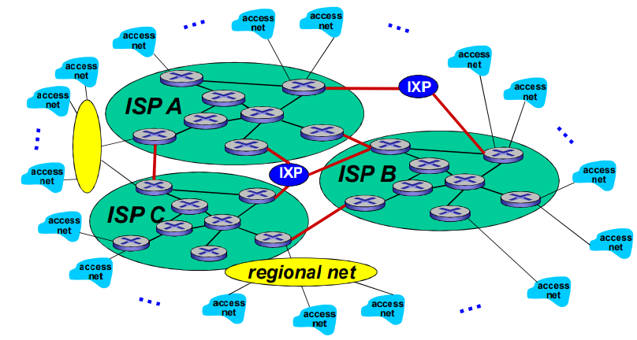**

然后**内容提供商网络 (Internet Content Providers,e.g., Google, Microsoft, Akamai, Baidu,Tencent)** 可能会构建它们自己的网络，将它们的服务、内容更加靠近端用户，向用户提供更好的服务,减少自己的运营支出

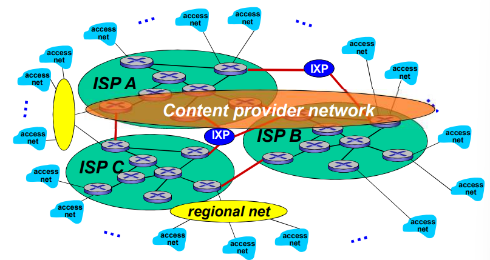

在网络的最中心，一些为数不多的充分连接的大范围网络（分布广、节点有限、 但是之间有着多重连接）

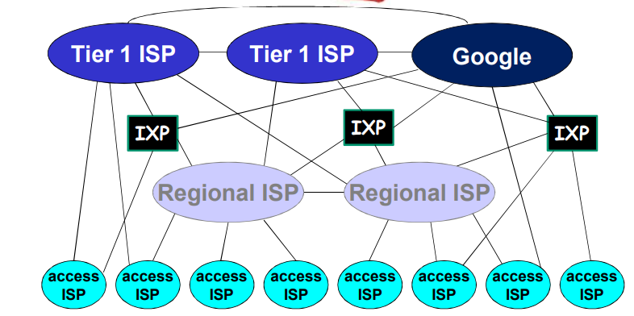

- **“tier-1” commercial ISPs** (e.g., Level 3, Sprint, AT&T, NTT), 国家或者国际 范围的覆盖
- **content provider network** (e.g., Google): 将它们的数据中心接入ISP，方便周边 用户的访问；通常私有网络之间用专网绕过第一层ISP和区域ISPs

### 松散的层次模型

#### 第一层ISP

- **中心：第一层ISP**（如UUNet, BBN/Genuity, Sprint,  AT&T）国家/国际覆盖，速率极高
  - 直接与其他第一层ISP相连
  - 与大量的第二层ISP和其他客户网络相连

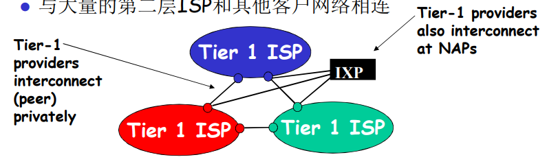

>  BBN/GTE US backbone network

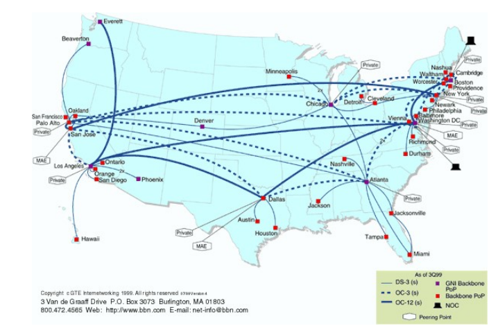

> Tier-1 ISP: e.g., Sprint

POP：我是上层的ISP，你是下层的ISP，你需要通过我接入到更大的ISP

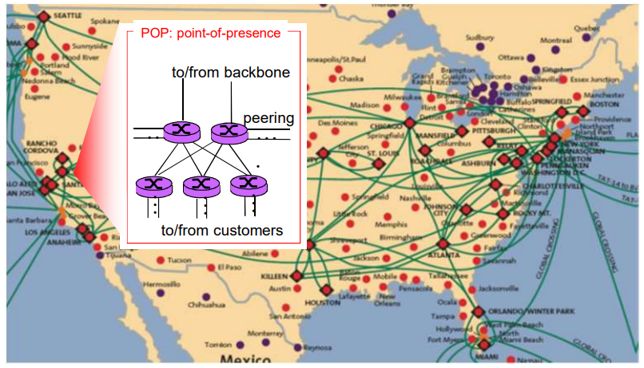

#### 第二层ISP

- **第二层ISP: 更小些的 (通常是区域性的) ISP**
  - 与一个或多个第一层ISPs，也可能与其他第二层ISP

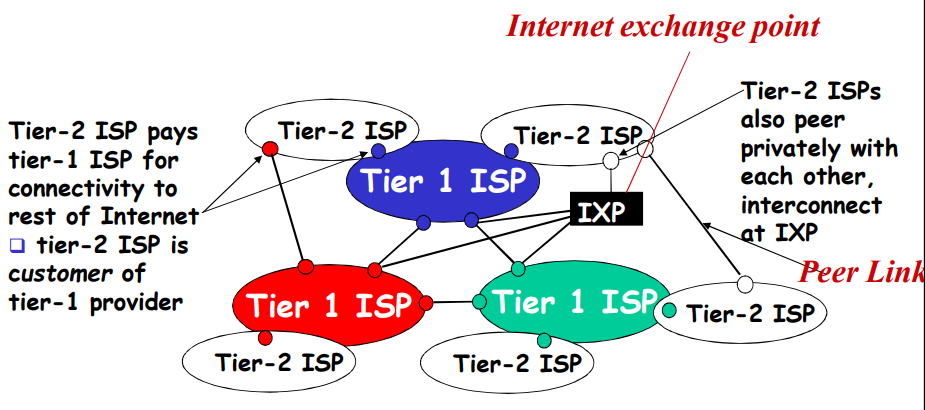

#### 第三层ISP

- 第三层ISP与其他本地ISP
  - 接入网 (与端系统最近)

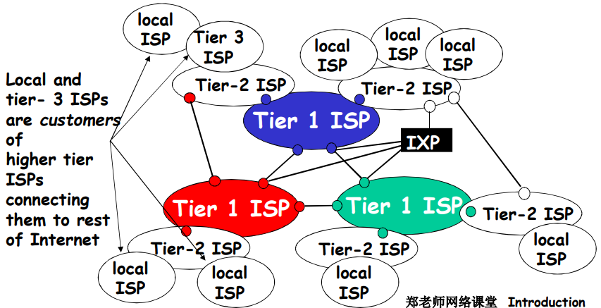

#### 一个分组要经过许多网络

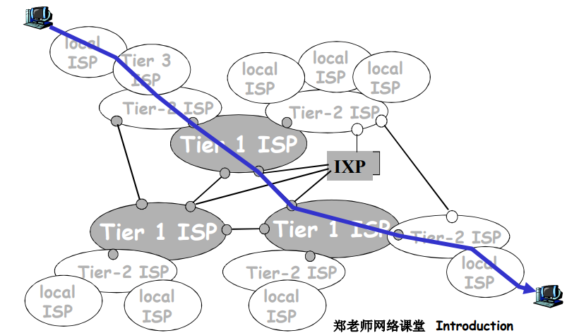

- 很多内容提供商(如：Google, Akamai )可能会部署自己的网 络,连接自己的在各地的DC（数据中心），走自己的数据
- 连接若干local ISP和各级（包括一层）ISP,更加靠近用户
  - 经济考虑：少付费
  - 用户体验考虑：更快

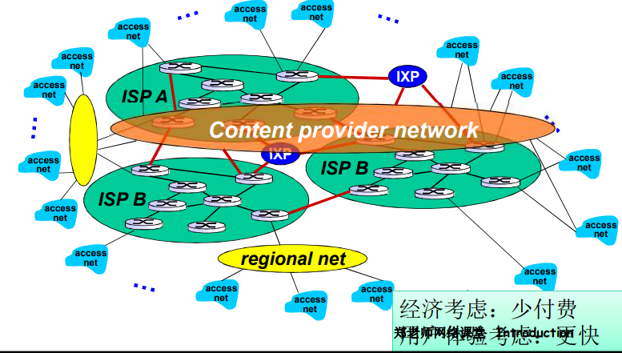

#### ISP之间的连接

- POP: 高层ISP面向客户网络的接入点，涉及费用结算
  - 如一个低层ISP接入多个高层ISP，多宿（multi home）
- 对等接入：2个ISP对等互接，不涉及费用结算
- IXP：多个对等ISP互联互通之处，通常不涉及费用结算
  - 对等接入
- ICP自己部署专用网络，同时和各级ISP连接

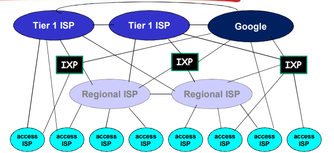

## 分组延时、丢失和吞吐量

### 分组丢失和延时是怎样发生的？

为什么不把分组队列容量设置大一点？因为如果设置大一点的话，很容易出现拥挤，导致所有数据都堵塞，所以该丢还是丢，成本、实时性问题

ip报文段有个**紧急字段**，专门用来处理紧急数据

在路由器缓冲区的分组队列

- **分组到达链路的速率超过了链路输出的能力**
- 分组等待排到队头、被传输

### 四种分组延时

> 节点处理延时

- 检查 bit级差错
- 检查分组首部和决定将分组导向何处

> 排队延时

- 在输出链路上等待传输的 时间
- 依赖于路由器的拥塞程度

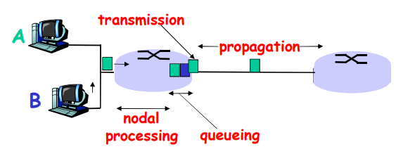

> 传输延时

- R=链路带宽(bps)
- L=分组长度(bits)
- 将分组发送到链路上的 时间= L/R
- 存储转发延时

> 传播延时

- d = 物理链路的长度
- s = 在媒体上的传播速度 (~2x108 m/sec)
- 传播延时 = d/s

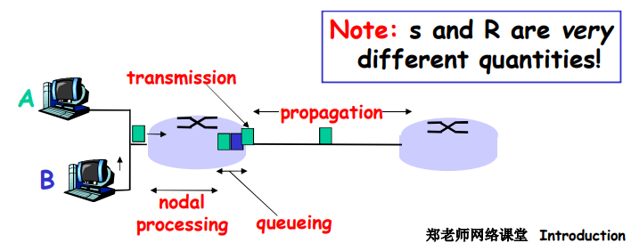

### 节点延时

类似车队

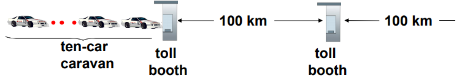

- dproc = 处理延时
  - 通常是微秒数量级或更少
- dqueue = 排队延时
  - 取决于拥塞程度
- dtrans = 传输延时
  - = L/R, 对低速率的链路而言很大（如拨号），通常为微秒级 到毫秒级
- dprop = 传播延时
  - 几微秒到几百毫

LAN局域网和WAN广域网情况不同

### 排队延时

- R=链路带宽 (bps)
- L=分组长度 (bits)
- a=分组到达队列的平均 速率

流量强度 = La/R

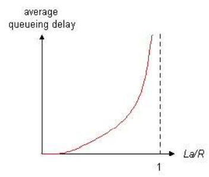

- La/R ~ 0: 平均排队延时很小
- La/R -> 1: 延时变得很大
- La/R > 1: 比特到达队列的速率超过了从该队列输出的速率，平均排队延时将趋向无穷大！

设计系统时流量强度不能大于1！

### Internet的延时和路由

- Internet 的延时和路由是什么样的呢? 
- **Traceroute 诊断程序**：提供从源端，经过路 由器，到目的的延时测量
  - For all i:
    - 沿着目的的路径，向每个路由器发送3个探测分组
    - 路由器 i 将向发送方返回一个分组
    - 发送方对发送和回复之间间隔计时

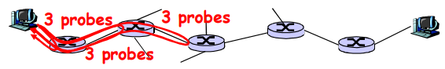

### 关于traceroute

- 在Windows系统下
  - Tracerert hostname
    - 如 Tracerert www.gucas.ac.cn
  - 更完整的例子
    - tracert [-d] [-h maximum_hops] [-j computer-list] [-w  timeout] target_name
    - 请见帮助： [http://www.linkwan.com/gb/broadmeter/article/trace -help.htm](http://www.linkwan.com/gb/broadmeter/article/trace -help.htm)
- 测试网址：
  - www.traceroute.org
  - www.linkwan.co

利用了ICMP协议（互联网控制报文协议）:

- IP头部有一个TTL字段，每经过一个路由TTL减1，如果到达某个路由为0，则会丢弃这个数据报文，并且返回给源主机一个ICMP报文

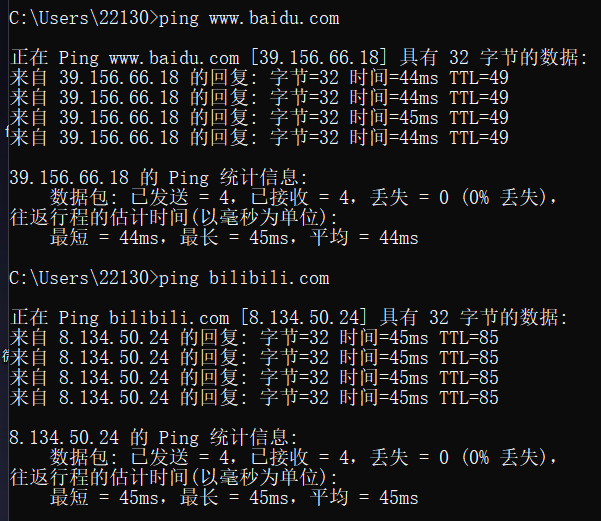

- RTT Round Trip Time 往返延迟
- 然后设置TTL为足够大，数据到达目的主机，但是目的主机对应的端口没有进程去处理，返回一个ICMP报文（目标端口不可达），这就是Traceroute的工作原理

`traceroute: gaia.cs.umass.edu to www.eurecom.fr`

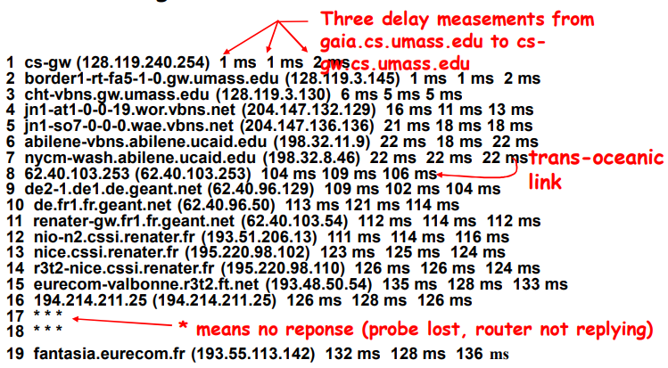

### 分组丢失

- 链路的队列缓冲区容量有限
- 当分组到达一个满的队列时，该分组将会丢失
- 丢失的分组可能会被前一个节点或源端系统重传，或根本不重传

> 分情况讨论

- 本身为不可靠的服务
  - 无线网（**向上层提供可靠的服务，因为下层传输不可靠**），**丢失需要在上一个节点进行重传**
  - 以太网（**不用向上层提供可靠的服务，因为下层传输比较可靠了**），就由上层负责保证可靠传输，**丢失需要在源主机进行重传**
- **如果是UDP，丢了就丢了，源主机不用重传**（可能在应用层基于UDP的改造协议，在应用层层次进行重传）

### 吞吐量

- 吞吐量：在源端和目标端之间传输的速率（数 据量/单位时间）
  - **瞬间吞吐量**：在一个时间点的速率
  - **平均吞吐量**：在一个长时间内平均值

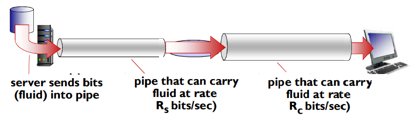

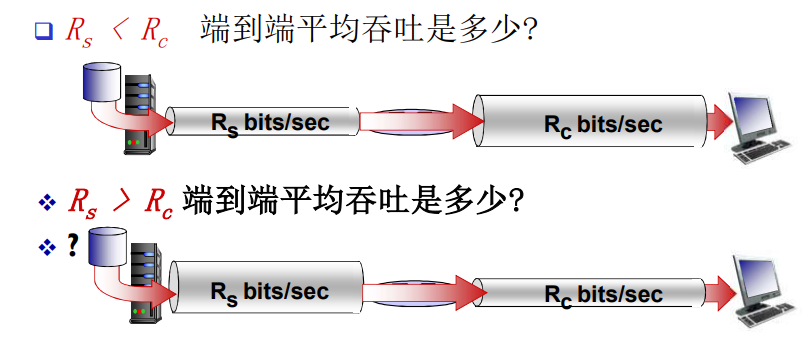

> 瓶颈链路

端到端路径上，限制端到端吞吐的链路，其他节点都不传输，吞吐量`min{Rs,Rc}`

端到端平均吞吐=`min{R1，R2 ,…,Rn }`

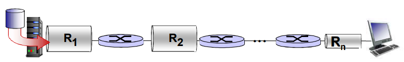

> 互联网场景

- 链路上的每一段实 际可用带宽Ri’=?
- 端到端吞吐量： min{Ri’}
- 每个连接上的端到 端吞吐:  min(Rc ,Rs ,R/10)
- 实际上: Rc 或者 Rs 经常是瓶颈

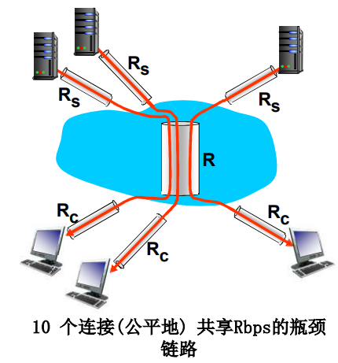

## 协议层次及服务模型

网络是一个复杂的系统!

- 网络功能繁杂：数字信号的物理信号承载、点到点、路由、rdt、进 程区分、应用等
- 现实来看，网络的许多构成元素和 设备: 
  - 主机
  - 路由器
  - 各种媒体的链路
  - 应用
  - 协议
  - 硬件, 软件

问题是： 如何组织和实现这个复杂的网络功能？

- 例子1

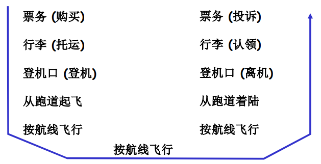

航线的层次功能

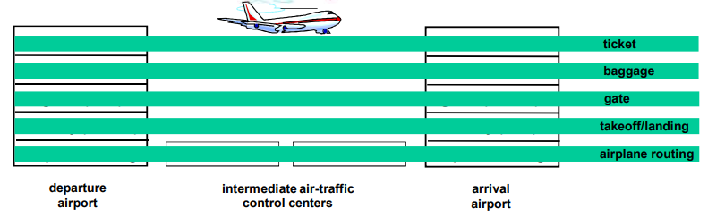

- 例子2

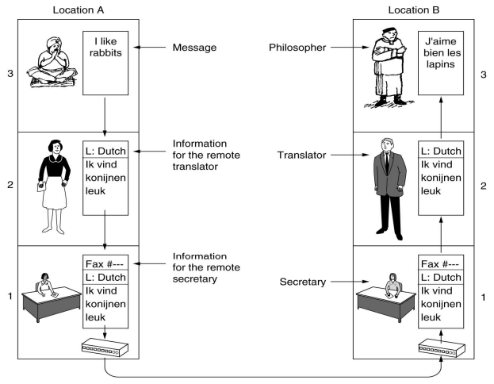

层次化方式实现复杂网络功能：

- 将网络复杂的功能分层功能明确的**层次**，每一层实现了其中一个或一 组**功能**，功能中有其上层可以使用的功能：**服务**
- 本层协议实体相互交互执行本层的**协议动作**，目的是实现本层功能， 通过接口为上层提供更好的服务
- 在实现本层协议的时候，直接**利用了下层所提供的服务**
- 本层的服务：借助下层服务实现的本层协议实体之间交互带来的新功 能（上层可以利用的）+更下层所提供的服务

最上层和最下层分别就像CEO和底层员工

### 服务和服务访问点

- 服务( Service)：低层实体向上层实体提供它们之间的 通信的能力
  - 服务用户(service user)
  - 服务提供者(service provider )
- 原语(primitive)：上层使用下层服务的形式，高层使用 低层提供的服务，以及低层向高层提供服务都是通过 服务访问原语来进行交互的---形式
- 服务访问点 SAP (Services Access Point) ：上层 使用下层提供的服务通过层间的接口—地点； 
  - 例子：邮箱
  - 地址(address)：下层的一个实体支撑着上层的多个实体， SAP有标志不同上层实体的作用
  - 可以有不同的实现，队列
  - 例子:传输层的SAP: 端口(port)

### 服务的类型

-  面向连接的服务和无连接的服务-方式
  - 面向连接的服务( Connection-oriented Service)
    - **连接(Connection)**：两个通信实体为进行通信而建立的一 种结合
    - 面向连接的服务通信的过程：建立连接，通信，拆除连接
    - 面向连接的服务的例子：网络层的连接被成为虚电路
    - 适用范围：对于大的数据块要传输; 不适合小的零星报文
    - 特点：保序
    - 服务类型:
      - 可靠的信息流 传送页面(可靠的获得,通过接收方的确认)
      - 可靠的字节流 远程登录
      - 不可靠的连接 数字化声音
  - 无连接的服务(Connectionless Service)
    - 无连接服务：两个对等层实体在通信前不需要建立一个连接，不预留资源；不需要通信双方都是活跃；(例：寄信)
    - 特点：不可靠、可能重复、可能失序
    - IP分组，数据包；
    - 适用范围：适合传送零星数据；
    - 服务类型：
      - 不可靠的数据报 电子方式的函件
      - 有确认的数据报 挂号信
      - 请求回答 信息查询

### 服务和协议

- 服务与协议的区别
  - 服务(Service)：低层实体向上层实体提供它们之间的 通信的能力，是通过原语(primitive)来操作的，垂直
  - 协议(protocol) ：对等层实体(peer entity)之间在相互通信的过程中，需要遵循的规则的集合，水平
- 服务与协议的联系
  - 本层**协议的实现**要靠下层提供的服务来实现
  - 本层实体通过协议为上层**提供更高级的服务**

### 数据单元(DU)

- 一对多的关系：上层发送的一个数据单元太大了，需要拆解成分组大小
- 多对一的关系：上层发送很多个非常小的数据单元，下层将小单元组合成一个分组
- 一对一的关系：上层发送了一个数据单元，没有超出分组大小

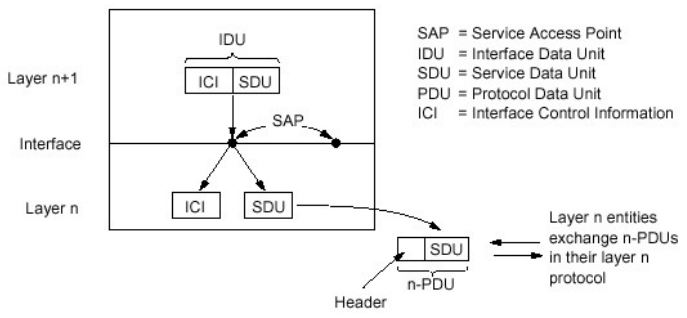

从应用层往下（五层模型）：数据/报文段（Message）、TCP报文段/用户数据包（Segment）、分组/IP数据包（Packet）、帧（frame）、比特（bit）

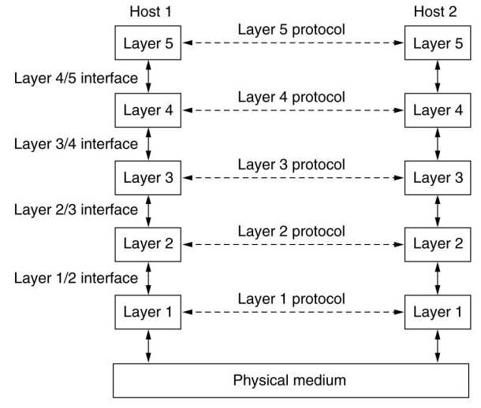

### 分层处理和实现复杂系统的好处？

对付复杂的系统

- 概念化：结构清晰，便于标示网络组件，以及描述其 相互关系
  - 分层参考模型
- 结构化：模块化更易于维护和系统升级
  - 改变某一层服务的实现不影响系统中的其他层次
    - 对于其他层次而言是透明的
  - 如改变登机程序并不影响系统的其它部分
    - 改变2个秘书使用的通信方式不影响2个翻译的工作
    - 改变2个翻译使用的语言也不影响上下2个层次的工作
- 分层思想被认为有害的地方？

### Internet 协议栈

- 应用层: 网络应用
  - 为人类用户或者其他应用进程提供网络应用服务
  - FTP, SMTP, HTTP,DNS
- 传输层: 主机之间的数据传输
  - 在网络层提供的端到端通信基础上，细分为进程 到进程，将不可靠的通信变成可靠地通信
  - TCP, UDP
- 网络层: 为数据报从源到目的选择路由
  - 主机主机之间的通信，端到端通信，不可靠
  - IP, 路由协议
- 链路层: 相邻网络节点间的数据传输
  - 2个相邻2点的通信，点到点通信，可靠或不可靠
  - 点对对协议PPP, 802.11(wifi), Ethernet
- 物理层: 在线路上传送bit

### ISO/OSI 参考模型

- **表示层:** 允许应用解释传输的数据, e.g., 加密，压缩，机器相关的表示转换
- **会话层:** 数据交换的同步，检查点，恢复
- 互联网协议栈没有这两层!
  - 这些服务，如果需要的话，必须被应用实现
  - 需要吗?

### 封装和解封装

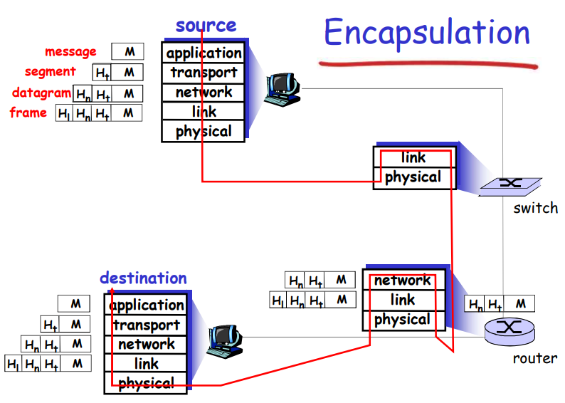

源主机：

- 通过每层的接口，将数据交给下层处理，下层加上自己的数据信息，形成本层的数据单元（报文段）**（应用层、传输层）**
- 然后将报文段将给网络层，网络层也加上自己的头部（源主机IP、目的主机IP等，头部信息怎么来的？本层形成的+上层数据通过ICI转换告诉我的）**（网络层）**
- 链路层得到分组数据并加上链路层头部和链路层尾部形成帧，交给物理层**（链路层）**
- 物理层通过一个bit或者多个bit一组进行发送（到达对方的物理层再逐步还原）**（物理层）**

交换机：

- 帧头当中有目标MAC地址，然后查交换机的栈表（交换表），决定通过源端口进来，通过哪个目标端口出去？交给对应端口的网卡处理，这个网卡再把数据封装成帧**（链路层）**
- 然后通过物理层发送**（物理层）**

路由：

- 路由器每个网卡接入不同网，通过其中一个网卡收到数据帧，把帧的数据取出来（分组），分组中取出目标的ip信息，查网络层的转发表，决定通过哪个网口放出去**（网络层）**
- 把分组数据通过接口交给对应的网卡，这个网卡再把数据封装成帧**（链路层）**
- 然后通过物理层发送**（物理层）**

目标主机：

- 物理层获得数据，交给链路层**（物理层）**

- 物理层判断帧头帧尾，获取分组数据数据交给网络层**（链路层）**
- 分组数据再把报文段拿出来，拿给传输层**（网络层）**
- 传输层再把报文段的Message或者Message的一部分交给应用层**（传输层）**
- 应用进程拿到数据**（应用层）**

### 各层次的协议数据单元

- 应用层：报文(message)
- 传输层：报文段(message segment)：TCP段，UDP数据报
- 网络层：分组packet（如果无连接方式：数据报 datagram）
- 数据链路层：帧(frame)
- 物理层：位(bit)

## 历史

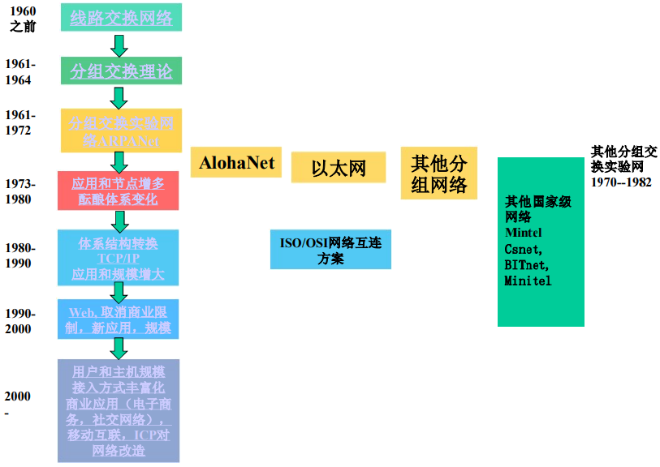

### 早期（1960以前）计算机网络

- 线路交换网络
- 线路交换的特性使得其不适合计算机之间的通信
  - 线路建立时间过长
  - 独享方式占用通信资源，不适合突发性很强的计算机之间的通信
  - 可靠性不高：非常不适合军事通信
- 三个小组独立地开展分组交换的研究
  - 1961: Kleinrock(MIT)，排队论，展现了分组交换的有效性
  - 1964: Baran(美国兰德公司) – 军用网络上的分组交换
  - 1964：Donald（英国）等，NPL

### 1961-1972: 早期的分组交换概念

- 1967: 美国高级研究计 划研究局考虑ARPAnet
  - Kleinrock在MIT的同事
- 1969: 第一个 ARPAnet  节点开始工作,UCLA
  - IMP:接口报文处理机
- 1969年底: 4个节点

- 1972: 
  - ARPAnet 公众演示
  - 网络控制协议是第一个端 系统直接的主机-主机协议
    - NCP协议：相当于传输层 和网络层在一起，支持应 用开发
  - 第一个e-mail 程序（ BBN）
  - ARPAnet有15个节点

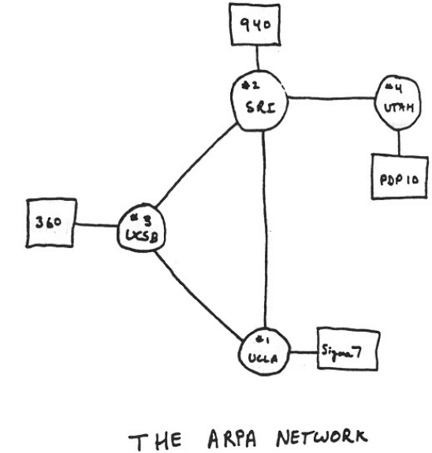

### 1972-1980: 专用网络和网络互联

- 出现了很多对以后来说重要的网络形式， 雨后春笋
  - 1970: ALOHAnet,夏威夷上的微波网络
  - 1973: Metcalfe在博士论文中提出了 Ethernet
  - ATM网络
  - ALOHAnet，Telenet，Cyclades法国等
- **1970后期，网络体系结构的必要性**
  - 专用的体系结构： DECnet, SNA, XNA
  - 标准化的体系结构
- 1974: 网际互联的Cerf and Kahn 体系结构
- 1979: ARPAnet的规模在持续增加，体系 结构也在酝酿着变化，以支持网络互联和 其他目的（性能）需求
  - 节点数目增加，有200个节点

Cerf and Kahn 网络互联原则:

- 极简、自治
- 尽力而为（best  effort）服务模型
- 无状态的路由器
- 分布控制

定义了今天的Internet体系结构

### 1980-1990: 体系结构变化, 网络数量激增，应用丰富

- **1983**: TCP/IP部署，标记日
  - NCP分化成2个层次，TCP/IP， 从而出现UDP
  - 覆盖式IP解决网络互联问题
  - 主机设备和网络交换设备分开
- **1982**: smtp e-mail协议定义
- **1983**: DNS 定义，完成域名到IP地址的转换
- **1985:** ftp 协议定义
- **1988**: TCP拥塞控制

- 其他网络形式的发展
  - 新的国家级网络: Csnet,  BITnet, NSFnet, Minitel
  - **1985年**：ISO/OSI提出， 时机不对且太繁琐
- 100,000主机连接到网络联邦

### 1990, 2000’s: 商业化, Web, 新的应用

- **1990年代初**: NSF对ARPAnet 的访问网，双主干，ARPAnet退役
- **1991**: NSF放宽了对NSFnet用于商业目的的限制 (1995退役)， ASFNET非盈利性机构维护，后面 叫Internet
- UNIX 中TCP/IP的**免费捆绑**
- **1990年代初**: Web
  - hypertext [Bush 1945, Nelson  1960’s]
  - HTML, HTTP: Berners-Lee
  - 1994: Mosaic (Netscape， andreesen)
  - **1990年代后期**: Web的商业化

1990后期 – 21世纪:

- TCP/IP体系结构的**包容性**，在其上部署应用便捷，出现非常多的应用
- 新一代**杀手级应用**（即时讯息 ，P2P 文件共享，社交网络等 ）更进一步促进互联网的发展
- 安全问题不断出现和修订（互联网的**补丁对策**）
- 2001网络泡沫，使得一些好公 司沉淀下来（谷歌，微软，苹 果，Yahoo，思科）
- 主干网的速率达到Gbps

### 2005-现在

- ~50+亿主机：包括智能手机和平板
- 宽带接入的快速部署
- 高速无线接入无处不在：移动互联时代
  - 4G部署,5G蓄势待发
  - 带宽大，终端性能高，价格便宜，应用不断增多
- 在线社交网络等新型应用的出现: 
  - Facebook: 10亿用户
  - 微信，qq：数十亿用户
- 内容提供商 (Google, Microsoft)创建他们自己的网络
  - 通过自己的专用网络提供对搜索、视频内容和电子邮件的即刻访问
- 电子商务，大学，企业在云中运行他们的服务 (eg, Amazon EC2)
- 体系结构酝酿着大的变化，未来网络蠢蠢欲动

## 小结

### 小结1

- 组成角度看什么是互联网
  - 边缘：端系统（包括应用）+接入网
  - 核心：网络交换设备+通信链路
  - 协议：对等层实体通信过程中遵守的规则的集合
    - 语法，语义，时序
- 为了实现复杂的网络功能，采用分层方式设计、实现和调试
  - 应用层，传输层，网络层，数据链路层，物理层
  - 协议数据单位：
    - 报文，报文段，分组，帧，位
- 从服务角度看互联网
  - 通信服务基础设施
    - 提供的通信服务：面向连接 无连接
  - 应用

-  应用之间的交互
  - C/S模式
  - P2P模式

### 小结2

- 数据交换
  - 分组数据交换
  - 线路交换
- 比较线路交换和分组交换
- 分组交换的2种方式
  - 虚电路
  - 数据报
- 接入网和物理媒介
  - 接入网技术：
    - 住宅：ADSL，拨号，cable modem
    - 单位：以太网
    - 无线接入方式
  - 物理媒介
    - 光纤，同轴电缆，以太网，双绞线
- ISP层次结构

### 中科大校园网

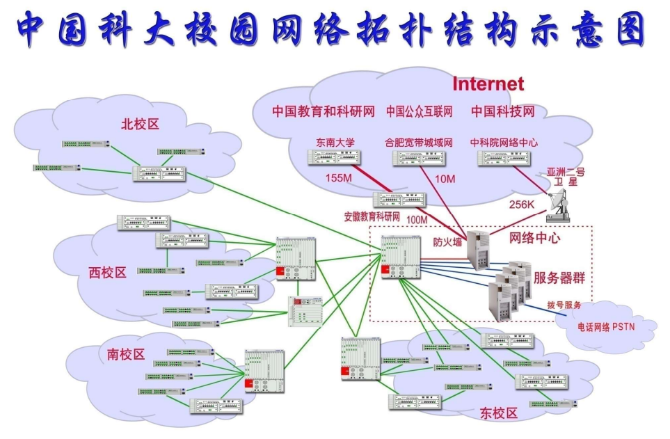

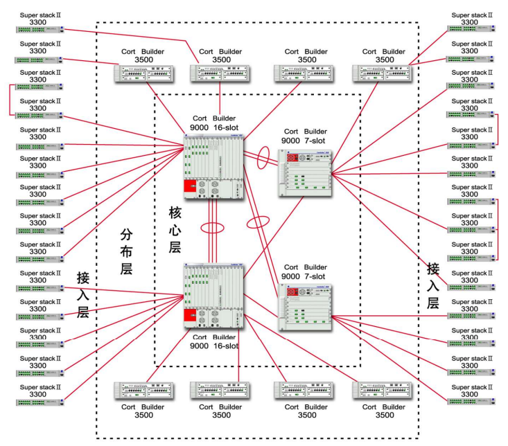
