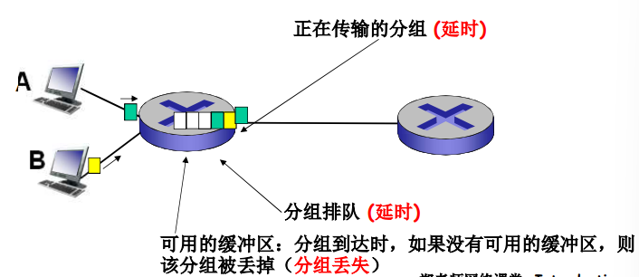
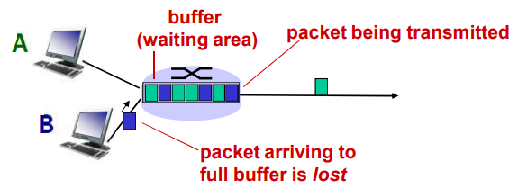
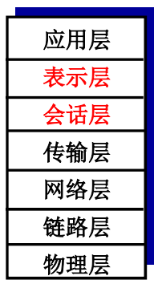
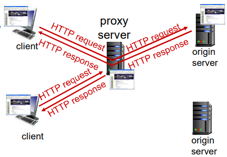
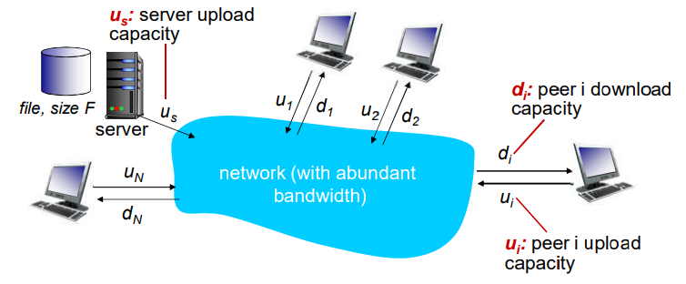

# 计算机网络概述

## 杂谈

> 五层协议杂谈

- 物理层：将媒体机上传输和接收电磁波信号、光信号，把链路层来的`0101..`的数据转化为电磁波信号、光信号，负责发送、接收、转化等工作
- 链路层：负责相邻的两个节点（同一个交换机）之间数据传输，传输以帧为单位的数据，解决了点到点的问题
- 网络层：在链路层点到点的基础上，实现了源主机到目标主机之间的传输，扩展了数据链路的功能，提供端到端的传输（但是传输比较糙，不好直接使用，并且也不可靠，尽力而为，可能会丢、出错、乱序）
- 传输层：在网络层的基础上，加强它的服务，把网络通信从主机到主机的传输变成了（进程到进程之间的通信），提供了可靠的传输协议，传输指标（BPS，每秒传输的位）
- 应用层：在传输层的基础上，应用层可以按照应用层协议，实现各种各样的应用

除了互联网还有很大其它网络，各种专用网络...，互联网仅仅只是其中一种，只是比较普及而已、

## 什么是Internet

### 从具体构成角度

> 节点

- 主机节点：主机及其上运行的应用程序（笔记本、平板、联网的机顶盒）
- 数据节点：路由器、交换机等网络交换设备，既不是源也不是目标，（交换机工作在链路层、路由器工作在网络层、负载均衡设备更高层）

> 边：通信链路

- 接入网链路：主机连接到互联网的链路
- 主干链路：路由器间的链路

> 协议：对等层实体在通信过程中应该遵循的规则集合

> 数以亿计的、互联的计算设备: 

- 主机 = 端系统（end system、host）
- 运行网络应用程序

> 通信链路

- 光纤、同轴电缆、无线电 、卫星
- 传输速率 = 带宽（bps）

> 分组交换设备：转发分组 (packets) 

- 路由器和交换机


- **协议**控制发送、接收消息
  - 如TCP、IP、HTTP、FTP、 PPP
- **Internet：“网络的网络”**
  - 松散的层次结构，互连的ISP
  - 公共Internet vs. 专用intranet
- Internet标准
  - RFC: Request for comments
  - IETF: Internet Engineering Task Force

### 什么是协议

网络协议: 

- 类似人类协议
- 机器之间的协议而非人与人之间的协议 
- Internet 中所有的通信行为都受协议制约 

协议定义了在两个或多个通信实体之间交换的报文格式和次序，以及在报文传输和/或接收或其他事件方面所采取的动作

### 从服务角度

- **使用通信设施进行通信的分布式应用**
  - Web、VoIP、email、分布式 游戏、电子商务、社交网络 …...
- **通信基础设施为apps提供编程接口（通信服务）**
  - 将发送和接收数据的apps与互联网连接起来 
  - 为app应用提供服务选择，类似于邮政服务：
    - 无连接不可靠服务
    - 面向连接的可靠服务

## 网络结构


- **网络边缘**：
  - 主机
  - 应用程序（客户端和服务 器）
- **网络核心**（数据交换的作用）：
  - 互连着的路由器
  - 网络的网络
- **接入网、物理媒体**：
  - 有线或者无线通信链路

总结：边缘、核心、接入

### 网络边缘

- **端系统（主机）**
  - 运行应用程序
  - 如Web、email
  - 在 “网络的边缘”
- **客户/服务器模式**
  - 客户端向服务器请求、接收服务
  - 如Web浏览器/服务器；email 客户端/服务器
- **对等（peer-peer ）模式**
  - 很少（甚至没有）专门的服务器
  - 如 Gnutella、KaZaA、Emule

> TCP特性
>
> - 可靠地、按顺序地传送数据
>   - 确认和重传
> - 流量控制
>   - 发送方不会淹没接收方
> - 拥塞控制
>   - 当网络拥塞时，发送方降低发送速率

- 可靠的，面向连接，传输数据（不多不少、不错原序）

- 流量控制：比如服务器性能很高，客户端性能很低，则需要控制传输速率（协调双方的网络处理能力）
- 拥塞控制：比如传输的链路出现阻塞，则发送速率也不能太快（考虑实时的链路状态）

> UDP特性
>
> - 无连接
> - 不可靠数据传输
> - 无流量控制
> - 无拥塞控制

qq的oicq就是基于UDP协议改造的

## 网络核心

- 网络核心：路由器的网状网络

- 基本问题：数据怎样通过网络进行传输？
  - 电路交换：为每个呼叫预留一条 专有电路：如电话网
  - 分组交换：
    - 将要传送的数据分成一个个单位： 分组
    - 将分组从一个路由器传到相邻路由器（hop），一段段最终从源端传到目标端
    - 每段：采用链路的最大传输能力（ 带宽）

### 电路交换

> 端到端的资源被分配给从源端 到目标端的呼叫 “call”：

- 图中，每段链路有4条线路：
  - 该呼叫采用了上面链路的第2 个线路，右边链路的第1个线 路（piece）
- 独享资源：不同享
  - 每个呼叫一旦建立起来就能够保证性能
- 如果呼叫没有数据发送，被分配的资源就会被浪费 (no sharing)
- 通常被传统电话网络采用

> 为呼叫预留端-端资源

- 链路带宽、交换能力
- 专用资源：不共享
- 保证性能
- 要求建立呼叫连接

网络资源（如带宽）被分成片

- 为呼叫分配片
- 如果某个呼叫没有数据， 则其资源片处于**空闲状态** （不共享）

- 网络资源（如带宽）被分成片
- 将带宽分成片
  - 频分(Frequencydivision multiplexing)
  - 时分(Time-division  multiplexing)
  - 波分(Wave-division  multiplexing


#### 计算举例

> 在一个电路交换网络上，从主机A到主机B发送 一个640,000比特的文件需要多长时间？ 
>
> - 所有的链路速率为1.536 Mbps
> - 每条链路使用时隙数为24的TDM
> - 建立端-端的电路需500 ms(传输过程就类似平行四边形，斜边就是延时的500ms)
>
> 

每条链路的速率（一个时间片）：1.536Mbps/24 = 64kbps 

传输时间：640kb/64kps = 10s

共用时间：传输时间+建立链路时间=10s + 500ms = 10.5s

#### 电路交换不适合计算机之间的通信

- 连接建立时间长
- 计算机之间的通信有突发性，如果使用线路交 换，则浪费的片较多
  - 即使这个呼叫没有数据传递，其所占据的片也不能 够被别的呼叫使用
- 可靠性不高？

### 分组交换

#### 存储转发

- 被传输到下一个链路之前， 整个分组必须到达路由器： **存储-转发**
- 在一个速率为R bps的链路 ，一个长度为L bits 的分组 的存储转发延时： L/R s

例子：

- L = 7.5 Mbits
- R = 1.5 Mbps
- 3次存储转发的延时 = 15 s


缺点：存储是有上限的，高峰期就会造成拥塞问题

#### 排队和延迟和丢失

- 如果到达速率>链路的输出速率: 
  - 分组将会排队，等待传输
  - 如果路由器的缓存用完了，分组将会被抛弃


#### 关键功能

**路由**: 决定分组采用的源到 目标的路径

- 路由算法

**转发**: 将分组从路由器的输入链路转移到输出链路

#### 统计多路复用

A&B 时分复用链路资源

A&B 分组没有固定的模式：统计多路复用（特殊的时分，没有固定的时间片划分）


### 分组交换 vs. 电路交换

**同样的网络资源，分组交换允许更多用户使用网络！**

- 1 Mb/s 链路
- 每个用户：
  - 活动时100 kb/s
  - 10% 的时间是活动的


- 电路交换：

  - 10 用户

- 分组交换：

  - 35 用户时`>=` 10个用户活动的概率为 0.0004（超过10个用户活动就会发生丢包情况）

  

Q: 预约服务（线路交换）对比按需服务（分组交换）的例子?

### 分组交换网络：存储-转发

分组交换: 分组的存储转发一段一段从源端传到目标端 ，按照有无网络层的连接，分成： 

- 数据报网络：
  - 分组的目标地址决定下一跳
  - 在不同的阶段，路由可以改变
  - 类似：问路
  - Internent
- 虚电路网络：
  - 每个分组都带标签（虚电路标识 VC ID），标签决定下一跳
  - 在呼叫建立时决定路径，在整个呼叫中路径保持不变
  - 路由器维持每个呼叫的状态信息
  - X.25 和ATM

中间路由器不维护它们间的状态 --- 面向连接

### 数据报(datagram) 的工作原理

- 在通信之前,无须建立起一个连接,有数据就传输
- 每一个分组都独立路由(路径不一样,可能会失序)
- 路由器根据分组的目标地址进行路由


### 虚电路(virtual circuit)的工作原理

每个虚电路表都有输入和输出


### 网络分类


## 接入网络和物理媒体

Q: 怎样将端系统和边缘路由器连接？

- 住宅接入网络
- 单位接入网络 （学校、公 司）
- 无线接入网络

注意：

- 接入网络的带宽 (bits per  second) ？
- 共享/专用？

### 住宅接入

#### 住宅接入：modem

在传输音频数据的链路上传输数据（网上冲浪...）

- 将上网数据**调制**加载音频信号上， 在电话线上传输，在局端将其中的数据**解调**出来；反之亦然
  - 调频
  - 调幅
  - 调相位
  - 综合调制
- **拨号调制解调器**
  - 56Kbps 的速率直接接入路由器 (通常更低)
  - 不能同时上网和打电话：不能总是在线


#### 接入网：digital subscriber line (DSL)


- 采用现存的到交换局DSLAM的电话线

  - DSL线路上的数据被传到互联网

  - DSL线路上的语音被传到电话网

- < 2.5 Mbps上行传输速率(typically < 1 Mbps) 
- < 24 Mbps下行传输速率(typically < 10 Mbps)

#### 接入网：线缆网络


有线电视信号线缆双向改造

**FDM**: 在不同频段传输不同信道的数据， 数字电视和上网数据（上下行）

杂谈：可以通过电网传输网络数据，在电路端点加上power电路解调器，用电力线传输数据，在国外有使用这种方式的


- **HFC: hybrid fiber coax**
  - 非对称: 最高30Mbps的下行传输速率, 2 Mbps 上行传输 速率
- **线缆和光纤网络**将个家庭用户接入到 ISP 路由器
- 各用户**共享**到线缆头端的接入网络
  - 与DSL不同, DSL每个用户一个专用线路到CO（central  office）

#### 住宅接入：电缆模式


这种方式已经主键淘汰了......

### 家庭网络


### 企业接入网络(Ethernet)


- 经常被企业或者大学等机构采用
- 10 Mbps, 100Mbps, 1Gbps, 10Gbps传输率
- 现在，端系统经常直接接到以太网络交换机上

### 无线接入网络

各无线端系统共享无线接入网络（端系统到无线路由器）

- 通过基站或者叫接入点

**无线LANs**

- 建筑物内部 (100 ft)
- 802.11b/g (WiFi): 11, 54  Mbps 传输速率


**广域无线接入**

- 由电信运营商提供 (cellular) ,  10’s km
- 1 到 10 Mbps
- 3G, 4G: LTE


### 物理媒体

- **Bit**: 在发送-接收对间传播
- **物理链路**：连接每个发送-接 收对之间的物理媒体
- **导引型媒体**: 
  - 信号沿着固体媒介被导引：同 轴电缆、光纤、 双绞线
- **非导引型媒体**：
  - 开放的空间传输电磁波或者光 信号，在电磁或者光信号中承载数字数据

- 双绞线 (TP)
  - 两根绝缘铜导线拧合
    - 5类：100Mbps 以太网 ，Gbps 千兆位以太网
    - 6类：10Gbps万兆以太网


- **同轴电缆：**
  - 两根同轴的铜导线
  - 双向
  - 基带电缆： 
    - 电缆上一个单个信道
    - Ethernet
  - 宽带电缆：
    - 电缆上有多个信道
    - HFC


- **光纤和光缆：**（正因为高锟先生没有申请专利，今天的网络才如此普及）
  - 光脉冲，每个脉冲表示一个 bit，在玻璃纤维中传输
  - 高速：
    - 点到点的高速传输（如10  Gps-100Gbps传输速率 ）
  - 低误码率：在两个中继器之 间可以有很长的距离，不受 电磁噪声的干扰
  - 安全


### 无线链路

- 开放空间传输电磁波，携 带要传输的数据
- 无需物理“线缆”
- 双向
- 传播环境效应：
  - 反射
  - 吸收
  - 干扰

> 无线链路类型:

- 地面微波
  - e.g. up to 45 Mbps channels
- LAN (e.g., WiFi)
  - 11Mbps, 54 Mbps,540Mbps…
- wide-area (e.g., 蜂窝)
  - 3G cellular: ~ 几Mbps
  - 4G 10Mbps
  - 5G 数Gbps
- 卫星
  - 每个信道Kbps 到45Mbps (或者 多个聚集信道)
  - 270 msec端到端延迟
  - 同步静止卫星和低轨卫星

马斯克的“星链计划”

## Internet结构和ISP

### 互联网络结构：网络的网络

- 端系统通过接入**ISPs** (Internet Service Providers)连 接到互联网
  - 住宅，公司和大学的ISPs
- 接入ISPs相应的必须是互联的
  - 因此任何2个端系统可相互发送分组到对方
- 导致的“网络的网络”非常复杂
  - 发展和演化是通过**经济的和国家的政策**来驱动的
- 让我们采用渐进方法来描述当前互联网的结构

> 问题: 给定数百万接入ISPs，如何将它们互联到一起

如果使用全连接，代价为O(n^2)

选项: 将每个接入ISP都连接到**全局ISP**（全局范围内覆盖）？ **客户ISPs**和**提供者ISPs**有经济合约


但是，如果全局ISP是可行的业务，那会有竞争者 有利可图，一定会有竞争


**竞争**：但如果全局ISP是有利可为的业务，那会有竞争者

**合作**：通过ISP之间的合作可以完成业务的扩展，肯定会有互 联，对等互联的结算关系


然后业务会细分（全球接入和区域接入），区域网络将出 现，用与将接入ISPs连接到全局ISPs

****

然后**内容提供商网络 (Internet Content Providers,e.g., Google, Microsoft, Akamai, Baidu,Tencent)** 可能会构建它们自己的网络，将它们的服务、内容更加靠近端用户，向用户提供更好的服务,减少自己的运营支出


在网络的最中心，一些为数不多的充分连接的大范围网络（分布广、节点有限、 但是之间有着多重连接）


- **“tier-1” commercial ISPs** (e.g., Level 3, Sprint, AT&T, NTT), 国家或者国际 范围的覆盖
- **content provider network** (e.g., Google): 将它们的数据中心接入ISP，方便周边 用户的访问；通常私有网络之间用专网绕过第一层ISP和区域ISPs


### 松散的层次模型

#### 第一层ISP

- **中心：第一层ISP**（如UUNet, BBN/Genuity, Sprint,  AT&T）国家/国际覆盖，速率极高
  - 直接与其他第一层ISP相连
  - 与大量的第二层ISP和其他客户网络相连


>  BBN/GTE US backbone network


> Tier-1 ISP: e.g., Sprint

POP：我是上层的ISP，你是下层的ISP，你需要通过我接入到更大的ISP


#### 第二层ISP

- **第二层ISP: 更小些的 (通常是区域性的) ISP**
  - 与一个或多个第一层ISPs，也可能与其他第二层ISP


#### 第三层ISP

- 第三层ISP与其他本地ISP
  - 接入网 (与端系统最近)


#### 一个分组要经过许多网络


- 很多内容提供商(如：Google, Akamai )可能会部署自己的网 络,连接自己的在各地的DC（数据中心），走自己的数据
- 连接若干local ISP和各级（包括一层）ISP,更加靠近用户
  - 经济考虑：少付费
  - 用户体验考虑：更快


#### ISP之间的连接

- POP: 高层ISP面向客户网络的接入点，涉及费用结算
  - 如一个低层ISP接入多个高层ISP，多宿（multi home）
- 对等接入：2个ISP对等互接，不涉及费用结算
- IXP：多个对等ISP互联互通之处，通常不涉及费用结算
  - 对等接入
- ICP自己部署专用网络，同时和各级ISP连接


## 分组延时、丢失和吞吐量

### 分组丢失和延时是怎样发生的？

为什么不把分组队列容量设置大一点？因为如果设置大一点的话，很容易出现拥挤，导致所有数据都堵塞，所以该丢还是丢，成本、实时性问题

ip报文段有个**紧急字段**，专门用来处理紧急数据

在路由器缓冲区的分组队列

- **分组到达链路的速率超过了链路输出的能力**
- 分组等待排到队头、被传输



### 四种分组延时

> 节点处理延时

- 检查 bit级差错
- 检查分组首部和决定将分组导向何处

> 排队延时

- 在输出链路上等待传输的 时间
- 依赖于路由器的拥塞程度


> 传输延时

- R=链路带宽(bps)
- L=分组长度(bits)
- 将分组发送到链路上的 时间= L/R
- 存储转发延时

> 传播延时

- d = 物理链路的长度
- s = 在媒体上的传播速度 (~2x108 m/sec)
- 传播延时 = d/s


### 节点延时

类似车队


- dproc = 处理延时
  - 通常是微秒数量级或更少
- dqueue = 排队延时
  - 取决于拥塞程度
- dtrans = 传输延时
  - = L/R, 对低速率的链路而言很大（如拨号），通常为微秒级 到毫秒级
- dprop = 传播延时
  - 几微秒到几百毫

LAN局域网和WAN广域网情况不同

### 排队延时

- R=链路带宽 (bps)
- L=分组长度 (bits)
- a=分组到达队列的平均 速率

流量强度 = La/R


- La/R ~ 0: 平均排队延时很小
- La/R -> 1: 延时变得很大
- La/R > 1: 比特到达队列的速率超过了从该队列输出的速率，平均排队延时将趋向无穷大！

设计系统时流量强度不能大于1！

### Internet的延时和路由

- Internet 的延时和路由是什么样的呢? 
- **Traceroute 诊断程序**：提供从源端，经过路 由器，到目的的延时测量
  - For all i:
    - 沿着目的的路径，向每个路由器发送3个探测分组
    - 路由器 i 将向发送方返回一个分组
    - 发送方对发送和回复之间间隔计时


### 关于traceroute

- 在Windows系统下
  - Tracerert hostname
    - 如 Tracerert www.gucas.ac.cn
  - 更完整的例子
    - tracert [-d] [-h maximum_hops] [-j computer-list] [-w  timeout] target_name
    - 请见帮助： [http://www.linkwan.com/gb/broadmeter/article/trace -help.htm](http://www.linkwan.com/gb/broadmeter/article/trace -help.htm)
- 测试网址：
  - www.traceroute.org
  - www.linkwan.co

利用了ICMP协议（互联网控制报文协议）:

- IP头部有一个TTL字段，每经过一个路由TTL减1，如果到达某个路由为0，则会丢弃这个数据报文，并且返回给源主机一个ICMP报文


- RTT Round Trip Time 往返延迟
- 然后设置TTL为足够大，数据到达目的主机，但是目的主机对应的端口没有进程去处理，返回一个ICMP报文（目标端口不可达），这就是Traceroute的工作原理

`traceroute: gaia.cs.umass.edu to www.eurecom.fr`


### 分组丢失

- 链路的队列缓冲区容量有限
- 当分组到达一个满的队列时，该分组将会丢失
- 丢失的分组可能会被前一个节点或源端系统重传，或根本不重传



> 分情况讨论

- 本身为不可靠的服务
  - 无线网（**向上层提供可靠的服务，因为下层传输不可靠**），**丢失需要在上一个节点进行重传**
  - 以太网（**不用向上层提供可靠的服务，因为下层传输比较可靠了**），就由上层负责保证可靠传输，**丢失需要在源主机进行重传**
- **如果是UDP，丢了就丢了，源主机不用重传**（可能在应用层基于UDP的改造协议，在应用层层次进行重传）

### 吞吐量

- 吞吐量：在源端和目标端之间传输的速率（数 据量/单位时间）
  - **瞬间吞吐量**：在一个时间点的速率
  - **平均吞吐量**：在一个长时间内平均值


> 瓶颈链路

端到端路径上，限制端到端吞吐的链路，其他节点都不传输，吞吐量`min{Rs,Rc}`

端到端平均吞吐=`min{R1，R2 ,…,Rn }`


> 互联网场景

- 链路上的每一段实 际可用带宽Ri’=?
- 端到端吞吐量： min{Ri’}
- 每个连接上的端到 端吞吐:  min(Rc ,Rs ,R/10)
- 实际上: Rc 或者 Rs 经常是瓶颈


## 协议层次及服务模型

网络是一个复杂的系统!

- 网络功能繁杂：数字信号的物理信号承载、点到点、路由、rdt、进 程区分、应用等
- 现实来看，网络的许多构成元素和 设备: 
  - 主机
  - 路由器
  - 各种媒体的链路
  - 应用
  - 协议
  - 硬件, 软件

问题是： 如何组织和实现这个复杂的网络功能？

- 例子1


航线的层次功能


- 例子2


层次化方式实现复杂网络功能：

- 将网络复杂的功能分层功能明确的**层次**，每一层实现了其中一个或一 组**功能**，功能中有其上层可以使用的功能：**服务**
- 本层协议实体相互交互执行本层的**协议动作**，目的是实现本层功能， 通过接口为上层提供更好的服务
- 在实现本层协议的时候，直接**利用了下层所提供的服务**
- 本层的服务：借助下层服务实现的本层协议实体之间交互带来的新功 能（上层可以利用的）+更下层所提供的服务

最上层和最下层分别就像CEO和底层员工

### 服务和服务访问点

- 服务( Service)：低层实体向上层实体提供它们之间的 通信的能力
  - 服务用户(service user)
  - 服务提供者(service provider )
- 原语(primitive)：上层使用下层服务的形式，高层使用 低层提供的服务，以及低层向高层提供服务都是通过 服务访问原语来进行交互的---形式
- 服务访问点 SAP (Services Access Point) ：上层 使用下层提供的服务通过层间的接口—地点； 
  - 例子：邮箱
  - 地址(address)：下层的一个实体支撑着上层的多个实体， SAP有标志不同上层实体的作用
  - 可以有不同的实现，队列
  - 例子:传输层的SAP: 端口(port)

### 服务的类型

-  面向连接的服务和无连接的服务-方式
  - 面向连接的服务( Connection-oriented Service)
    - **连接(Connection)**：两个通信实体为进行通信而建立的一 种结合
    - 面向连接的服务通信的过程：建立连接，通信，拆除连接
    - 面向连接的服务的例子：网络层的连接被成为虚电路
    - 适用范围：对于大的数据块要传输; 不适合小的零星报文
    - 特点：保序
    - 服务类型:
      - 可靠的信息流 传送页面(可靠的获得,通过接收方的确认)
      - 可靠的字节流 远程登录
      - 不可靠的连接 数字化声音
  - 无连接的服务(Connectionless Service)
    - 无连接服务：两个对等层实体在通信前不需要建立一个连接，不预留资源；不需要通信双方都是活跃；(例：寄信)
    - 特点：不可靠、可能重复、可能失序
    - IP分组，数据包；
    - 适用范围：适合传送零星数据；
    - 服务类型：
      - 不可靠的数据报 电子方式的函件
      - 有确认的数据报 挂号信
      - 请求回答 信息查询

### 服务和协议

- 服务与协议的区别
  - 服务(Service)：低层实体向上层实体提供它们之间的 通信的能力，是通过原语(primitive)来操作的，垂直
  - 协议(protocol) ：对等层实体(peer entity)之间在相互通信的过程中，需要遵循的规则的集合，水平
- 服务与协议的联系
  - 本层**协议的实现**要靠下层提供的服务来实现
  - 本层实体通过协议为上层**提供更高级的服务**

### 数据单元(DU)

- 一对多的关系：上层发送的一个数据单元太大了，需要拆解成分组大小
- 多对一的关系：上层发送很多个非常小的数据单元，下层将小单元组合成一个分组
- 一对一的关系：上层发送了一个数据单元，没有超出分组大小


从应用层往下（五层模型）：数据/报文段（Message）、TCP报文段/用户数据包（Segment）、分组/IP数据包（Packet）、帧（frame）、比特（bit）


### 分层处理和实现复杂系统的好处？

对付复杂的系统

- 概念化：结构清晰，便于标示网络组件，以及描述其 相互关系
  - 分层参考模型
- 结构化：模块化更易于维护和系统升级
  - 改变某一层服务的实现不影响系统中的其他层次
    - 对于其他层次而言是透明的
  - 如改变登机程序并不影响系统的其它部分
    - 改变2个秘书使用的通信方式不影响2个翻译的工作
    - 改变2个翻译使用的语言也不影响上下2个层次的工作
- 分层思想被认为有害的地方？

### Internet 协议栈

- 应用层: 网络应用
  - 为人类用户或者其他应用进程提供网络应用服务
  - FTP, SMTP, HTTP,DNS
- 传输层: 主机之间的数据传输
  - 在网络层提供的端到端通信基础上，细分为进程 到进程，将不可靠的通信变成可靠地通信
  - TCP, UDP
- 网络层: 为数据报从源到目的选择路由
  - 主机主机之间的通信，端到端通信，不可靠
  - IP, 路由协议
- 链路层: 相邻网络节点间的数据传输
  - 2个相邻2点的通信，点到点通信，可靠或不可靠
  - 点对对协议PPP, 802.11(wifi), Ethernet
- 物理层: 在线路上传送bit

### ISO/OSI 参考模型

- **表示层:** 允许应用解释传输的数据, e.g., 加密，压缩，机器相关的表示转换
- **会话层:** 数据交换的同步，检查点，恢复
- 互联网协议栈没有这两层!
  - 这些服务，如果需要的话，必须被应用实现
  - 需要吗?



### 封装和解封装


源主机：

- 通过每层的接口，将数据交给下层处理，下层加上自己的数据信息，形成本层的数据单元（报文段）**（应用层、传输层）**
- 然后将报文段将给网络层，网络层也加上自己的头部（源主机IP、目的主机IP等，头部信息怎么来的？本层形成的+上层数据通过ICI转换告诉我的）**（网络层）**
- 链路层得到分组数据并加上链路层头部和链路层尾部形成帧，交给物理层**（链路层）**
- 物理层通过一个bit或者多个bit一组进行发送（到达对方的物理层再逐步还原）**（物理层）**

交换机：

- 帧头当中有目标MAC地址，然后查交换机的栈表（交换表），决定通过源端口进来，通过哪个目标端口出去？交给对应端口的网卡处理，这个网卡再把数据封装成帧**（链路层）**
- 然后通过物理层发送**（物理层）**

路由：

- 路由器每个网卡接入不同网，通过其中一个网卡收到数据帧，把帧的数据取出来（分组），分组中取出目标的ip信息，查网络层的转发表，决定通过哪个网口放出去**（网络层）**
- 把分组数据通过接口交给对应的网卡，这个网卡再把数据封装成帧**（链路层）**
- 然后通过物理层发送**（物理层）**

目标主机：

- 物理层获得数据，交给链路层**（物理层）**

- 物理层判断帧头帧尾，获取分组数据数据交给网络层**（链路层）**
- 分组数据再把报文段拿出来，拿给传输层**（网络层）**
- 传输层再把报文段的Message或者Message的一部分交给应用层**（传输层）**
- 应用进程拿到数据**（应用层）**

### 各层次的协议数据单元

- 应用层：报文(message)
- 传输层：报文段(message segment)：TCP段，UDP数据报
- 网络层：分组packet（如果无连接方式：数据报 datagram）
- 数据链路层：帧(frame)
- 物理层：位(bit)

## 历史


### 早期（1960以前）计算机网络

- 线路交换网络
- 线路交换的特性使得其不适合计算机之间的通信
  - 线路建立时间过长
  - 独享方式占用通信资源，不适合突发性很强的计算机之间的通信
  - 可靠性不高：非常不适合军事通信
- 三个小组独立地开展分组交换的研究
  - 1961: Kleinrock(MIT)，排队论，展现了分组交换的有效性
  - 1964: Baran(美国兰德公司) – 军用网络上的分组交换
  - 1964：Donald（英国）等，NPL

### 1961-1972: 早期的分组交换概念

- 1967: 美国高级研究计 划研究局考虑ARPAnet
  - Kleinrock在MIT的同事
- 1969: 第一个 ARPAnet  节点开始工作,UCLA
  - IMP:接口报文处理机
- 1969年底: 4个节点

- 1972: 
  - ARPAnet 公众演示
  - 网络控制协议是第一个端 系统直接的主机-主机协议
    - NCP协议：相当于传输层 和网络层在一起，支持应 用开发
  - 第一个e-mail 程序（ BBN）
  - ARPAnet有15个节点


### 1972-1980: 专用网络和网络互联

- 出现了很多对以后来说重要的网络形式， 雨后春笋
  - 1970: ALOHAnet,夏威夷上的微波网络
  - 1973: Metcalfe在博士论文中提出了 Ethernet
  - ATM网络
  - ALOHAnet，Telenet，Cyclades法国等
- **1970后期，网络体系结构的必要性**
  - 专用的体系结构： DECnet, SNA, XNA
  - 标准化的体系结构
- 1974: 网际互联的Cerf and Kahn 体系结构
- 1979: ARPAnet的规模在持续增加，体系 结构也在酝酿着变化，以支持网络互联和 其他目的（性能）需求
  - 节点数目增加，有200个节点


Cerf and Kahn 网络互联原则:

- 极简、自治
- 尽力而为（best  effort）服务模型
- 无状态的路由器
- 分布控制

定义了今天的Internet体系结构


### 1980-1990: 体系结构变化, 网络数量激增，应用丰富

- **1983**: TCP/IP部署，标记日
  - NCP分化成2个层次，TCP/IP， 从而出现UDP
  - 覆盖式IP解决网络互联问题
  - 主机设备和网络交换设备分开
- **1982**: smtp e-mail协议定义
- **1983**: DNS 定义，完成域名到IP地址的转换
- **1985:** ftp 协议定义
- **1988**: TCP拥塞控制

- 其他网络形式的发展
  - 新的国家级网络: Csnet,  BITnet, NSFnet, Minitel
  - **1985年**：ISO/OSI提出， 时机不对且太繁琐
- 100,000主机连接到网络联邦

### 1990, 2000’s: 商业化, Web, 新的应用

- **1990年代初**: NSF对ARPAnet 的访问网，双主干，ARPAnet退役
- **1991**: NSF放宽了对NSFnet用于商业目的的限制 (1995退役)， ASFNET非盈利性机构维护，后面 叫Internet
- UNIX 中TCP/IP的**免费捆绑**
- **1990年代初**: Web
  - hypertext [Bush 1945, Nelson  1960’s]
  - HTML, HTTP: Berners-Lee
  - 1994: Mosaic (Netscape， andreesen)
  - **1990年代后期**: Web的商业化

1990后期 – 21世纪:

- TCP/IP体系结构的**包容性**，在其上部署应用便捷，出现非常多的应用
- 新一代**杀手级应用**（即时讯息 ，P2P 文件共享，社交网络等 ）更进一步促进互联网的发展
- 安全问题不断出现和修订（互联网的**补丁对策**）
- 2001网络泡沫，使得一些好公 司沉淀下来（谷歌，微软，苹 果，Yahoo，思科）
- 主干网的速率达到Gbps

### 2005-现在

- ~50+亿主机：包括智能手机和平板
- 宽带接入的快速部署
- 高速无线接入无处不在：移动互联时代
  - 4G部署,5G蓄势待发
  - 带宽大，终端性能高，价格便宜，应用不断增多
- 在线社交网络等新型应用的出现: 
  - Facebook: 10亿用户
  - 微信，qq：数十亿用户
- 内容提供商 (Google, Microsoft)创建他们自己的网络
  - 通过自己的专用网络提供对搜索、视频内容和电子邮件的即刻访问
- 电子商务，大学，企业在云中运行他们的服务 (eg, Amazon EC2)
- 体系结构酝酿着大的变化，未来网络蠢蠢欲动

## 小结

### 小结1

- 组成角度看什么是互联网
  - 边缘：端系统（包括应用）+接入网
  - 核心：网络交换设备+通信链路
  - 协议：对等层实体通信过程中遵守的规则的集合
    - 语法，语义，时序
- 为了实现复杂的网络功能，采用分层方式设计、实现和调试
  - 应用层，传输层，网络层，数据链路层，物理层
  - 协议数据单位：
    - 报文，报文段，分组，帧，位
- 从服务角度看互联网
  - 通信服务基础设施
    - 提供的通信服务：面向连接 无连接
  - 应用

-  应用之间的交互
  - C/S模式
  - P2P模式

### 小结2

- 数据交换
  - 分组数据交换
  - 线路交换
- 比较线路交换和分组交换
- 分组交换的2种方式
  - 虚电路
  - 数据报
- 接入网和物理媒介
  - 接入网技术：
    - 住宅：ADSL，拨号，cable modem
    - 单位：以太网
    - 无线接入方式
  - 物理媒介
    - 光纤，同轴电缆，以太网，双绞线
- ISP层次结构

### 中科大校园网


# 应用层

我们国家在应用层上面的创新还是挺不错的！

- 网络应用的原理：网络应用协议的概念和实现方面
  - 传输层的服务模型
  - 客户-服务器模式
  - 对等模式(peerto-peer)
  - 内容分发网络

- 网络应用的实例：互联网流行的应用层协 议
  - HTTP
  - FTP
  - SMTP / POP3 /  IMAP
  - DNS
- 编程：网络应用程序
- Socket API

> 一些网络应用的例子

- E-mail
- Web
- 文本消息
- 远程登录
- P2P文件共享
- 即时通信
- 多用户网络游戏
- 流媒体(YouTube,  Hulu, Netflix)
- Internet 电话
- 实时电视会议
- 社交网络
- 搜索
- ……

> 创建一个新的网络应用

编程

- 在不同的端系统上运行
- 通过网络基础设施提供的服 务，应用进程彼此通信
- 如Web:
- Web 服务器软件与浏览器软件通信

网络核心中没有应用层软件

- 网络核心没有应用层功能
- 网络应用只在端系统上存在，快速网络应用开发和部署

## 应用层协议原理

可能的应用架构：

- 客户-服务器模式（C/S:client/server）
  - 可扩展性差
  - 客户端可以DHCP，服务器固定ip
- 对等模式(P2P:Peer To Peer)
- 混合体：客户-服务器和对等体系结

### 客户-服务器（C/S）体系结构

- 服务器:
  - 一直运行
  - 固定的IP地址和周知的端 口号（约定）
  - 扩展性：服务器场
    - 数据中心进行扩展
    - 扩展性差
- 客户端:
  - 主动与服务器通信
  - 与互联网有间歇性的连接
  - 可能是动态IP 地址
  - 不直接与其它客户端通信


### 对等体（P2P）体系结构

- （几乎）没有一直运行的服务 器
- 任意端系统之间可以进行通信
- 每一个节点既是客户端又是服务器
  - **自扩展性-新peer节点带来新的服务能力，当然也带来新的服务请求**
- 参与的主机间歇性连接且可以改变IP地址
  - **难以管理**
- 例子: Gnutella，迅雷


### C/S和P2P体系结构的混合体

Napster

- 文件搜索：集中
  - 主机在中心服务器上注册其资源
  - 主机向中心服务器查询资源位置
- 文件传输：P2P
  - 任意Peer节点之间

即时通信

- 在线检测：集中
  - 当用户上线时，向中心服务器注册其IP地址
  - 用户与中心服务器联系，以找到其在线好友的位置
- 两个用户之间聊天：P2P

### 进程通信

**进程**：在主机上运行的应用程序

- 在同一个主机内，使用**进程间通信机制**通信（ 操作系统定义）
- 不同主机，通过交换**报文（Message）**来通信
  - 使用OS提供的通信服务
  - 按照应用协议交换报文
    - 借助传输层提供的服务

**客户端进程**：发起通信的进程

**服务器进程**：等待连接的进程

- 注意：P2P架构的应用也有客户端进程和服务器进程之分

### 分布式进程通信需要解决的问题


- 问题1：进程标示和寻址问题**（服务用户）**
- 问题2：传输层-应用层提供服务是如何**（服务）**
  - 位置：层间界面的SAP （TCP/IP ：socket） 
  - 形式：应用程序接口API （TCP/IP ：socket API）
- 问题3：如何使用传输层提供的服务，实现应用进程之间的报文交换，实现应用**（用户使用服务）**
  - 定义应用层协议：报文格式，解释，时序等
  - 编制程序，使用OS提供的API ，调用网络基础设施提 供通信服务传报文，实现应用时序等；

#### 问题1：对进程进行编址（addressing）

- 进程为了接收报文，必须有一个标识即：SAP（发送也需要标示）
  - 主机：唯一的 32位IP地址
    - 仅仅有IP地址不能够唯一标示一个进程；在一台端系统上有很 多应用进程在运行
  - 所采用的传输层协议：TCP or UDP
  - 端口号（Port Numbers）
- 一些知名端口号的例子：
  - HTTP: TCP 80
  - Mail: TCP25
  - ftp:TCP 21
- 一个进程：用IP+port标示端节点
- 本质上，一对主机进程之间的通信由2个端节点构成

#### 问题2：传输层提供的服务-需要穿过层间的信息


- 层间接口必须要携带的信息
  - 要传输的报文（对于本层来说：SDU）
  - 谁传的：对方的应用进程的标示：IP+TCP(UDP) 端口
  - 传给谁：对方的应用进程的标示：对方的IP+TCP(UDP)端口号
- 传输层实体（tcp或者udp实体）根据这些信息进行TCP 报文段（UDP数据报）的封装
  - 源端口号，目标端口号，数据等
  - 将IP地址往下交IP实体，用于封装IP数据报：源IP,目标IP

- 如果Socket API 每次传输报文，都携带如此多的信息，太繁琐易错，不便于管理
- 用个代号标示通信的双方或者单方：socket
- 就像OS打开文件返回的句柄一样
  - 对句柄的操作，就是对文件的操作
- TCP socket：
  - TCP服务，两个进程之间的通信需要之前要建立连接
    - 两个进程通信会**持续**一段时间，通信关系稳定
    - 可以用一个整数表示两个应用实体之间的通信关系 ，**本地**标示
    - 穿过层间接口的信息量**最小**
    - TCP socket：源IP,源端口，目标IP,目标 端口

#### TCP之上的套接字（socket）

- 对于使用面向连接服务（TCP）的应用而言，套接字是4元组的一个具有**本地意义的标示**
  - 4元组：**(源IP，源port，目标IP，目标port)**
  - 唯一的指定了一个会话（2个进程之间的会话关系）
  - 应用使用这个**标示**，与远程的应用进程通信
  - 不必在每一个报文的发送都要指定这4元组
  - 就像使用操作系统打开一个文件，OS返回一个文件句柄一样，以后使用这个文件句柄，而不是使用这个文件的目录名、文件名
  - 简单，便于管理


#### 问题2：传输层提供的服务-层间信息代码

- UDP socket：
  - UDP服务，两个进程之间的通信需要之前无需建立连接
    - 每个报文都是独立传输的
    - 前后报文可能给不同的分布式进程
  - 因此，只能用一个整数表示本应用实体的标示
    - 因为这个报文可能传给另外一个分布式进程
    - 穿过层间接口的信息大小最小
  - UDP socket：本IP,本端口
  - 但是传输报文时：必须要提供对方IP，port
    - 接收报文时： 传输层需要上传对方的IP，port

-  对于使用无连接服务（UDP）的应用而言，套接字是2元组的一个具有**本地意义的标示**
  - 2元组：**IP，port** （源端指定）
  - UDP套接字指定了应用所在的一个**端节点（end  point）**
  - 在发送数据报时，采用创建好的本地套接字（标示 ID），就不必在发送每个报文中指明自己所采用的 ip和port  但是在发送报文时，必须要指定对方的ip和udp  port(另外一个段节点)


#### 套接字（Socket）

- 进程向**套接字**发送报文或从套接字接收报文
- 套接字 <-> 门户
  - 发送进程将报文**推出**门户，发送进程依赖于传输层设施在另外一侧的 门将报文交付给接受进程
  - 接收进程从另外一端的门户**收到**报文（依赖于传输层设施）


#### 问题3：如何使用传输层提供的服务实现应用


- 定义应用层协议：报文格式，解释，时序等
- 编制程序，通过API调用网络基础设施提供通信服务传报文，解析报文，实现应用时序等

### 应用层协议

- 定义了：运行在不同端系统上的应用**进程**如何相互交换报文
  - 交换的**报文类型**：请求和应答报文
  - 各种报文类型的**语法**：报文中的 各个字段及其描述
  - 字段的**语义**：即字段取值的含义
  - 进程何时、如何发送报文及对报 文进行响应的**规则** 
- 应用协议仅仅是应用的一个组成部分
  - Web应用：HTTP协议，web客 户端，web服务器，HTML


**公开协议**：

- 由RFC文档定义
- 允许互操作
- 如HTTP, SMTP

**专用（私有）协议**：

- 协议不公开
- 如：Skype

### 应用需要传输层提供什么样的服务？ 如何描述传输层的服务？

数据丢失率

- 有些应用则要求100%的可 靠数据传输（如文件）
- 有些应用（如音频）能容忍 一定比例以下的数据丢失

延迟

- 一些应用 出于有效性考虑，对 数据传输有严格的时间限制
  - Internet 电话、交互式游戏
  - 延迟、延迟差

吞吐

- 一些应用（如多媒体）必须 需要最小限度的吞吐，从而 使得应用能够有效运转
- 一些应用能充分利用可供使用的吞吐(弹性应用)

安全性

- 机密性
- 完整性
- 可认证性（鉴别）

### 常见应用对传输服务的要求


### Internet 传输层提供的服务

TCP 服务：

- **可靠的传输服务**
- **流量控制**：发送方不会淹没接受方
- **拥塞控制**：当网络出现拥 塞时，能抑制发送方
- **不能提供的服务**：时间保证、最小吞吐保证和安全
- **面向连接**：要求在客户端 进程和服务器进程之间建立连接

UDP 服务：

- 不可靠数据传输
- 不提供的服务：可靠， 流量控制、拥塞控制、 时间、带宽保证、建立 连接

### UDP存在的必要性

- 能够**区分不同的进程**，而IP服务不能
  - 在IP提供的主机到主机端到端功能的基础上，区分了主机的应用进程
- **无需建立连接**，省去了建立连接时间，适合事务性的应用
- **不做可靠性的工作**，例如检错重发，适合那些对实时性要求比较高而对正确性要求不高的应用
  - 因为为了实现可靠性（准确性、保序等），必须付出时间代价（检错重发）
- 没有拥塞控制和流量控制，**应用能够按照设定的速度发送数据**
  - 而在TCP上面的应用，应用发送数据的速度和主机向网络发送 的实际速度是不一致的，因为有流量控制和拥塞控制

### Internet应用及其应用层协议和传输协议


### 安全TCP

TCP & UDP

- 都没有加密
- 明文通过互联网传输 ，甚至密码

SSL（secure socket layer）

- 在TCP上面实现，提供加密的TCP连接
- 私密性
- 数据完整性
- 端到端的鉴别

SSL在应用层

- 应用采用SSL库，SSL库使用TCP通信

SSL socket API

- 应用通过API将明文交给socket，SSL将其加密在互联网上传输

## Web and HTTP

- **Web页**：由一些**对象**组成
- 对象可以是HTML文件、JPEG图像、Java小程序、声音剪辑文件等
- Web页含有一个**基本的HTML文件**，该基本HTML文 件又包含若干对象的引用（链接）
- 通过**URL**对每个对象进行引用
  - 访问协议，用户名，口令字，端口等；
- URL格式（图片错误，端口在域名后面）


### HTTP概况

**HTTP: 超文本传输协议**

- Web的应用层协议
- 客户/服务器模式
  - 客户: 请求、接收和显示 Web对象的浏览器
  - 服务器: 对请求进行响应， 发送对象的Web服务器
- HTTP 1.0: RFC 1945
- HTTP 1.1: RFC 2068


**使用TCP:** 

- 客户发起一个与服务器的 TCP连接 (建立套接字)， 端口号为 80
- 服务器接受客户的TCP连 接
- 在浏览器(HTTP客户端)与Web服务器(HTTP服 务器 server)交换HTTP 报文 (应用层协议报文)
- TCP连接关闭

**HTTP是无状态的**

服务器并不维护关 于客户的任何信息，HTTP本身是无状态，用Cookie或Session记录会话状态不代表HTTP就是有状态的

**维护状态的协议很复杂！**

- 必须维护历史信息(状态)
- 如果服务器/客户端死机，它 们的状态信息可能不一致， 二者的信息必须是一致
- 无状态的服务器能够支持更多的客户端

### HTTP连接

> 非持久HTTP

- 最多只有一个对象在TCP连接上发送
- 下载多个对象需要多 个TCP连接
- HTTP/1.0使用非持 久连接

> 持久HTTP

- 多个对象可以在一个 （在客户端和服务器 之间的）TCP连接上传输
- HTTP/1.1 默认使用 持久连接

### 响应时间模型

往返时间RTT（round-trip  time）：一个小的分组从客 户端到服务器，在回到客户 端的时间（传输时间忽略）

响应时间：

- 一个RTT用来发起TCP连接
- 一个 RTT用来HTTP请求并 等待HTTP响应
- 文件传输时间 共：

2RTT+传输时间


### 持久HTTP

**非持久HTTP的缺点：**

- 每个对象要2个 RTT
- 操作系统必须为每个TCP连接分配资源
- 但浏览器通常打开并行TCP连接 ，以获取引用对象

**持久HTTP**

- 服务器在发送响应后，仍保持 TCP连接
- 在相同客户端和服务器之间的后 续请求和响应报文通过相同的连接进行传送
- 客户端在遇到一个引用对象的时 候，就可以尽快发送该对象的请求

**非流水方式的持久HTTP：**

- 客户端只能在收到前一个响应后才能发出新的请求
- 每个引用对象花费一个RTT（请求+确认=1个RTT） 
- 缺点（TCP对头阻塞问题，影响整体传输效率）

**流水方式的持久HTTP：**(并行，不必等上一个请求完成再发起下一个请求)

- HTTP/1.1的默认模式
- 客户端遇到一个引用对象就立即产生一个请求
- 所有引用（小）对象只花费一个 RTT是可能的

### HTTP请求报文

两种类型的HTTP报文：**请求、响应**

- **HTTP请求报文:**
  - ASCII（人能阅读）


### 提交表单输入

Post方式：

- 网页通常包括表单输入
- 包含在实体主体(entity body )中的输入被提交到服务器

URL方式：

- 方法：GET
- 输入通过请求行的 URL字段上载


### 方法类型

HTTP/1.0

- GET
- POST
- HEAD
  - 要求服务器在响应报文中不包含请求对象（故障跟踪）

HTTP/1.1

- GET, POST, HEAD
- PUT
  - 将实体主体中的文件上载到URL字段规定的路径
- DELETE
  - 删除URL字段规定的文件

### HTTP响应报文


### HTTP响应状态码

位于服务器->客户端的响应报文中的首行

一些状态码的例子：

**200 OK**

- 请求成功，请求对象包含在响应报文的后续部分 

**301 Moved Permanently**

- 请求的对象已经被永久转移了；新的URL在响应报文的Location: 首部行中指定
- 客户端软件自动用新的URL去获取对象

**400 Bad Request**

- 一个通用的差错代码，表示该请求不能被服务器解读

**404 Not Found**

- 请求的文档在该服务上没有找到

**505 HTTP Version Not Supported**

### Trying out HTTP (client side) for yourself


```sh
telnet www.baidu.com 80

GET / HTTP/1.1
Host: www.baidu.com
```


### 用户-服务器状态：cookies

大多数主要的门户网站使用 cookies

**4个组成部分：**

- 在HTTP响应报文中有一个cookie的首部行
- 在HTTP请求报文含有一个cookie的首部行
- 在用户端系统中保留有一个cookie文件，由用户的浏览器管理
- 在Web站点有一个后端数据库

例子：

- Susan总是用同一个PC使 用Internet Explore上 网
- 她第一次访问了一个使 用了Cookie的电子商务 网站
- 当最初的HTTP请求到达服务器时，该Web站点 产生一个唯一的ID，并以此作为索引在它的后 端数据库中产生一个项

### Cookies: 维护状态


**Cookies能带来什么：**

- 用户验证
- 购物车
- 推荐
- 用户状态 (Web e-mail)

**如何维持状态：**

- 协议端节点：在多个事务上 ，发送端和接收端维持状态
- cookies: http报文携带状 态信息

**Cookies与隐私：**

- Cookies允许站点知道许多关于用户的信息
- 可能将它知道的东西卖给第三方
- 使用重定向和cookie的搜索引擎还能知道用户更多的信息
  - 如通过某个用户在大量站点上的行为，了解其个人浏览方式的大致模式
- 广告公司从站点获得信息

### Web缓存 (代理服务器)

**目标**：不访问原始服务器，就满足客户的请求

- 用户设置浏览器： 通过缓存访问Web
- 浏览器将所有的HTTP  请求发给缓存
  - 在缓存中的对象：缓存直接返回对象
  - 如对象不在缓存，缓存请求原始服务器，然后再将对象返回给客户端



- 缓存既是客户端又是服务器
- 通常缓存是由ISP安装 (大学、公司、居 民区ISP)

**为什么要使用Web缓存 ？**

- 降低客户端的请求响应时间
- 可以大大减少一个机构内部网络与Internent接入链路上的流量
- 互联网大量采用了缓存：可以使较弱的ICP也能够有效提供内容
- 2-8原则：访问的内容有趋同性

### 缓存实例


- 流量强度接近于1，排队延时会很大

> 方案：采用更快的接入链路


> 方案：安装本地缓存


- 如何保障一致性


## FTP

现在有新的文件分发协议，使用变少了


- 向远程主机上传输文件或从远程主机接收文件
- 客户/服务器模式
  - 客户端：发起传输的一方
  - 服务器：远程主机
- ftp: RFC（request of comment） 959
- ftp服务器：端口号为21

### 控制连接与数据连接分开

- FTP客户端与FTP服务器通过端口21联系，并使用TCP为传输协议
- 客户端通过控制连接获得身份确认
- 客户端通过控制连接发送命令浏览远程目录
- 收到一个文件传输命令时，服务器打开一个到客户端的数据连接
- 一个文件传输完成后，服务器关闭连接


- 服务器打开第二个TCP数据连接用 来传输另一个文件
- 控制连接： **带外（ “out of band”  ）**传送
- FTP服务器维护用户的状态信息： 当前路径、用户帐户与控制连接对应
- **有状态**

### FTP命令、响应

命令样例：

- 在**控制连接**上以**ASCII**文本方式传送
- **USER username**
- **PASS password**
- **LIST**：请服务器返回远程主机当前目录的文件列表
- **RETR filename**：从远程主 机的当前目录检索文件 (gets)
- **STOR filename**：向远程主 机的当前目录存放文件 (puts)

返回码样例：

- 状态码和状态信息 (同HTTP)
- **331 Username OK,  password required**
- **125 data connection  already open;  transfer starting**
- **425 Can’t open data  connection**
- **452 Error writing  file**

## 电子邮件（EMail）

3个主要组成部分：

- 用户代理
- 邮件服务器
- 简单邮件传输协议：SMTP

用户代理

- 又名 “邮件阅读器”
- 撰写、编辑和阅读邮件
- 如Outlook、Foxmail
- 输出和输入邮件保存在服务器 上


### 邮件服务器

邮件服务器

- **邮箱**中管理和维护发送给用户 的邮件
- 输出**报文队列**保持待发送邮件报文
- 邮件服务器之间的**SMTP协议** ：发送email报文
  - 客户：发送方邮件服务器
  - 服务器：接收端邮件服务 器

###  SMTP [RFC 2821]

- 使用TCP在客户端和服务器之间传送报文，端口 号为25

- 直接传输：从发送方服务器到接收方服务器
- 传输的3个阶段
  - 握手
  - 传输报文
  - 关闭
- 命令/响应交互
  - 命令：ASCII文本
  - 响应：状态码和状态信息
- 报文必须为7位ASCII码（0~127）

### 举例

1. Alice使用用户代理撰写邮件 并发送给 bob@someschool.edu
2. Alice的用户代理将邮件发送 到她的邮件服务器；邮件放 在报文队列中
3. SMTP的客户端打开到Bob邮 件服务器的TCP连接
4. SMTP客户端通过TCP连接发 送Alice的邮件
5. Bob的邮件服务器将邮件放到 Bob的邮箱
6. Bob调用他的用户代理阅读邮 件


### 简单的SMTP交互

- telnet servername 25
- see 220 reply from server
- enter HELO, MAIL FROM, RCPT TO, DATA, QUIT  commands

above lets you send email without using email client  (reader)

```sh
S: 220 hamburger.edu 
C: HELO crepes.fr 
S: 250 Hello crepes.fr, pleased to meet you 
C: MAIL FROM: <alice@crepes.fr> 
S: 250 alice@crepes.fr... Sender ok 
C: RCPT TO: <bob@hamburger.edu> 
S: 250 bob@hamburger.edu ... Recipient ok 
C: DATA
S: 354 Enter mail, end with "." on a line by itself 
C: Do you like ketchup? 
C: How about pickles? 
C: . 
S: 250 Message accepted for delivery 
C: QUIT
S: 221 hamburger.edu closing connection
```

### SMTP：总结

- SMTP使用持久连接
- SMTP要求报文（首部和主体）为7位ASCII编码
- SMTP服务器使用 CRLF.CRLF决定报文的 尾部

**HTTP比较：**

- HTTP：拉（pull）
- SMTP：推（push）
- 二者都是ASCII形式的命令/ 响应交互、状态码
- HTTP：每个对象封装在各自 的响应报文中
- SMTP：多个对象包含在一个报文中

### 邮件报文格式


### 报文格式：多媒体扩展

- MIME：多媒体邮件扩展（multimedia mail extension）, RFC 2045, 2056
- 在报文首部用额外的行申明MIME内容类型


### 邮件访问协议


- SMTP: 传送到接收方的邮件服务器
- 邮件访问协议：从服务器访问邮件
  - POP：邮局访问协议（Post Office Protocol）[RFC 1939]
    - 用户身份确认 (代理<-->服务器) 并下载
  - IMAP：Internet邮件访问协议（Internet Mail Access  Protocol）[RFC 1730]
  - 更多特性 (更复杂)  在服务器上处理存储的报文
  - HTTP：Hotmail , Yahoo! Mail等
    - 方便

### POP3协议


- 先前的例子使用 “下载 并删除”模式。
  - 如果改变客户机，Bob不能阅读邮件

- “下载并保留”：不同客户机上为报文的拷贝
- POP3在会话中是无状态的
- “本地管理文件夹”

### IMAP

- IMAP服务器将每个报文与一个文件夹联系起来
- 允许用户用目录来组织报文
- 允许用户读取报文组件
- IMAP在会话过程中保留用户状态：
  - 目录名、报文ID与目录名之间映射
- “远程管理文件夹”

## DNS

### DNS(Domain Name System)

- DNS的必要性
  - IP地址标识主机、路由器
  - 但IP地址不好记忆，不便人类使用(没有意义)
  - 人类一般倾向于使用一些有意义的字符串来标识 Internet上的设备
    - 例如：qzheng@ustc.edu.cn 所在的邮件服务器 www.ustc.edu.cn 所在的web服务器
  - 存在着“字符串”—IP地址的转换的必要性
  - 人类用户提供要访问机器的“字符串”名称
  - 由DNS负责转换成为二进制的网络地

### DNS系统需要解决的问题

- 问题1：如何命名设备
  - 用有意义的字符串：好记，便于人类用使用
  - 解决一个平面命名的重名问题：层次化命名
- 问题2：如何完成名字到IP地址的转换
  - 分布式的数据库维护和响应名字查询
- 问题3：如何维护、增加或者删除一个域名，需要在域名系统中做哪些工作

### DNS(Domain Name System)的历史

- ARPANET的名字解析解决方案
  - 主机名：没有层次的一个字符串（一个平面）
  - 存在着一个（集中）维护站：维护着一张 主机名-IP地址 的映射文件：Hosts.txt
  - 每台主机定时从维护站取文件
- ARPANET解决方案的问题
  - 当网络中主机数量很大时
    - 没有层次的主机名称很难分配
    - 文件的管理、发布、查找都很麻烦

### DNS(Domain Name System)总体思路和目标 

DNS的主要思路

- **分层**的、基于域的命名机制
- 若干**分布式**的数据库完成名字到IP地址的转换
- 运行在UDP之上端口号为53的**应用**服务
- 核心的Internet功能，但以应用层协议实现  在网络边缘处理复杂性

DNS主要目的：

- 实现主机名-IP地址的转换(name/IP translate)  其它目的
  - **主机别名**到**规范名字**的转换：Host aliasing
  - 邮件服务器**别名**到邮件服务器的**正规名字**的转换：Mail server  aliasing
  - **负载均衡**：Load Distribution

### 问题1：DNS名字空间(The DNS Name Space)

DNS域名结构

- 一个层面命名设备会有很多重名

- NDS采用层次树状结构的命名方法

- Internet 根被划为几百个顶级域(top lever domains)

  - 通用的(generic)

    .com; .edu ; .gov ; .int ; .mil ; .net ; .org .firm ; .hsop ; .web ; .arts ; .rec ;

  - 国家的(countries)

    .cn ; .us ; .nl ; .jp

- 每个(子)域下面可划分为若干子域(subdomains

- 树叶是主机

> 根名字服务器


> DNS名字空间(The DNS Name Space)


- 域名(Domain Name)
  - 从本域往上，直到树根
  - 中间使用“.”间隔不同的级别
  - 例如：
    - ustc.edu.cn
    - auto.ustc.edu.cn
    - www.auto. ustc.edu.cn
  - 域的域名：可以用于表示一个域
  - 主机的域名：一个域上的一个主机

- 域名的管理
  - 一个域管理其下的子域
    - .jp 被划分为 ac.jp co.jp
    - .cn 被划分为 edu.cn com.cn
  - 创建一个新的域，必须征得它所属域的同意
- 域与物理网络无关
  - 域遵从组织界限，而不是物理网络
    - 一个域的主机可以不在一个网络
    - 一个网络的主机不一定在一个域
  - 域的划分是逻辑的，而不是物理的

### 问题2：解析问题-名字服务器(Name Server)

- 一个名字服务器的问题
  - 可靠性问题：单点故障
  - 扩展性问题：通信容量
  - 维护问题：远距离的集中式数据库
- 区域(zone)
  - 区域的划分有区域管理者自己决定
  - 将DNS名字空间划分为互不相交的区域，每个区域都是树的一部分
  - 名字服务器：
    - 每个区域都有一个名字服务器：维护着它所管辖区域的权威信息 (authoritative record)
    - 名字服务器允许被放置在区域之外，以保障可靠性


- 权威DNS服务器：组织机构的DNS服务器， 提供组织机构服务器（如 Web和mail）可访问的主机和IP之间的映射组织机构可以选择实现自己维护或由某个服务提供商来维护

### TLD服务器

- **顶级域(TLD)服务器：**负责顶级域名（如com, org, net,  edu和gov）和所有国家级的顶级域名（如cn, uk, fr, ca,  jp ）

  - Network solutions 公司维护com TLD服务器

  - Educause公司维护edu TLD服务器

### 区域名字服务器维护资源记录

- 资源记录(resource records)
  - 作用：维护 域名-IP地址(其它)的映射关系
  - 位置：Name Server的分布式数据库中
- RR格式: (domain_name, ttl, type,class,Value)
  - Domain_name: 域名
  - Ttl: time to live : 生存时间(权威，缓冲记录)
  - Class 类别 ：对于Internet，值为IN
  - Value 值：可以是数字，域名或ASCII串
  - Type 类别：资源记录的类型

### DNS记录


### 资源记录(resource records)


### 工作流程

一台设备联网需要以下四种条件：

- ip地址
- 子网掩码
- 默认网关
- DNS

DNS大致工作过程

- 应用调用解析器(resolver)
- 解析器作为客户向Name Server发出查询报文 （封装在UDP段中）
- Name Server返回响应报文(name/ip)


> 本地名字服务器（Local Name Server）

- 并不严格属于层次结构

- 每个ISP (居民区的ISP、公司、大学）都有一个本地DNS服务器
  - 也称为“默认名字服务器”
- 当一个主机发起一个DNS查询时，查询被送到其本地DNS服务器
  - 起着代理的作用，将查询转发到层次结构

> 名字服务器(Name Server)

- 名字解析过程
  - 目标名字在Local Name Server中
    - 情况1：查询的名字在该区域内部
    - 情况2：缓存(cashing)

与本地名字服务器不能解析名字时，联系根名字服务器顺着根-TLD 一直找到权威名字服务器


> 递归查询

- 名字解析负担都放在当前联络的名字服务器上
- 问题：根服务器的负担太重
- 解决： 迭代查询 (iterated  queries)


> 迭代查询

主机cis.poly.edu 想知道主机 gaia.cs.umass.edu 的IP地址

- 根（及各级域名）服务器 返回的不是查询结果，而是下一个NS的地址
- 最后由权威名字服务器给 出解析结果
- 当前联络的服务器给出可以联系的服务器的名字
- “我不知道这个名字，但 可以向这个服务器请求”


### DNS协议、报文 DNS协议

查询和响应报文的报文格式相同

报文首部

- 标识符（ID）：16位
- flags:
  - 查询/应答
  - 希望递归
  - 递归可用
  - 应答为权威


### 提高性能：缓存 

- 一旦名字服务器学到了一个映射，就将该映射**缓存**起来
- 根服务器通常都在本地服务器中缓存着
  - 使得根服务器不用经常被访问
- 目的：提高效率
- 可能存在的问题：如果情况变化，缓存结果和 权威资源记录不一致
- 解决方案：TTL（默认2天）

### 问题3：维护问题：新增一个域

- 在上级域的名字服务器中增加两条记录，指向这个新增 的子域的域名和域名服务器的地址
- 在新增子域 的名字服务器上运行名字服务器，负责本域 的名字解析： 名字->IP地址 
  - 例子：在com域中建立一个“Network Utopia”
- 到注册登记机构注册域名networkutopia.com
  - 需要向该机构提供权威DNS服务器（基本的、和辅助的）的名字和IP地址
  - 登记机构在com TLD服务器中插入两条RR记录: (networkutopia.com, dns1.networkutopia.com, NS) (dns1.networkutopia.com, 212.212.212.1, A) 
- 在networkutopia.com的权威服务器中确保有
  - 用于Web服务器的www.networkuptopia.com的类型为A的记录
  - 用于邮件服务器mail.networkutopia.com的类型为MX的记录

### 攻击DNS

**DDoS 攻击**

- 对根服务器进行流量轰炸攻击：发送大量ping
  - 没有成功
  - 原因１：根目录服务器配置了流量过滤器，防火墙
  - 原因２：Local DNS 服务器缓存了TLD服务器的IP地址,  因此无需查询根服务器
- 向TLD服务器流量轰炸攻击 ：发送大量查询
  - 可能更危险
  - 效果一般，大部分DNS缓存 了TLD

**重定向攻击**

- 中间人攻击
  - 截获查询，伪造回答，从而攻击某个（DNS回答指定的IP）站点

- DNS中毒
  - 发送伪造的应答给DNS服务器，希望它能够缓存这个虚假的结果
- 技术上较困难：分布式截获和伪造

**利用DNS基础设施进行DDoS**

- 伪造某个IP进行查询， 攻击这个 目标IP
- 查询放大，响应报文比查询报文大
- 效果有限

## P2P应用

### 纯P2P架构

- 没有（或极少）一直运行的服务器
- 任意端系统都可以直接通信
- 利用peer的服务能力
- Peer节点间歇上网，每次IP地址都有可能变化
- 例子:
  - 文件分发 (BitTorrent)
  - 流媒体(KanKan)
  - VoIP (Skype）

### 文件分发: C/S vs P2P

问题: 从一台服务器分发文件（大小F）到N个peer 需要多少时间？

- Peer节点上下载能力是有限的资源



> C/S模式


> p2p模式

每个客户端在下载的时候，为提供上载带宽（人人为我，我为人人）


> 对比


### P2P文件分发： BitTorrent

- 文件被分为一个个块256KB
- 网络中的这些peers发送接收文件块，相互服务


- Peer加入torrent:
  - 一开始没有块，但是将会通过其他节点处累积文件块
  - 向跟踪服务器注册，获得peer节点列表，和部分peer节点构成邻居关系 (“连接 ”) P2P文件分发： BitTorrent

- 当peer下载时，该peer可以同时向其他节点提供上载服务

- Peer可能会变换用于交换块的peer节点

- **扰动churn**: peer节点可能会上线或者下线

- 一旦一个peer拥有整个文件，它会（自私的）离开或者保留（利他主义）在torrent中

### BitTorrent: 请求，发送文件块

请求块：

- 在任何给定时间，不同peer节点拥有一个文件块 的子集
- 周期性的，Alice节点向 邻居询问他们拥有哪些块 的信息
- Alice向peer节点请求它希望的块，稀缺的块

发送块：

- 一报还一报titfor-tat
- Alice向4个peer发送块，这些块向它自己提供最大带宽的服务
  - 其他peer被Alice阻塞 (将不会 从Alice处获得服务)
  - 每10秒重新评估一次：前4位
  - 每个30秒：随机选择其他peer节点，向这个节点发送块
    - “优化疏通” 这个节点
    - 新选择的节点可以加入这个top 4

### BitTorrent: tit-for-tat

- Alice “优化疏通” Bob
- Alice 变成了Bob的前4位提供者;
- Bob答谢Alice
- Bob 变成了Alice的前4提供者


### P2P文件共享

- Alice在其笔记本电脑上运行P2P客户端程序
- 间歇性地连接到 Internet，每次从其 ISP得到新的IP地址
- 请求“双截棍.MP3”
- 应用程序显示其他有“ 双截棍.MP3” 拷贝的对等方

- Alice选择其中一个对等方， 如Bob.
- 文件从Bob’s PC传送到 Alice的笔记本上：HTTP
- 当Alice下载时，其他用户也 可以从Alice处下载
- Alice的对等方既是一个Web 客户端，也是一个瞬时Web 服务器

所有的对等方都是服务器 = 可扩展性好！


> 两大问题

- 如何定位所需资源
- 如何处理对等方的加入与离开


> 可能的方案

- 集中
- 分散
- 半分散

### P2P：集中式目录

最初的“Napster”设计

- 当对等方连接时，它告知中心服务器：
  - IP地址
  - 内容
- Alice查询 “双截棍 .MP3”
- Alice从Bob处请求文件


> 集中式目录中存在的问题

- 单点故障
- 性能瓶颈
- 侵犯版

文件传输是分散的， 而定位内容则是高度集中的

### 查询洪泛：Gnutella

- 全分布式
  - 没有中心服务器
- 开放文件共享协议
- 许多Gnutella客户端 实现了Gnutella协议
  - 类似HTTP有许多的浏览器

覆盖网络：图

- 如果X和Y之间有一个TCP连接，则二者之间 存在一条边
- 所有活动的对等方和边就是覆盖网络
- 边并不是物理链路
- 给定一个对等方，通常所连接的节点少于10个

> Gnutella：协议

思想有点类似bfs，广度优先遍历，同时注意剪枝

- 在已有的TCP连接上发送查询报文
- 对等方转发查询报文
- 以反方向返回查询命中报文


> Gnutella：对等方加入

- 对等方X必须首先发现某些已经在覆盖网络中的其他对等方：使用可用对等方列表
  - 自己维持一张对等方列表（经常开机的对等方的IP）
  - 联系维持列表的Gnutella站点
- X接着试图与该列表上的对等方建立TCP连接，直到与某个对等方Y建立连接
- X向Y发送一个Ping报文，Y转发该Ping报文
- 所有收到Ping报文的对等方以Pong报文响应
  - IP地址、共享文件的数量及总字节数
- X收到许多Pong报文，然后它能建立其他TCP连接 对等方离开？

对等方离开怎么办？

### 利用不匀称性：KaZaA

- 每个对等方要么是一个 组长，要么隶属于一个组长
  - 对等方与其组长之间有 TCP连接
  - 组长对之间有TCP连接
- 组长跟踪其所有的孩子的内容
- 组长与其他组长联系
  - 转发查询到其他组长
  - 获得其他组长的数据拷贝


> KaZaA：查询

- 每个文件有一个散列标识码和一个描述符
- 客户端向其组长发送关键字查询
- 组长用匹配进行响应：
  - **对每个匹配：元数据、散列标识码和IP地址**
- 如果组长将查询转发给其他组长，其他组长也以匹配进行响应
- 客户端选择要下载的文件
  - **向拥有文件的对等方发送一个带散列标识码的HTTP请求**

> Kazaa小技巧

- 请求排队
  - 限制并行上载的数量
  - 确保每个被传输的文件从上载节点接收一定量的带宽
- 激励优先权
  - 鼓励用户上载文件
  - 加强系统的扩展性
- 并行下载
  - 从多个对等方下载同一个文件的不同部分
  - HTTP的字节范围首部
  - 更快地检索一个文件

> Distributed Hash Table (DHT)

- 哈希表
- DHT方案
- 环形DHT 以及覆盖网络
- Peer波动

### bit搜索

通过对tracking server（跟踪服务器）进行搜索

- 匹配描述

- 找到文件hash标识
- 试图请求对应跟踪服务器下载对应文件

所以bit链接就是对应的资源hash值

时间久了bit链接有的会失效也就说得通了

## CDN

### 视频流化服务和CDN：上下文

- 视频流量：占据着互联网大部分的带宽 

  - Netflix, YouTube: 占据37%, 16% 的ISP下行流量

  - ~1B YouTube 用户, ~75M Netflix用户

- 挑战：规模性-如何服务者 ~1B 用户?

- 单个超级服务器无法提供服务（为什么）

- 挑战：异构性

  - 不同用户拥有不同的能力（例如：有线接入和移 动用户；带宽丰富和受限用户）

- **解决方案:** 分布式的，应用层面的基础设施

### 多媒体: 视频


- **CBR: (constant bit  rate):** 以固定速率编码
- **VBR: (variable bit  rate):** 视频编码速率随 时间的变化而变化
- **例子:**
  - MPEG 1 (CD-ROM) 1.5  Mbps
  - MPEG2 (DVD) 3-6 Mbps
  - MPEG4 (often used in  Internet, < 1 Mbps)

### 存储视频的流化服务：


> 多媒体流化服务：DASH

- DASH: Dynamic, Adaptive Streaming over HTTP
- 服务器: 
  - 将视频文件分割成多个块
  - 每个块独立存储，编码于不同码率（8-10种：蓝光、高清、标清....）
  - **告示文件（manifest file）**: 提供不同块的URL
-  客户端:
  - 先获取告示文件
  - 周期性地测量服务器到客户端的带宽
  - 查询告示文件,在一个时刻请求一个块，HTTP头部指定字节范围
    - 如果带宽足够，选择最大码率的视频块
    - 会话中的不同时刻，可以切换请求不同的编码块 (取决于当时的可用带宽)

- **“智能”客户端:** 客户端自适应决定（B站自适应）
  - **什么时候**去请求块 (不至于缓存挨饿，或者溢出)
  - 请求**什么编码速率**的视频块 (当带宽够用时，请求高质量的视频块)
  - **哪里**去请求块 (可以向离自己近的服务器发送URL，或者向高可用带宽的服务器请求)

### Content Distribution Networks

- **挑战**: 服务器如何通过网络向上百万用户同时 流化视频内容 (上百万视频内容)?
- **选择1**: 
  - 单个的、大的超级服务中心“megaserver”
  - 服务器到客户端路径上跳数较多，瓶颈链路的带宽小导致停顿
  - “二八规律”决定了网络同时充斥着同一个视频的多个拷贝，效率低（付费高、带宽浪费、效果差）
  - 单点故障点，性能瓶颈
  - 周边网络的拥塞

评述：相当简单，但是这个方法**不可扩展**

- **选项2:** 通过**CDN**，全网部署缓存节点，存储服务 内容，就近为用户提供服务，提高用户体验
  - **enter deep**: 将CDN服务器深入到许多接入网
    - 更接近用户，数量多，离用户近，管理困难
    - Akamai, 1700个位置
  - **bring home**: 部署在少数(10个左右)关键位置，如将服务器簇安装于POP附近（离若干1stISP POP较近）
    - 采用租用线路将服务器簇连接起来
    - Limelight

### Content Distribution Networks (CDNs)

- CDN: 在CDN节点中存储内容的多个拷贝
  - e.g. Netflix stores copies of MadMen
- 用户从CDN中请求内容
  - 重定向到最近的拷贝，请求内容
  - 如果网络路径拥塞，可能选择不同的拷贝


OTT 挑战: 在拥塞的互联网上复制内容

- 从哪个CDN节点中获取内容？
- 用户在网络拥塞时的行为？
- 在哪些CDN节点中存储什么内容

> CDN:“简单”内容访问场景


> 案例学习: Netflix


## TCP套接字编程

### Socket编程

应用进程使用传输层提供的服务才能够交换报文，实现应用协议，实现应用 TCP/IP：

- 应用进程使用Socket API访问传输服务地点：界面上的SAP(Socket）
- 方式：Socket API

**目标:** 学习如何构建能借助sockets进行通信的C/S应用

程序

**socket:** 分布式应用进程之间的门，传输层协议提供的端到端服务接口


2种传输层服务的socket类型:

- TCP: 可靠的、字节流的服务
- UDP: 不可靠（数据UDP数据报）服务

### TCP套接字编程

- **套接字：**应用进程与端到端传输协议（TCP或UDP）之间 的门户
- **TCP服务：**从一个进程向另一个进程可靠地传输**字节流**


服务器首先运行，等待连接建立

> 1：服务器进程必须先处于运行状态

- **创建**欢迎socket
- 和本地端口**捆绑**
- 在欢迎socket上阻塞式**等待接收**用户的连接

客户端主动和服务器建立连接：

> 2：**创建**客户端本地套接字（**隐式捆绑**到本地port）

- 指定服务器进程的IP地址和端口号，与服务器进程连接

> 3 ：当与客户端连接请求到来时

- 服务器**接受**来自用户端的请求 ，解除阻塞式等待，返回一个新的socket（与欢迎socket不 一样），与客户端通信
  - 允许服务器与多个客户端通信
  - 使用源IP和源端口来区分不同的客户端

> 从应用程序的角度

TCP在客户端和服务器进程之间提供了可靠的、字节流（管道）服务

> C/S模式的应用样例:

- 客户端从标准输入装置读取一行字符，发送给服务器
- 服务器从socket读取字符
- 服务器将字符转换成大写，然后返回给客户端
- 客户端从socket中读取一行字符，然后打印出来

实际上，这里描述了C-S之间交互的动作次序


### C/S socket 交互: TCP

- 假设服务器（`IP:1.1.1.1,Port:80`）,客户端（`IP:2.2.2.2,Port:8080`）
- sad和cad就是sockaddr_in结构体

> 执行流程

服务端

（1）welcomeSocket = Socket()`

（2）绑定IP和端口：`bind(welcomeSocket, &sad,)`

（4）监听端口连接：`accept(welcomeSocket,)`，将建立连接成功的的客户端IP和端口进行绑定

（8）接收请求：`read()`

（9）响应结果：`write()`

（11）关闭连接：`close()`

客户端

（3）`ClientSocket = Socket(PF_INET,...)`

（5）绑定IP和端口：`bind(ClientSocket , &cad,)`请求开始阻塞，建立连接成功，绑定服务器IP和端口，解除阻塞

（6）指定连接服务器，进行连接：`connect(clientSocket,&sad,....)`

（7）发送请求：`send()`

（10）接收结果：`read()`

（12）关闭连接：`close()`

> 优化：
>
> - 服务端accept一个客户端连接，fork一个新的进程去处理这个连接，老进程继续监听
> - 一个端口只能被一个服务器进程绑定，可以被多个进程共用


> 数据结构 sockaddr_in（服务器进程的端节点）

IP地址和port捆绑关系的数据结构（标示进程的端节点）

```c
struct sockaddr_in {
    short sin_family; //AF_INET 地址簇 
    u_short sin_port; // port 端口
    struct in_addr sin_addr ; // IP address, unsigned long IP地址
    char sin_zero[8]; // align 对齐（IPv6）
}; 
```

> 数据结构 hostent

域名和IP地址的数据结构

```c
struct hostent {
    char *h_name; // 主机域名
    char **h_aliases; // 指向数组的指针，二维的，主机一系列的别名
    int h_addrtype; // 地址的类型
    int h_length; //地址长度
    char **h_addr_list; // IP地址的列表，用于域名解析的函数调用
    #define h_addr h_addr_list[0];
} 
```

作为调用域名解析函数时的参数返回后，将IP地址拷贝到 sockaddr_in的IP地址部分

> 例子: C客户端(TCP)

```c
/* client.c */
void main(int argc, char *argv[]) {
    struct sockaddr_in sad; /* structure to hold an IP address of server */
    int clientSocket; /* socket descriptor */
    struct hostent *ptrh; /* pointer to a host table entry */
    
    char Sentence[128];
    char modifiedSentence[128];
    
    host = argv[1]; port = atoi(argv[2]);
    
    // 隐式
    clientSocket = socket(PF_INET, SOCK_STREAM, 0);
    memset((char *)&sad,0,sizeof(sad)); /* clear sockaddr structure */
    sad.sin_family = AF_INET; /* set family to Internet */
    // htons将主机字节序转化为网络字节序，存在大端小端问题，高位对齐还是地位对齐
    sad.sin_port = htons((u_short)port);
    /* Convert host name to IP address */
    ptrh = gethostbyname(host);
    //将IP地址拷贝到sad.sin_addr
    memcpy(&sad.sin_addr, ptrh->h_addr, ptrh->h_length);
    
    
    connect(clientSocket, (struct sockaddr *)&sad, sizeof(sad));
    
    
    // ....
}
```


> 例子: C服务端(TCP)

```c
/* server.c */
void main(int argc, char *argv[]) {
    struct sockaddr_in sad; /* structure to hold an IP address of server*/
    struct sockaddr_in cad; /*client */
    int welcomeSocket, connectionSocket; /* socket descriptor */
    struct hostent *ptrh; /* pointer to a host table entry */
    
    char clientSentence[128];
    char capitalizedSentence[128];
    
    port = atoi(argv[1]);
    
    // Create welcoming socket at port
    welcomeSocket = socket(PF_INET, SOCK_STREAM, 0);
    memset((char *)&sad,0,sizeof(sad)); /* clear sockaddr structure */
    sad.sin_family = AF_INET; /* set family to Internet */
    sad.sin_addr.s_addr = INADDR_ANY; /* set the local IP address */
    sad.sin_port = htons((u_short)port);/* set the port number */
    // Bind a local address
    bind(welcomeSocket, (struct sockaddr *)&sad, sizeof(sad));
    
    /* Specify the maximum number of clients that can be queued */
    listen(welcomeSocket, 10);
    while(1) {
        // Wait, on welcoming socket for contact by a client
        connectionSocket=accept(welcomeSocket, (struct sockaddr *)&cad, &alen);
        n=read(connectionSocket, clientSentence, sizeof(clientSentence));
        /* capitalize Sentence and store the result in capitalizedSentence*/
        // Write out the result to socket
        n=write(connectionSocket,capitalizedSentence,strlen(capitalizedSentence)+1);
        close(connectionSocket);
    }
}
```

## UDP 套接字编程

UDP接收方主要干两件事：

- 接收消息内容
- 对方的端节点

**UDP: 在客户端和服务器之间没有连接**

- 没有握手
- 发送端在每一个报文中明确地指定目标的IP地址和端口号
- 服务器必须从收到的分组中 提取出发送端的IP地址和端口号

**UDP: 传送的数据可能乱序， 也可能丢失**

**进程视角看UDP服务**：UDP 为客户端和服务器提供 不可靠的字节组的传送服务

### Client/server socket 交互: UDP


> C客户端 (UDP)

```c
/* client.c */
void main(int argc, char *argv[]) {
    struct sockaddr_in sad; /* structure to hold an IP address */
    int clientSocket; /* socket descriptor */
    struct hostent *ptrh; /* pointer to a host table entry */
    
    char Sentence[128];
    char modifiedSentence[128];
    
    host = argv[1]; port = atoi(argv[2]);
    
    // 创建客户端 socket,没有连接到服务器
    clientSocket = socket(PF_INET, SOCK_DGRAM, 0);
    
    /* determine the server's address */
    memset((char *)&sad,0,sizeof(sad)); /* clear sockaddr structure */
    sad.sin_family = AF_INET; /* set family to Internet */
    sad.sin_port = htons((u_short)port);
    ptrh = gethostbyname(host);
    /* Convert host name to IP address */
    memcpy(&sad.sin_addr, ptrh->h_addr, ptrh->h_length);
    
    // Get input stream from user
    gets(Sentence);
    
    // Send line to server
    addr_len =sizeof(struct sockaddr);
    n=sendto(clientSocket, Sentence, strlen(Sentence)+1,(struct sockaddr *) &sad, addr_len);
    
    // Read line from server
    n=recvfrom(clientSocket, modifiedSentence, sizeof(modifiedSentence),(struct sockaddr *) &sad, &addr_len);
    printf("FROM SERVER: %s\n",modifiedSentence);
    
    // Close connection
    close(clientSocket);
}
```

> C服务器(UDP)

```c
/* server.c */
void main(int argc, char *argv[]) {
    struct sockaddr_in sad; /* structure to hold an IP address */
    struct sockaddr_in cad;
    int serverSocket; /* socket descriptor */
    struct hostent *ptrh; /* pointer to a host table entry */
    
    char clientSentence[128];
    char capitalizedSentence[128];
    
    port = atoi(argv[1]);
    
    // Create welcoming socket at port
    serverSocket = socket(PF_INET, SOCK_DGRAM, 0);
    memset((char *)&sad,0,sizeof(sad)); /* clear sockaddr structure */
    sad.sin_family = AF_INET; /* set family to Internet */
    sad.sin_addr.s_addr = INADDR_ANY; /* set the local IP address */
    sad.sin_port = htons((u_short)port);/* set the port number */
    // Bind a local address
    bind(serverSocket, (struct sockaddr *)&sad, sizeof(sad));
    
    while(1) {
        // Receive messages from clients
        n=recvfrom(serverSocket, clientSentence, sizeof(clientSentence), 0(struct sockaddr *) &cad, &addr_len );
        /* capitalize Sentence and store the result in capitalizedSentence*/
        // Write out the result to socket
        n=sendto(serverSocket,capitalizedSentence,strlen(capitalizedSentence)+1,(struct sockaddr *) &cad, &addr_len);
    }// End of while loop, loop back and wait for another client connection
}
```

## 小结

- 应用程序体系结构
  - 客户-服务器
  - P2P
  - 混合
- 应用程序需要的服务品质描述:
  - 可靠性、带宽、延时、安全
- Internet传输层服务模式
  - 可靠的、面向连接的服务： TCP
  - 不可靠的数据报：UDP

- 流行的应用层协议:
  - HTTP
  - FTP
  - SMTP, POP, IMAP
  - DNS
- Socket编程

> 更重要的：学习协议的知识

- 应用层协议报文类型：请 求/响应报文：
  - 客户端请求信息或服务
  - 服务器以数据、状态码进 行响应
  - 报文格式：
    - 首部：关于数据信息的字段
    - 数据：被交换的信息

- 控制报文 vs. 数据报文
  - 带内、带外
- 集中式 vs. 分散式
- 无状态 vs. 维护状态
- 可靠的 vs. 不可靠的报文传输
- 在网络边缘处理复杂性

一个协议定义了在两个或多个通信实体之间交换报文的格式和次序、以及就一条报文传输和接收或其他事件采取的动作
