# 传输层

目标：

- 理解传输层的工作原理
  - 多路复用/解复用
  - 可靠数据传输
  - 流量控制
  - 拥塞控制

- 学习Internet的传输层协议
  - UDP：无连接传输
  - TCP：面向连接的可靠传输
  - TCP的拥塞控制

## 概述和传输层服务

- 为运行在不同主机上的应用进程提供**逻辑通信**
- 传输协议运行在端系统
  - 发送方：将应用层的报文分成报文段，然后传递给网络层
  - 接收方：将报文段重组成报文，然后传递给应用层
- 有多个传输层协议可供应 用选择
  - Internet: TCP和UDP

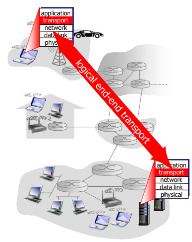

### 传输层 vs. 网络层

网络层服务：

- 主机之间 的逻辑通信
- 传输层服务：进程间的逻辑通信
  - 依赖于网络层的服务
    - 延时、带宽
  - 并对网络层的服务进行增强
    - 数据丢失、顺序混乱、 加密

> 类比：东西2个家庭的通信

Ann家的12个小孩给另Bill家的 12个小孩发信

- 主机 = 家庭
- 进程 = 小孩
- 应用层报文= 信封中的信件
- 传输协议= Ann 和 Bill
  - 为家庭小孩提供复用解复用服务
- 网络层协议 = 邮政服务
  - 家庭-家庭的邮包传输服务

### Internet传输层协议

提供进程与进程之间以Message为单位的逻辑通信，使得远端的两个进程可以逻辑通信，（逻辑通信大致可以理解为，表面上通过socket就可以进行通信，其实底层做了很多工作），

**TCP复用与解复用**，大致流程为：上层Message传输下来，分成若干段，加上段头段尾，交给下层传输，接收端收到数据，去掉段头整理程Message，交给上层）

注意一点：TCP向上层提供的是字节流的服务，保障这个字节流是正常的，不保证报文的界限，应用层考自己协议的标识

**传输层可以对有一些服务品质加强**，例如：带宽（拥塞控制）和延迟（滑动窗口）

- 可靠的、保序的传输： TCP
  - 多路复用、解复用
  - 拥塞控制
  - 流量控制
  - 建立连接
- 不可靠、不保序的传输：UDP
  - 多路复用、解复用
  - 没有为尽力而为的IP服务添加更多的其它额外服务
- 都不提供的服务：
  - 延时保证
  - 带宽保证

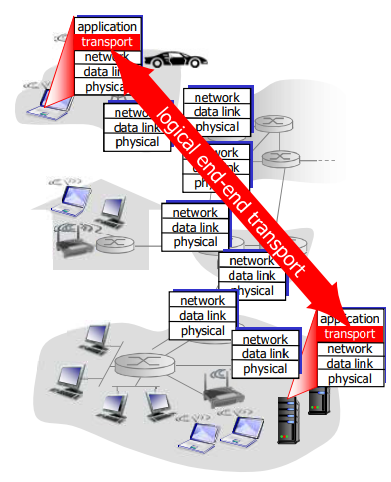

## 多路复用与解复用

### 多路复用/解复用

> 在发送方主机多路复用

从多个套接字接收来自多个进程的报文，根据套接字对应的IP地址和端口号等信息对报文段用头部加以封装 (该头部信息用于以后的解复用)

> 在接收方主机多路解复用

根据报文段的头部信息中的IP地址和端口号将接收到的报文段发给正确的套接字(和对应的应用进程)

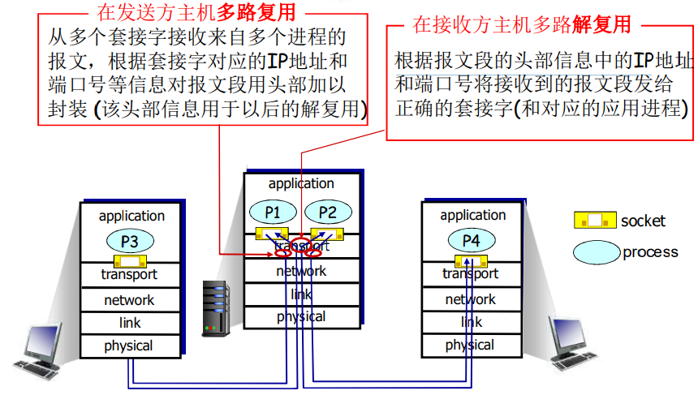

### 多路解复用工作原理

- 解复用作用：TCP或者UDP实体采用哪些信息，将报文段的数据部分交给正确的socket，从而交给正确的进程
- 主机收到IP数据报
  - 每个数据报有源IP地址和目标地址
  - 每个数据报承载一个传输层报文段
  - 每个报文段有一个源端口号和目标端口号 (特定应用有著名的端口号)
- 主机联合使用**IP地址**和**端口号**将报文段发送给合适的套接字

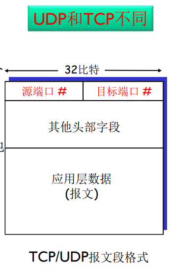


UDP头部有源IP地址、目标IP地址，而TCP头部没有，关于TCP报头没有IP字段的解释：对这方面的理解不能停留在理论上，确实，如果如书本上说的，每一层只管自己要的，dns解析的ip地址确实没法发到网络层，因为传输层tcp关注的头数据并不包括ip。但题主也知道，这样就没法工作了，所以实现上dns解析出ip地址后建立socket，然后进行connect系统调用的时候，ip地址实际上是作为参数传进去了，只不过tcp头封装的时候没放进去，而是放在ip头里面去了，这些东西书本上是讲标准，讲分层，但实现上可能就是程序。所以题主可以看看unix的socket编程，然后就不会陷入一种定式上了。

函数原型

```c
int socket(int domain, int type, int protocol);
```

### 无连接(UDP)多路解复用

- 创建套接字：

  服务器端：

  ```c
  /* 
  AF = Address Family
  PF = Protocol Family
  AF_INET = PF_INET
  1. 理论上，建立socket时是指定协议，应该用PF_XXXX，设置地址时应该用AF_XXXX。当然AF_INET和PF_INET的值是相同的，混用也不会有太大的问题
  2. 在函数socketpair与socket的domain参数中有AF_UNIX, AF_LOCAL, AF_INET, PF_UNIX, PF_LOCAL, PF_INET这几个参数有  AF_UNIX = AF_LOCAL, PF_UNIX = PF_LOCAL, AF_LOCAL = PF_LOCAL, AF_INET = PF_INET
  3. SOCK_DGRAM分是数据包,是UDP协议网络编程,第二个参数指定要创建的套接字类型，流套接字类型为SOCK_STREAM、数据报套接字类型为SOCK_DGRAM、原始套接字SOCK_RAW(WinSock接口并不适用某种特定的协议去封装它，而是由程序自行处理数据包以及协议首部）；两个重要的类型是 SOCK_STREAM 和 SOCK_DGRAM。 SOCK_STREAM表明数据像字符流 一样通过 socket 。而 SOCK_DGRAM 则表明数据将是数据报(datagrams)的形式。
  */
  serverSocket=socket(PF_INET,SOCK_DGRAM,0);
  // 绑定服务端口，
  bind(serverSocket, &sad, sizeof(sad));
  ```

  客户端：

  ```c
  // 客户端虽然代码没有bind，但是隐式的也对和本机IP和端口做了捆绑（客户端端口指定有一定的随机性）
  ClientSocket=socket(PF_INET,SOCK_DGRAM,0);
  ```

  没有Bind,ClientSocket和OS为之分配的某个端口号捆绑（客户端使用什么端口号无所谓，客户端主动找服务器）

- 在接收端，UDP套接字用二元组标识 **(目标IP地址、目标端口号)**

  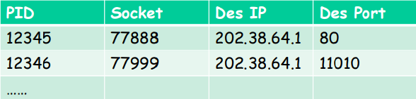

- 当主机收到UDP报文段：

  - 检查报文段的目标端口号
  - 用该端口号将报文段定位给套接字

- 如果两个不同源IP地址/源端口号的数据报，但是**有相同的目标IP地址和端口号**，则被定位到相同的套接字

### 无连接的多路解复用

- 回顾: 创建拥有本地端口号的套接字`DatagramSocket mySocket1 = new DatagramSocket(12534)`，当创建UDP段采用端口 号，可以指定：
  - 目标IP地址
  - 目标端口号

- 当主机接收到UDP段时：
  - 检查UDP段中的目标端口号 
  - 将UDP段交给具备那个端口号的套接字
  - （具备相同**目标IP地址**和**目标端口号**，即使是**源IP地址或/且源端口号**的IP数据报，将会被传到相同的目标UDP套接字上）

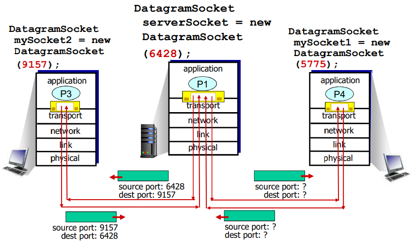

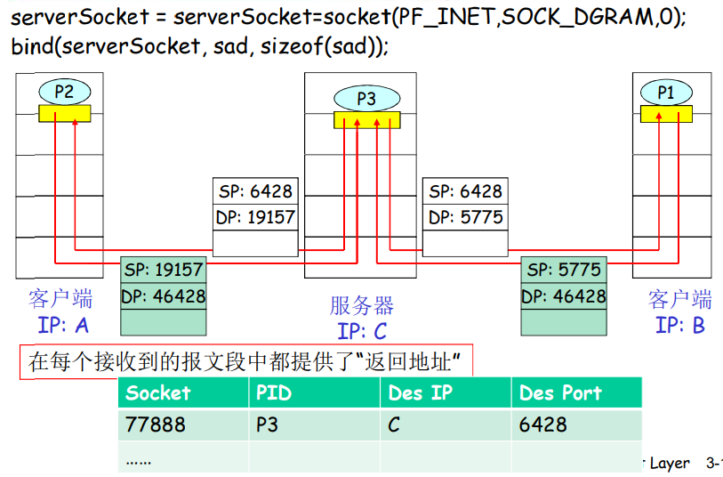

### 面向连接(TCP)的多路复用

- TCP套接字:四元组本地标识：
  - 源IP地址
  - 源端口号
  - 目的IP地址
  - 目的端口号
- **解复用**：接收主机用 这四个值来将数据报定位到合适的套接字
- 服务器能够在一个TCP端口上同时支持多个 TCP套接字：
  - 每个套接字由其四元组标识（有不同的源IP和源 PORT）
- Web服务器对每个连接客户端有不同的套接字
  - 非持久对每个请求有不同的套接字

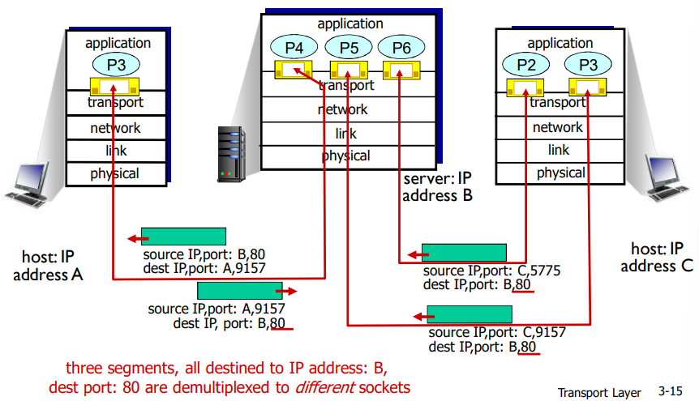

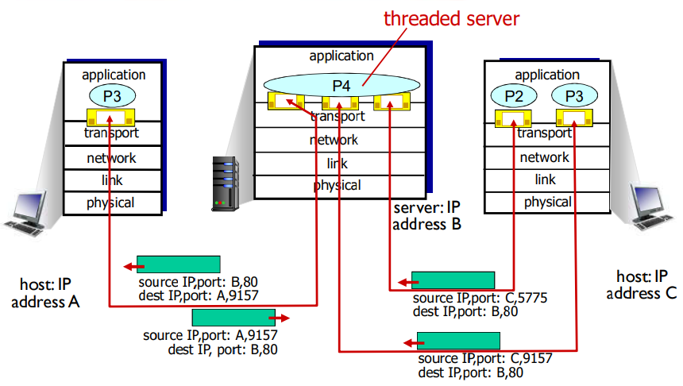

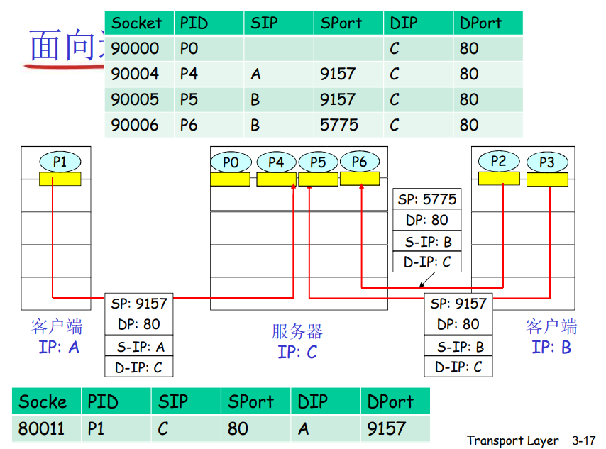

### 面向连接的多路复用：多线程Web Server

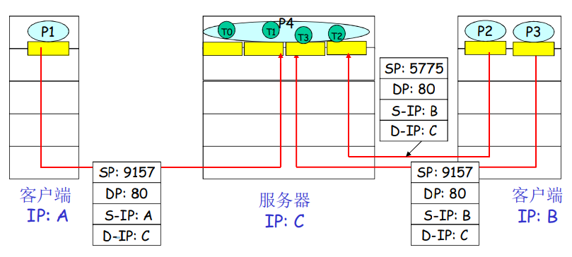

- 一个进程下面可能有多个线程：由多个线程分别为客户提供服务
- 在这个场景下，还是根据4元组决定将报文段内容同一个进程下的不同线程
- 解复用到不同线程

## 无连接传输：UDP

### UDP: User Datagram Protocol [RFC 768]

- “no frills,” “bare bones”Internet传输协议
- “尽力而为”的服务，报文段可能
  - 丢失
  - 送到应用进程的报文段乱序
- **无连接：**
  - UDP发送端和接收端之间没有握手
  - 每个UDP报文段都被独立地处理

- UDP 被用于:
  - 流媒体（丢失不敏感， 速率敏感、应用可控制 传输速率）
  - DNS
  - SNMP
- 在UDP上可行可靠传输:
  - 在应用层增加可靠性
  - 应用特定的差错恢复

### UDP：用户数据报协议


为什么要有UDP?

- 不建立连接 （会增加延时 ）
- 简单：在发送端和接收端没有连接状态
- 报文段的头部很小(开销小)(TCP20字节，UDP8字节，类似理解为卡车头部，头部太大了，效率就会低)
- 无拥塞控制和流量控制： UDP可以尽可能快的发送报文段
  - 应用->传输的速率= 主机->网 络的速率

### UDP校验和

目标： 检测在被传输报文段中的差错 (如比特反转)

**残存错误**：类似负负得正的现象，错到一块了(检验范围+检验和也为全1)，结果通过校验了

发送方：

- 将报文段的内容视为16 比特的整数
- 校验和：报文段的加法和 （1的补运算）
- 发送方将校验和放在UDP的校验和字段

接收方：

- 计算接收到的报文段的校验和
- 检查计算出的校验和与校验 和字段的内容是否相等：
  - 不相等–--检测到差错
  - 相等–--没有检测到差错 ，但也许还是有差
    - 残存错误

### Internet校验和的例子

- 注意：当数字相加时，在最高位的进位要回卷(进位回滚)，再加到结果上

例子：两个16比特的整数相加

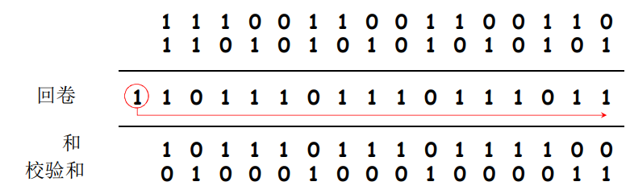

- 目标端：
  - **校验范围+校验和=1111111111111111** 通过校验
  - 否则没有通过校验
- 注：求和时，必须将进位回卷到结果上

## 可靠数据传输的原理

ps：有很少的一些网络，在数据链路层实现了可靠传输

### 可靠数据传输（rdt）的原理

- rdt在应用层、传输层和数据链路层都很重要  是
- 网络Top 10问题之一

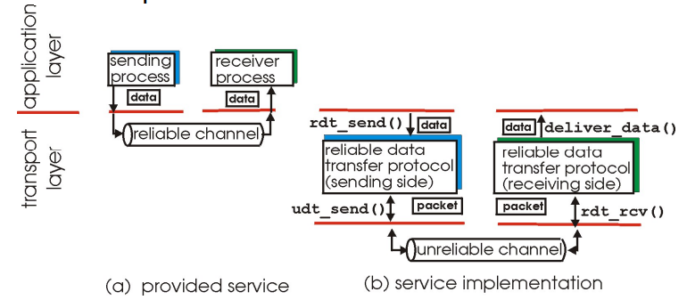

- 信道的不可靠特点决定了可靠数据传输协议（ rdt ）的复杂性

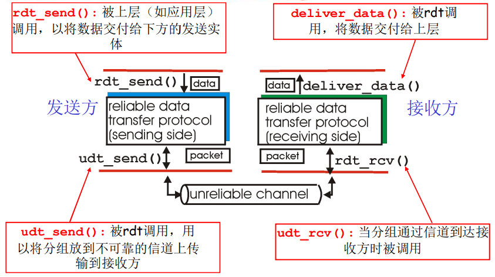

我们将：

- 渐增式地开发可靠数据传输协议（ rdt ）的发送方和接收方
- 只考虑单向数据传输
  - 但控制信息是双向流动的！
- 双向的数据传输问题实际上是2个单向数据传输问题的综合
- 使用有限状态机 (FSM) 来描述发送方和接收方

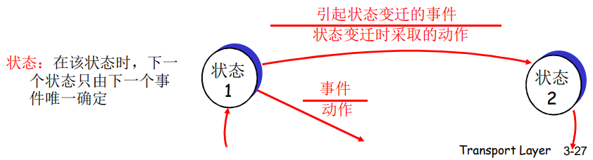

### Rdt1.0： 在可靠信道上的可靠数据传输

- 下层的信道是完全可靠的
  - 没有比特出错
  - 没有分组丢失
- 发送方和接收方的FSM
  - 发送方将数据发送到下层信道
  - 接收方从下层信道接收数据

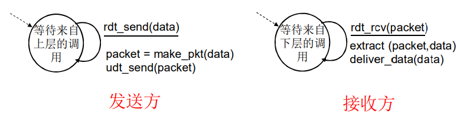

### Rdt2.0：具有比特差错的信道

- 下层信道可能会出错：将分组中的比特翻转
  - 用校验和来检测比特差错
- 问题：怎样从差错中恢复：
  - **确认(ACK)**：接收方显式地告诉发送方分组已被正确接收
  - **否定确认( NAK)**: 接收方显式地告诉发送方分组发生了差错
    - 发送方收到NAK后，发送方重传分组
- rdt2.0中的新机制：采用差错控制编码进行差错检测
  - 发送方差错控制编码、缓存
  - 接收方使用编码检错
  - 接收方的反馈：控制报文（ACK，NAK）：接收方->发送方
  - 发送方收到反馈相应的动作

### rdt2.0：FSM描述

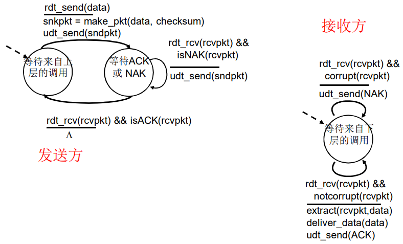

### rdt2.0：没有差错时的操作

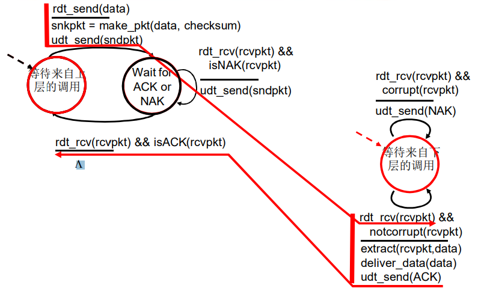

### rdt2.0：有差错时

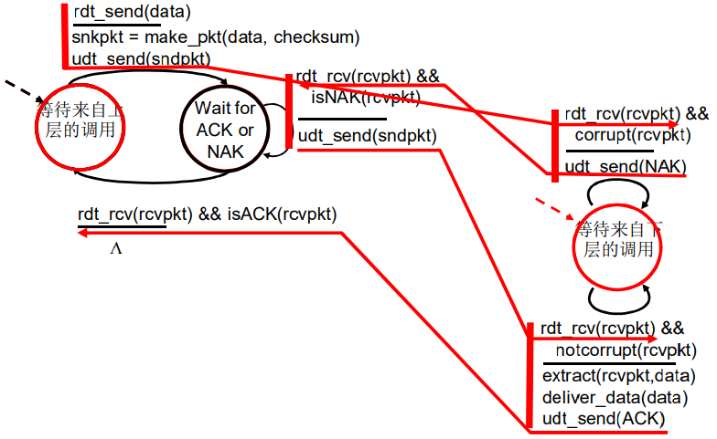

### rdt2.0的致命缺陷！-> rdt2.1

**如果ACK/NAK出错？**

- 发送方不知道接收方发 生了什么事情！
- 发送方如何做？
  - 重传？可能重复
  - 不重传？可能死锁(或出错)
- 需要引入新的机制
  - 序号

处理重复：

- 发送方在每个分组中加入**序号**
- 如果ACK/NAK出错，发 送方**重传**当前分组
- 接收方丢弃（不发给上层）重复分组

停等协议：发送方发送一个分组， 然后等待接收方的应答

### rdt2.1：发送方处理出错的ACK/NAK

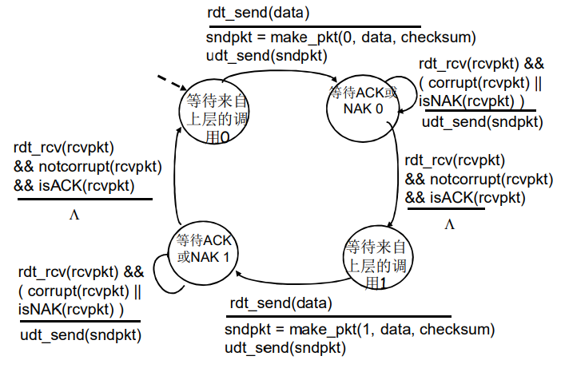

### rdt2.1：接收方处理出错的ACK/NAK

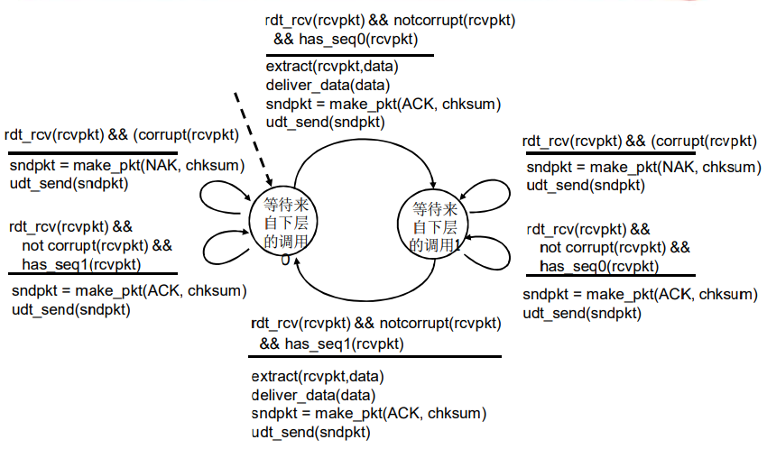

### rdt2.1：讨论

发送方：

- 在分组中加入序列号
- 两个序列号（0，1）就足够了
  - 一次只发送一个未经确认的分组
- 必须检测ACK/NAK是否出错（需要EDC ）
- 状态数变成了两倍
  - 必须记住当前分组的序列号为0还是1

接收方：

- 必须检测接收到的分组是否是重复的
  - 状态会指示希望接收到的 分组的序号为0还是1
- 注意：接收方并不知道发送方是否正确收到了其ACK/NAK
  - 没有安排确认的确认
  - 发送方如果没有收到确认，会继续重传老分组

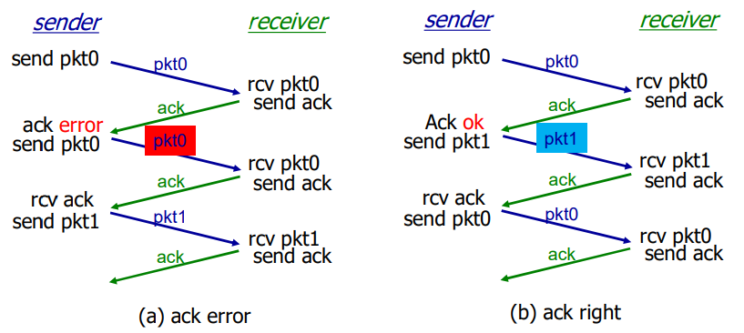

接收方不知道它最后发送的ACK/NAK是否被正确地收到

- 发送方不对收到的ack/nak给确认，**没有所谓的确认的确认**
- 接收方发送ack，如果后面接收方收到的是：
  - 老分组p0？则ack 错误
  - 下一个分组？P1，ack正确

### rdt2.2：无NAK的协议

- 功能同rdt2.1，但只使用ACK(ack 要编号）
- 接收方对**最后**正确接收的分组发ACK，以替代NAK 接收方必须显式地包含被正确接收分组的**序号**
- 当收到重复的ACK（如：再次收到ack0）时，发送方与收到NAK采取相同的动作：重传当前分组 
- 为后面的一次发送多个数据单位做一个准备
  - 一次能够发送多个
  - 每一个的应答都有：ACK，NACK；麻烦
  - 使用对前一个数据单位的ACK，代替本数据单位的nak
  - 确认信息减少一半，协议处理简单

NAK free


### rdt2.2的运行

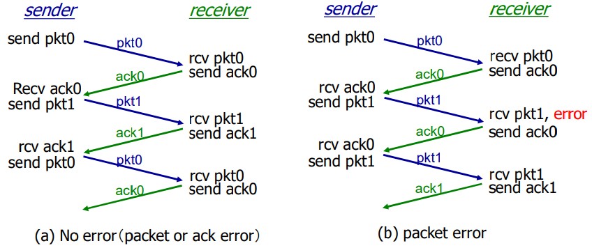

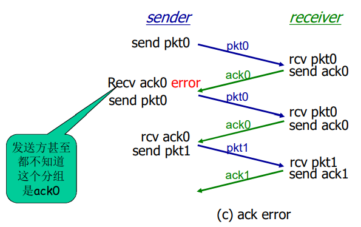

### rdt2.2：发送方和接收方片断

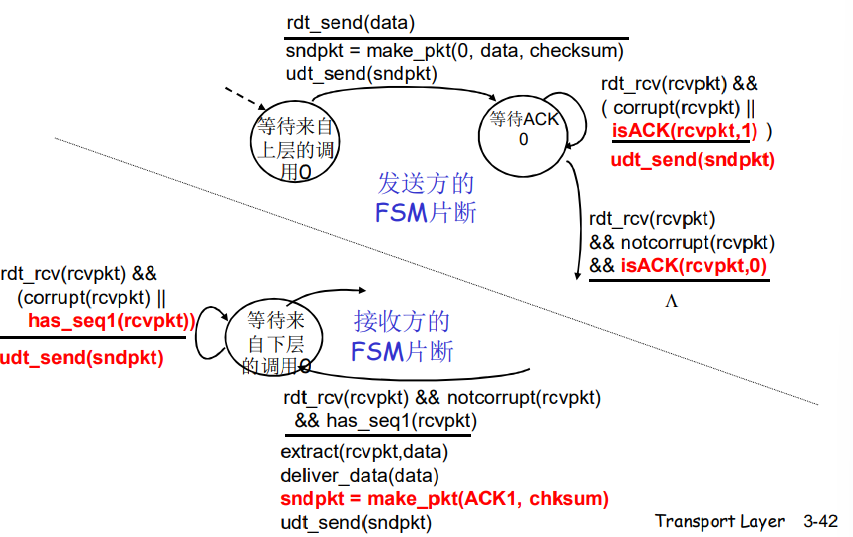

存在一个超时死锁的情况

### rdt3.0：具有比特差错和分组丢失的信道

**新的假设：**下层信道可能会丢失分组（数据或ACK）

- 会死锁
- 机制还不够处理这种状况：
  - 检验和
  - 序列号
  - ACK
  - 重传

方法：发送方等待ACK一段**合理的时间**（链路层的timeout时间确定的传输层timeout时间是适应式的）

- 发送端超时重传：如果到时没有 收到ACK->重传
- 问题：如果分组（或ACK ）只是被延迟了：
  - 重传将会导致数据重复，但利用**序列号**已经可以处理这个问题
  - 接收方必须指明被正确接收的序列号
- 需要一个倒计数定时器

### rdt3.0 发送方

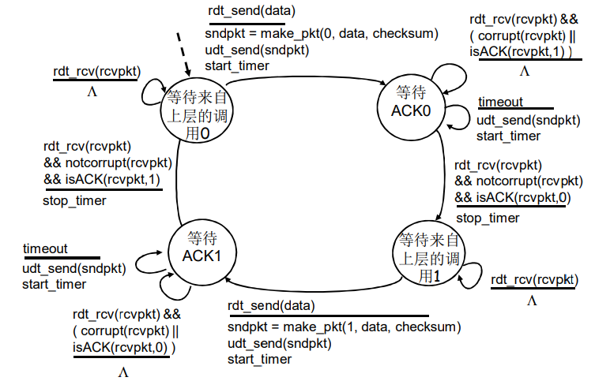

### rdt3.0的运行

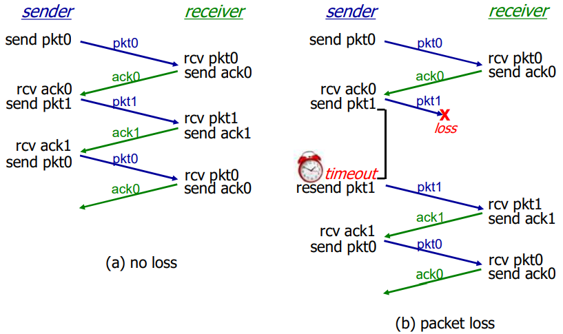

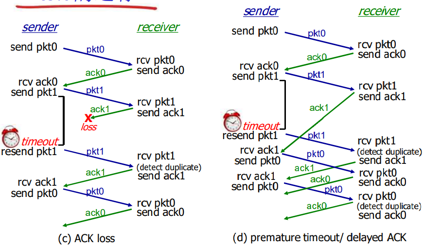

- 过早超时（延迟的ACK）也能够正常工作；但是效率较低，一半的分组和确认是重复的；
- 设置一个合理的超时时间也是比较重要的；

### rdt3.0的性能

- rdt3.0可以工作，但链路容量比较大的情况下，性能很差

  - 链路容量比较大，一次发一个PDU 的不能够充分利用链路的传输能力

- 例：1 Gbps的链路，15 ms端-端传播延时，分组大小为1kB：

  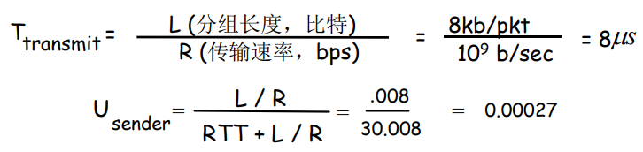

  - U sender：**利用率** – 忙于发送的时间比例
  - 每30ms发送1KB的分组 -> `270kbps=33.75kB/s` 的吞吐量（在1 Gbps 链路上）
  - **瓶颈**在于：网络协议限制了物理资源的利用！

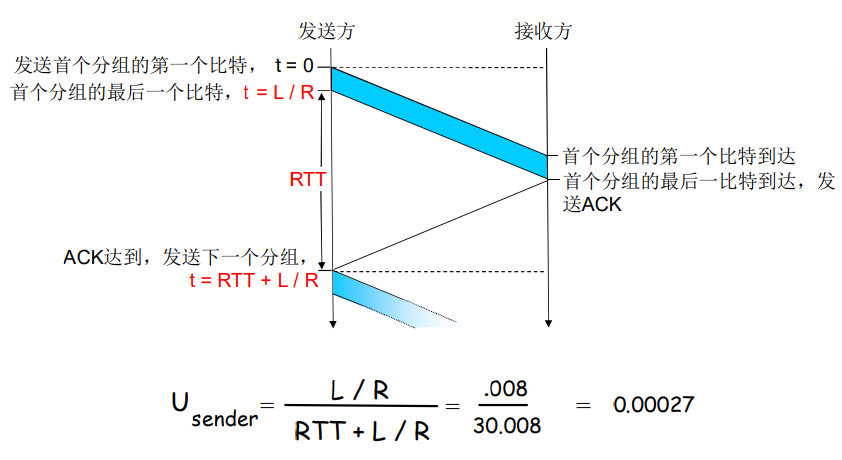

### 流水线：提高链路利用率

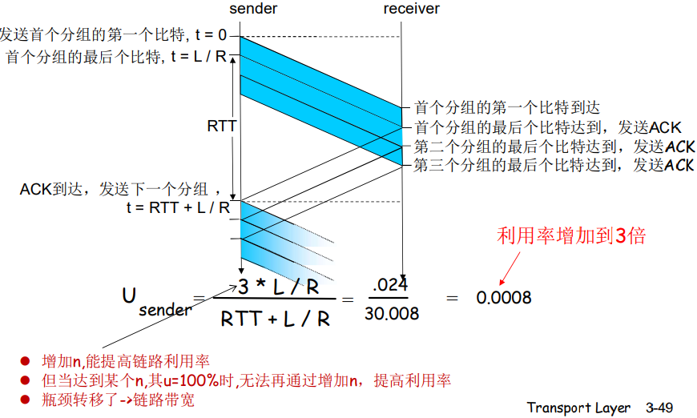

- 增加n,能提高链路利用率
- 但当达到某个n,其u=100%时,无法再通过增加n，提高利用率
- 瓶颈转移了->链路带宽

流水线：允许发送方在未得到对方确认的情况下一次发送多个分组

- 必须增加序号的范围:用多个bit表示分组的序号

- 在发送方/接收方要有缓冲区

  - 发送方缓冲：未得到确认，可能需要重传；
  - 接收方缓存：上层用户取用数据的速率≠接收到的数据速率；接收到的数据可 能乱序，排序交付（可靠）

  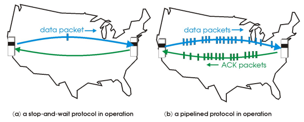

- 两种通用的流水线协议：**回退N步(GBN)**和**选择重传(SR)**

### 通用：滑动窗口(slide window)协议

- 发送缓冲区
  - 形式：内存中的一个区域，落入缓冲区的分组可以发送
  - 功能：用于存放已发送，但是没有得到确认的分组
  - 必要性：需要重发时可用
- 发送缓冲区的大小：一次最多可以发送多少个未经确认的分组
  - 停止等待协议=1
  - 流水线协议>1，合理的值，不能很大，链路利用率不能够超100%
- 发送缓冲区中的分组
  - **未发送的**：落入发送缓冲区的分组，可以连续发送出去；
  - **已经发送出去的、等待对方确认的分组**：发送缓冲区的分组只有得到确认才能删除

### 发送窗口滑动过程

> 相对表示方法

- 采用相对移动方式表示，分组不动

- 可缓冲范围移动，代表一段可以发送的权力

  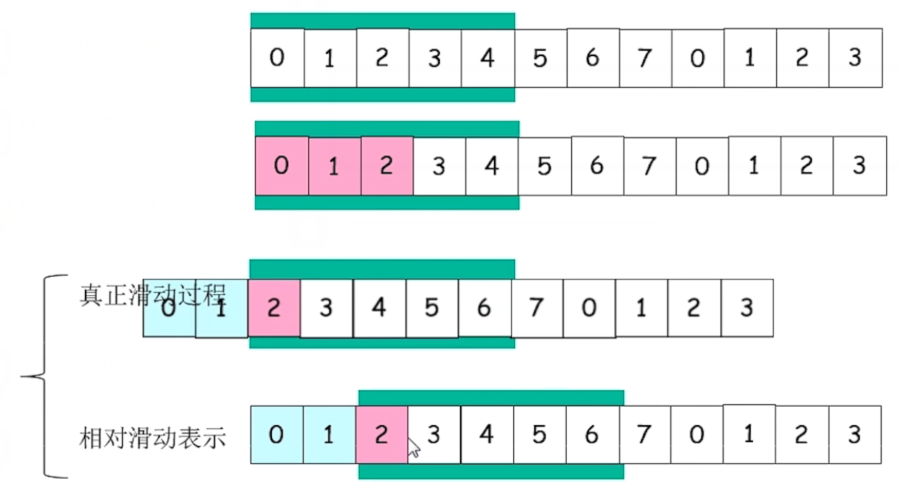

- 发送窗口：发送缓冲区内容的一个范围

  - 那些**已发送**但是**未经确认**分组的序号构成的空间

- 发送窗口的最大值<=发送缓冲区的值

- 一开始：没有发送任何一个分组

  - 后沿=前沿
  - 之间为发送窗口的尺寸=0

- 每发送一个分组，前沿前移一个单位

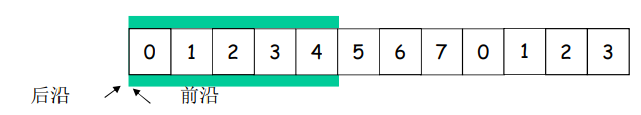

> 前沿移动

发送窗口前沿移动的极限：不能够超过发送缓冲区

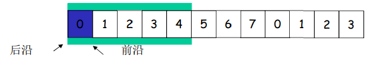

> 后沿移动

- 发送窗口后沿移动
  - 条件：收到老分组的确认
  - 结果：发送缓冲区罩住新的分组，来了分组可以发送
  - 移动的极限：不能够超过前沿

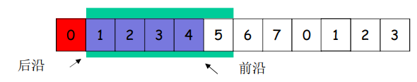

### 滑动窗口协议

- 发送窗口 (sending window)

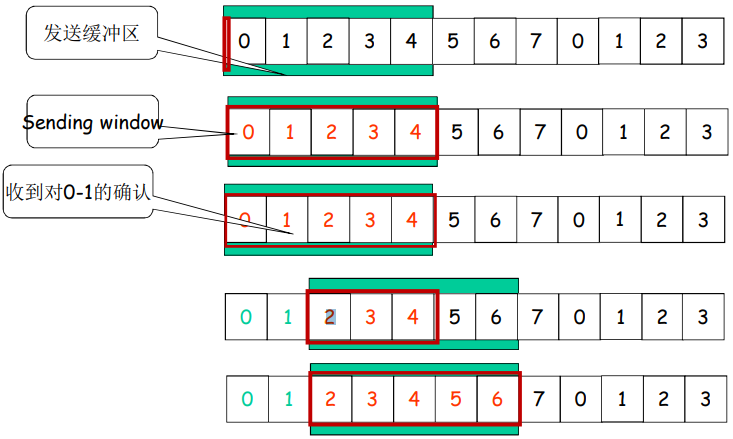

- 接收窗口 (receiving window)=接收缓冲区
  - 接收窗口用于控制哪些分组可以接收；
    - 只有收到的分组序号落入接收窗口内才允许接收
    - 若序号在接收窗口之外，则丢弃；
  - 接收窗口尺寸Wr=1，则只能顺序接收；
  - 接收窗口尺寸Wr>1 ，则可以乱序接收
    - 但提交给上层的分组，要按序
  - 例子：Wr＝1，在0的位置；只有0号分组可以接收；向前滑动一个，罩在1的位置，如果来了第2号分组，则丢弃；

- 接收窗口的滑动和发送确认
  - 滑动：
    - 低序号的分组到来，接收窗口移动；
    - 高序号分组乱序到，缓存但不交付（因为要实现rdt，不允许失序），不滑动
  - 发送确认：
    - 接收窗口尺寸=1 ； 发送连续收到的最大的分组确认（**累计确认**）
    - 接收窗口尺寸>1 ； 收到分组，发送那个分组的确认（**非累计确认**）

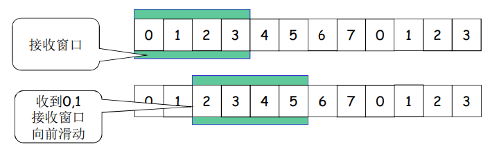

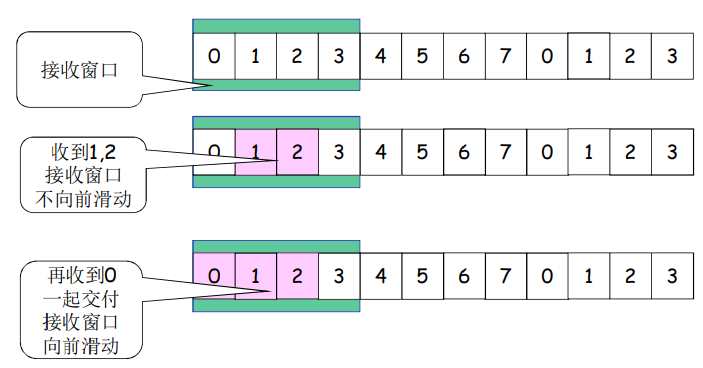

> 正常情况下的2个窗口互动

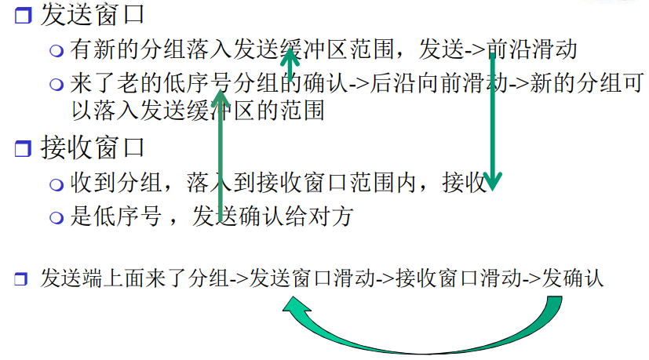

> 异常情况下GBN的2窗口互动

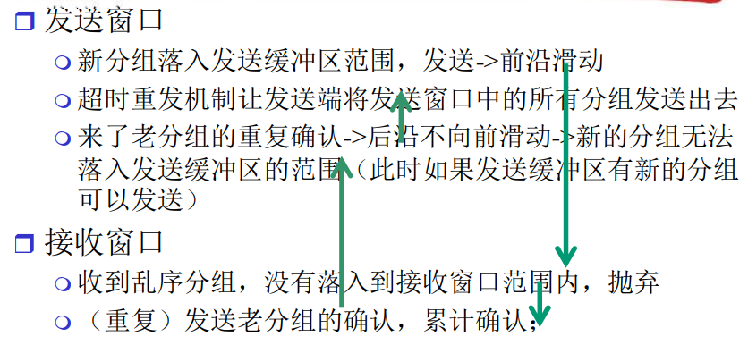

**可能存在老分组确认后面的分组传输超时**

> 异常情况下SR的2窗口互动

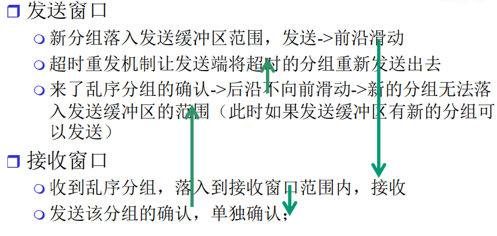

### GBN协议和SR协议的异同

- 相同之处
  - 发送窗口>1
  - 一次能够可发送多个未经确认的分组
- 不同之处
  - GBN :接收窗口尺寸=1
    - 接收端：只能顺序接收
    - 发送端：从表现来看，一旦一个分组没有发成功，如：0,1,2,3,4 ; 假如1未成功，234都发送出去了，**要返回1再发送；GB1**
  - SR: 接收窗口尺寸>1
    - 接收端：可以乱序接收
    - 发送端：发送0,1,2,3,4，一旦1未成功，2,3,4,已发送，无需重发，**选择性发送1**

### 流水线协议：总结

**Go-back-N:**

- 发送端最多在流水线中有N个未确认的分组
- 接收端只是发送累计 型确认**cumulative ack**
  - 接收端如果发现gap， 不确认新到来的分组
- 发送端拥有对最老的未确认分组的定时器
  - 只需设置**一个定时器**
  - 当定时器到时时，**重传所有未确认分组**

**Selective Repeat:**

- 发送端最多在流水线中有N个未确认的分组
- 接收方对每个到来的分组单独确认**individual ack（非累计确认）**
- 发送方为每个**未确认的分组保持一个定时器**
  - 当超时定时器到时，只是重发到时的未确认分组

### GBN：发送方扩展的FSM

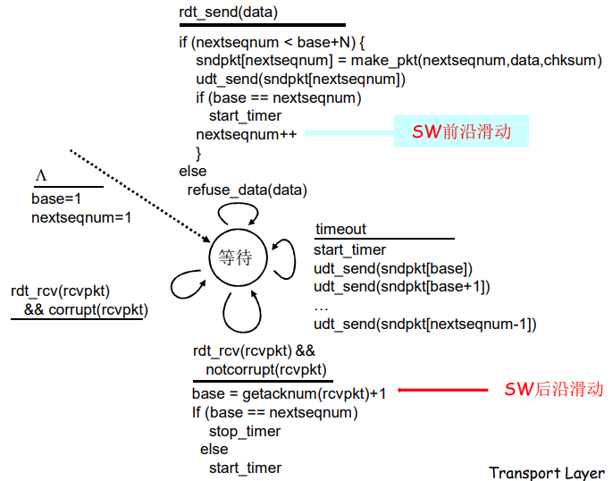

### GBN：接收方扩展的FSM

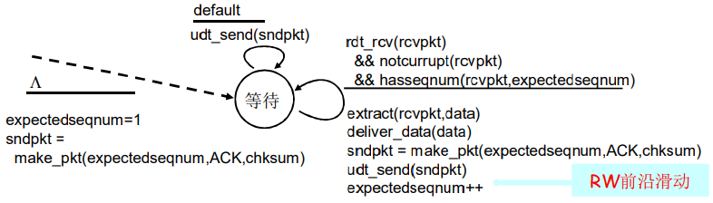

- 只发送ACK：对顺序接收的最高序号的分组
  - 可能会产生重复的ACK
  - 只需记住expectedseqnum；接收窗口=1
    - 只一个变量就可表示接收窗口
- 对乱序的分组：
  - 丢弃（不缓存）-> 在接收方不被缓存！
  - 对顺序接收的最高序号的分组进行确认-累计确认

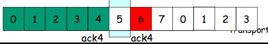

### 运行中的GBN

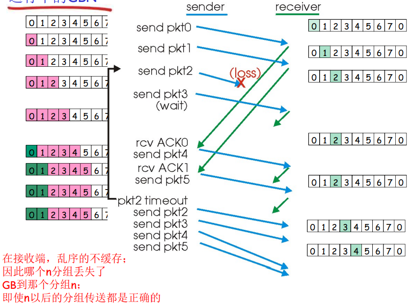

- 在接收端，乱序的不缓存；
- 因此哪个n分组丢失了 GB到那个分组n；
- 即使n以后的分组传送都是正确的

### 选择重传SR

- 接收方对每个正确接收的分组，分别发送 ACKn（非累积确认）
  - 接收窗口>1
    - 可以缓存乱序的分组
  - 最终将分组按顺序交付给上层
- 发送方只对那些没有收到ACK的分组进行重发-选择性重发
- 发送方为每个未确认的分组设定一个定时器
- 发送窗口的最大值（发送缓冲区）限制发送未确认分组的个数

> 发送方

**从上层接收数据：**

- 如果下一个可用于该分组的序 号可在发送窗口中，则发送

**timeout(n):**

- 重新发送分组n，重新设定定时器

**ACK(n) in [sendbase,sendbase+N]:**

- 将分组n标记为已接收
- 如n为最小未确认的分组序号， 将base移到下一个未确认序号

> 接收方

**分组n [rcvbase, rcvbase+N-1]**

- 发送ACK(n)
- 乱序：缓存
- 有序：该分组及以前缓存的 序号连续的分组交付给上层 ，然后将窗口移到下一个仍 未被接收的分组

**分组n [rcvbase-N, rcvbase-1]**

- ACK(n)

**其它：**

- 忽略该分组

### 选择重传SR的运行

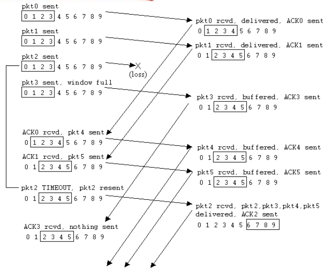

### 对比GBN和SR

|       | GBN                                    | SR                                       |
| ----- | -------------------------------------- | ---------------------------------------- |
| 优 点 | 简单，所需资源少（接收方一个缓存单元） | 出错时，重传一个代价小                   |
| 缺 点 | 一旦出错，回退N步代价大                | 复杂，所需要资源多（接收方多个缓存单元） |

适用范围

- 出错率低：比较适合GBN，出错非常罕见，没有必要用复杂的SR，为罕见的事件做日常的准备和复杂处理
- 链路容量大（延迟大、带宽大）：比较适合SR而不是GBN，一点出错代价太大

### 窗口的最大尺寸

- GBN: 2^n -1
  - 这样理解的，假设0-6 把7空出来当作特殊值备用，由于 ACK确认帧全部丢失了，发送端只能重新发送旧的0-6，接受端并不知道是旧的，就当新的来用。出错！！！
  - 但是如果发送端按照这个规则：（旧帧0123456） （新帧7012345）接受端就能判断是否是新帧还是旧帧了。在接收到0到6后，罩在7位置上，这时候来了重发的0，拒绝了，就不会将老的当新的了。

- SR:2^(n-1)

例如：n=2; 序列号：0, 1, 2, 3

- GBN =3
- SR=2

SR的例子：

- 接收方看不到二者的区别！
- 将重复数据误认为新数据 (a)

Q: 序号大小与窗口大小之间的关系？

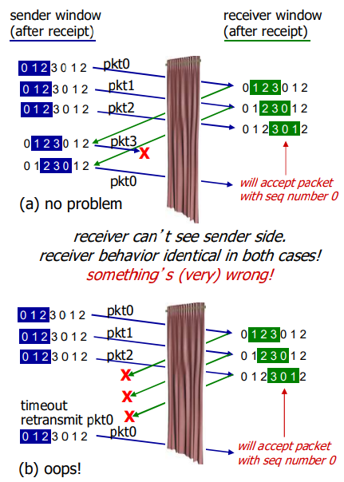