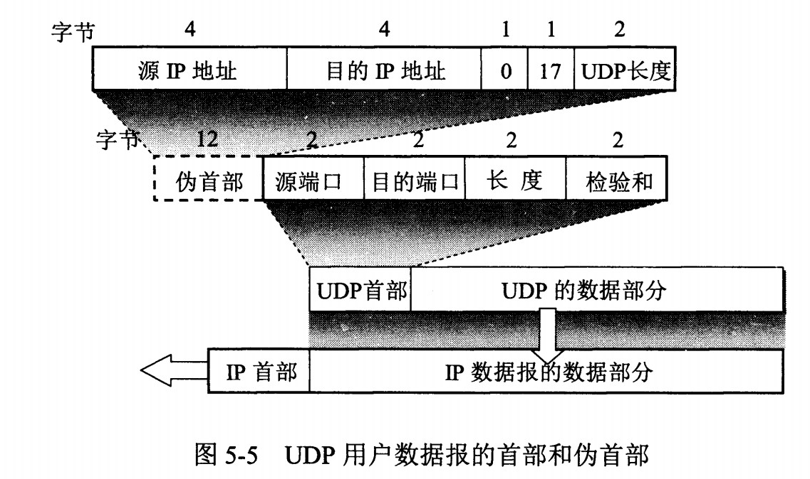
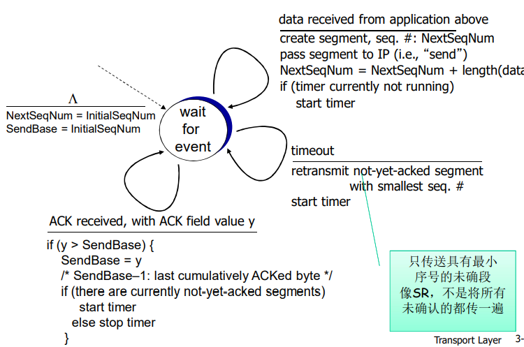
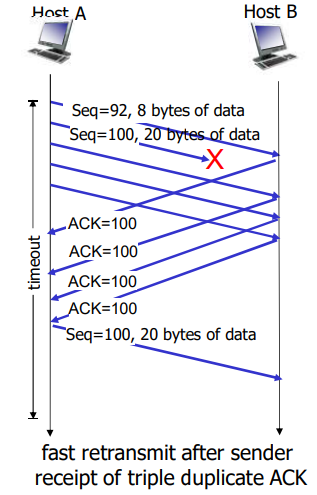
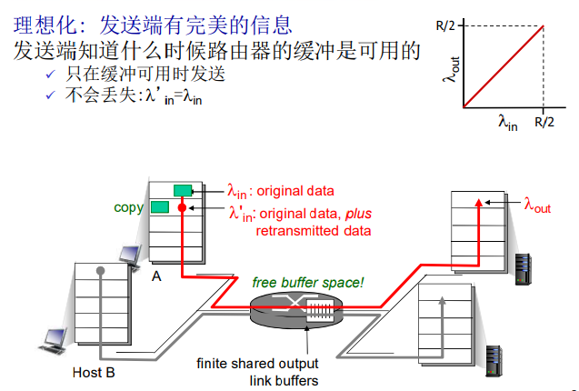
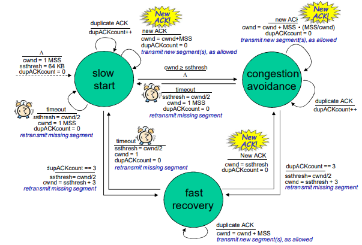
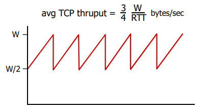

# 传输层

目标：

- 理解传输层的工作原理
  - 多路复用/解复用
  - 可靠数据传输
  - 流量控制
  - 拥塞控制

- 学习Internet的传输层协议
  - UDP：无连接传输
  - TCP：面向连接的可靠传输
  - TCP的拥塞控制

## 概述和传输层服务

- 为运行在不同主机上的应用进程提供**逻辑通信**
- 传输协议运行在端系统
  - 发送方：将应用层的报文分成报文段，然后传递给网络层
  - 接收方：将报文段重组成报文，然后传递给应用层
- 有多个传输层协议可供应 用选择
  - Internet: TCP和UDP


### 传输层 vs. 网络层

网络层服务：

- 主机之间 的逻辑通信
- 传输层服务：进程间的逻辑通信
  - 依赖于网络层的服务
    - 延时、带宽
  - 并对网络层的服务进行增强
    - 数据丢失、顺序混乱、 加密

> 类比：东西2个家庭的通信

Ann家的12个小孩给另Bill家的 12个小孩发信

- 主机 = 家庭
- 进程 = 小孩
- 应用层报文= 信封中的信件
- 传输协议= Ann 和 Bill
  - 为家庭小孩提供复用解复用服务
- 网络层协议 = 邮政服务
  - 家庭-家庭的邮包传输服务

### Internet传输层协议

提供进程与进程之间以Message为单位的逻辑通信，使得远端的两个进程可以逻辑通信，（逻辑通信大致可以理解为，表面上通过socket就可以进行通信，其实底层做了很多工作），

**TCP复用与解复用**，大致流程为：上层Message传输下来，分成若干段，加上段头段尾，交给下层传输，接收端收到数据，去掉段头整理程Message，交给上层）

注意一点：**TCP向上层提供的是字节流的服务，保障这个字节流是正常的，不保证报文的界限，应用层考自己协议的标识**

**传输层可以对有一些服务品质加强**，例如：带宽（拥塞控制）和延迟（滑动窗口）

- 可靠的、保序的传输： TCP
  - 多路复用、解复用
  - 拥塞控制
  - 流量控制
  - 建立连接
- 不可靠、不保序的传输：UDP
  - 多路复用、解复用
  - 没有为尽力而为的IP服务添加更多的其它额外服务
- 都不提供的服务：
  - 延时保证
  - 带宽保证


## 多路复用与解复用

### 多路复用/解复用

> 在发送方主机多路复用

从多个套接字接收来自多个进程的报文，根据套接字对应的IP地址和端口号等信息对报文段用头部加以封装 (该头部信息用于以后的解复用)

> 在接收方主机多路解复用

根据报文段的头部信息中的IP地址和端口号将接收到的报文段发给正确的套接字(和对应的应用进程)


### 多路解复用工作原理

- 解复用作用：TCP或者UDP实体采用哪些信息，将报文段的数据部分交给正确的socket，从而交给正确的进程
- 主机收到IP数据报
  - 每个数据报有源IP地址和目标地址
  - 每个数据报承载一个传输层报文段
  - 每个报文段有一个源端口号和目标端口号 (特定应用有著名的端口号)
- 主机联合使用**IP地址**和**端口号**将报文段发送给合适的套接字


UDP头部有源IP地址、目标IP地址，而TCP头部没有，关于TCP报头没有IP字段的解释：对这方面的理解不能停留在理论上，确实，如果如书本上说的，每一层只管自己要的，dns解析的ip地址确实没法发到网络层，因为传输层tcp关注的头数据并不包括ip。但题主也知道，这样就没法工作了，所以实现上dns解析出ip地址后建立socket，然后进行connect系统调用的时候，ip地址实际上是作为参数传进去了，只不过tcp头封装的时候没放进去，而是放在ip头里面去了，这些东西书本上是讲标准，讲分层，但实现上可能就是程序。所以题主可以看看unix的socket编程，然后就不会陷入一种定式上了。

函数原型

```c
int socket(int domain, int type, int protocol);
```

### 无连接(UDP)多路解复用

- 创建套接字：

  服务器端：

  ```c
  /* 
  AF = Address Family
  PF = Protocol Family
  AF_INET = PF_INET
  1. 理论上，建立socket时是指定协议，应该用PF_XXXX，设置地址时应该用AF_XXXX。当然AF_INET和PF_INET的值是相同的，混用也不会有太大的问题
  2. 在函数socketpair与socket的domain参数中有AF_UNIX, AF_LOCAL, AF_INET, PF_UNIX, PF_LOCAL, PF_INET这几个参数有  AF_UNIX = AF_LOCAL, PF_UNIX = PF_LOCAL, AF_LOCAL = PF_LOCAL, AF_INET = PF_INET
  3. SOCK_DGRAM分是数据包,是UDP协议网络编程,第二个参数指定要创建的套接字类型，流套接字类型为SOCK_STREAM、数据报套接字类型为SOCK_DGRAM、原始套接字SOCK_RAW(WinSock接口并不适用某种特定的协议去封装它，而是由程序自行处理数据包以及协议首部）；两个重要的类型是 SOCK_STREAM 和 SOCK_DGRAM。 SOCK_STREAM表明数据像字符流 一样通过 socket 。而 SOCK_DGRAM 则表明数据将是数据报(datagrams)的形式。
  */
  serverSocket=socket(PF_INET,SOCK_DGRAM,0);
  // 绑定服务端口，
  bind(serverSocket, &sad, sizeof(sad));
  ```

  客户端：

  ```c
  // 客户端虽然代码没有bind，但是隐式的也对和本机IP和端口做了捆绑（客户端端口指定有一定的随机性）
  ClientSocket=socket(PF_INET,SOCK_DGRAM,0);
  ```

  没有Bind,ClientSocket和OS为之分配的某个端口号捆绑（客户端使用什么端口号无所谓，客户端主动找服务器）

- 在接收端，UDP套接字用二元组标识 **(目标IP地址、目标端口号)**

  

- 当主机收到UDP报文段：

  - 检查报文段的目标端口号
  - 用该端口号将报文段定位给套接字

- 如果两个不同源IP地址/源端口号的数据报，但是**有相同的目标IP地址和端口号**，则被定位到相同的套接字

### 无连接的多路解复用

- 回顾: 创建拥有本地端口号的套接字`DatagramSocket mySocket1 = new DatagramSocket(12534)`，当创建UDP段采用端口 号，可以指定：
  - 目标IP地址
  - 目标端口号

- 当主机接收到UDP段时：
  - 检查UDP段中的目标端口号 
  - 将UDP段交给具备那个端口号的套接字
  - （具备相同**目标IP地址**和**目标端口号**，即使是**源IP地址或/且源端口号**的IP数据报，将会被传到相同的目标UDP套接字上）


### 面向连接(TCP)的多路复用

- TCP套接字:四元组本地标识：
  - 源IP地址
  - 源端口号
  - 目的IP地址
  - 目的端口号
- **解复用**：接收主机用 这四个值来将数据报定位到合适的套接字
- 服务器能够在一个TCP端口上同时支持多个 TCP套接字：
  - 每个套接字由其四元组标识（有不同的源IP和源 PORT）
- Web服务器对每个连接客户端有不同的套接字
  - 非持久对每个请求有不同的套接字


### 面向连接的多路复用：多线程Web Server


- 一个进程下面可能有多个线程：由多个线程分别为客户提供服务
- 在这个场景下，还是根据4元组决定将报文段内容同一个进程下的不同线程
- 解复用到不同线程

## 无连接传输：UDP

### UDP Datagram 和 TCP Message Segment报文的区别

> 知乎回答：
>
> https://www.zhihu.com/question/68641339

我的理解是：

- TCP考虑到本机的链路层的MTU，假如使用以太网协议，则每个帧只能传输1514个字节，除网络层头部和帧头帧尾，大约还有1480个字节，所以TCP就会设置一个MSS大小为1480字节，避免从我本机发出的分组报文在网络层传输**（但是在网络传输中还是可能会分片，例如中间路由跳转导致链路的通道大小变小，所以还是会分片，只是避免了从本机发出去的报文就会分片的情况，但是可以通过ICMP控制报文反馈，如果在链路传输中还是出现了分片，继续调小MSS的大小为合适）**，所以这就是TCP传输报文称为TCP Message Segment的原因**（既可能多个Message组合传输，也可能一个大Message分成多个传输）**，所以说TCP向上层协议提供的是字节流的服务，不定义Message边界
- UDP就不管那么多了，不管你链路层MTU的大小，应用层交给我的Message无论多大我都直接一次性传输，尽管如果Message很大，在网络层需要分片再传输，但是在传输层的UDP看来，如果传输成功，就好像是一次性传输了一个Datagram**（不过一般应用层基于UDP设计的协议，还是不会一次性传输过大的Message，因为在网络层分片的话确实会导致传输失败的概率增大，所以UDP可以看作是一个很基础的传输层协议，给应用层提供了很多二次开发的可能性）**

### UDP: User Datagram Protocol [RFC 768]

- “no frills,” “bare bones”Internet传输协议
- “尽力而为”的服务，报文段可能
  - 丢失
  - 送到应用进程的报文段乱序
- **无连接：**
  - UDP发送端和接收端之间没有握手
  - 每个UDP报文段都被独立地处理

- UDP 被用于:
  - 流媒体（丢失不敏感， 速率敏感、应用可控制 传输速率）
  - DNS
  - SNMP
- 在UDP上可行可靠传输:
  - 在应用层增加可靠性
  - 应用特定的差错恢复

### UDP：用户数据报协议



为什么要有UDP?

- 不建立连接 （会增加延时 ）
- 简单：在发送端和接收端没有连接状态
- 报文段的头部很小(开销小)(TCP20字节，UDP8字节，类似理解为卡车头部，头部太大了，效率就会低)
- 无拥塞控制和流量控制： UDP可以尽可能快的发送报文段
  - 应用->传输的速率= 主机->网 络的速率

### UDP校验和

目标： 检测在被传输报文段中的差错 (如比特反转)

**残存错误**：类似负负得正的现象，错到一块了(检验范围+检验和也为全1)，结果通过校验了

发送方：

- 将报文段的内容视为16 比特的整数
- 校验和：报文段的加法和 （1的补运算）
- 发送方将校验和放在UDP的校验和字段

接收方：

- 计算接收到的报文段的校验和
- 检查计算出的校验和与校验 和字段的内容是否相等：
  - 不相等–--检测到差错
  - 相等–--没有检测到差错 ，但也许还是有差
    - 残存错误

### Internet校验和的例子

- 注意：当数字相加时，在最高位的进位要回卷(进位回滚)，再加到结果上

例子：两个16比特的整数相加


- 目标端：
  - **校验范围+校验和=1111111111111111** 通过校验
  - 否则没有通过校验
- 注：求和时，必须将进位回卷到结果上

## 可靠数据传输的原理

ps：有很少的一些网络，在数据链路层实现了可靠传输

### 可靠数据传输（rdt）的原理

- rdt在应用层、传输层和数据链路层都很重要
  - 是

- 网络Top 10问题之一


- 信道的不可靠特点决定了可靠数据传输协议（ rdt ）的复杂性


我们将：

- 渐增式地开发可靠数据传输协议（ rdt ）的发送方和接收方
- 只考虑单向数据传输
  - 但控制信息是双向流动的！
- 双向的数据传输问题实际上是2个单向数据传输问题的综合
- 使用有限状态机 (FSM) 来描述发送方和接收方


### Rdt1.0： 在可靠信道上的可靠数据传输

- 下层的信道是完全可靠的
  - 没有比特出错
  - 没有分组丢失
- 发送方和接收方的FSM
  - 发送方将数据发送到下层信道
  - 接收方从下层信道接收数据


### Rdt2.0：具有比特差错的信道

- 下层信道可能会出错：将分组中的比特翻转
  - 用校验和来检测比特差错
- 问题：怎样从差错中恢复：
  - **确认(ACK)**：接收方显式地告诉发送方分组已被正确接收
  - **否定确认( NAK)**: 接收方显式地告诉发送方分组发生了差错
    - 发送方收到NAK后，发送方重传分组
- rdt2.0中的新机制：采用差错控制编码进行差错检测
  - 发送方差错控制编码、缓存
  - 接收方使用编码检错
  - 接收方的反馈：控制报文（ACK，NAK）：接收方->发送方
  - 发送方收到反馈相应的动作

### rdt2.0：FSM描述


### rdt2.0：没有差错时的操作


### rdt2.0：有差错时


### rdt2.0的致命缺陷！-> rdt2.1

**如果ACK/NAK出错？**

- 发送方不知道接收方发 生了什么事情！
- 发送方如何做？
  - 重传？可能重复
  - 不重传？可能死锁(或出错)
- 需要引入新的机制
  - 序号

处理重复：

- 发送方在每个分组中加入**序号**
- 如果ACK/NAK出错，发 送方**重传**当前分组
- 接收方丢弃（不发给上层）重复分组

停等协议：发送方发送一个分组， 然后等待接收方的应答

### rdt2.1：发送方处理出错的ACK/NAK


### rdt2.1：接收方处理出错的ACK/NAK


### rdt2.1：讨论

发送方：

- 在分组中加入序列号
- 两个序列号（0，1）就足够了
  - 一次只发送一个未经确认的分组
- 必须检测ACK/NAK是否出错（需要EDC ）
- 状态数变成了两倍
  - 必须记住当前分组的序列号为0还是1

接收方：

- 必须检测接收到的分组是否是重复的
  - 状态会指示希望接收到的 分组的序号为0还是1
- 注意：接收方并不知道发送方是否正确收到了其ACK/NAK
  - 没有安排确认的确认
  - 发送方如果没有收到确认，会继续重传老分组


接收方不知道它最后发送的ACK/NAK是否被正确地收到

- 发送方不对收到的ack/nak给确认，**没有所谓的确认的确认**
- 接收方发送ack，如果后面接收方收到的是：
  - 老分组p0？则ack 错误
  - 下一个分组？P1，ack正确

### rdt2.2：无NAK的协议

- 功能同rdt2.1，但只使用ACK(ack 要编号）
- 接收方对**最后**正确接收的分组发ACK，以替代NAK 接收方必须显式地包含被正确接收分组的**序号**
- 当收到重复的ACK（如：再次收到ack0）时，发送方与收到NAK采取相同的动作：重传当前分组 
- 为后面的一次发送多个数据单位做一个准备
  - 一次能够发送多个
  - 每一个的应答都有：ACK，NACK；麻烦
  - 使用对前一个数据单位的ACK，代替本数据单位的nak
  - 确认信息减少一半，协议处理简单

NAK free


### rdt2.2的运行


### rdt2.2：发送方和接收方片断


存在一个超时死锁的情况

### rdt3.0：具有比特差错和分组丢失的信道

**新的假设：**下层信道可能会丢失分组（数据或ACK）

- 会死锁
- 机制还不够处理这种状况：
  - 检验和
  - 序列号
  - ACK
  - 重传

方法：发送方等待ACK一段**合理的时间**（链路层的timeout时间确定的传输层timeout时间是适应式的）

- 发送端超时重传：如果到时没有 收到ACK->重传
- 问题：如果分组（或ACK ）只是被延迟了：
  - 重传将会导致数据重复，但利用**序列号**已经可以处理这个问题
  - 接收方必须指明被正确接收的序列号
- 需要一个倒计数定时器

### rdt3.0 发送方


### rdt3.0的运行


- 过早超时（延迟的ACK）也能够正常工作；但是效率较低，一半的分组和确认是重复的；
- 设置一个合理的超时时间也是比较重要的；

### rdt3.0的性能

- rdt3.0可以工作，但链路容量比较大的情况下，性能很差

  - 链路容量比较大，一次发一个PDU 的不能够充分利用链路的传输能力

- 例：1 Gbps的链路，15 ms端-端传播延时，分组大小为1kB：

  

  - U sender：**利用率** – 忙于发送的时间比例
  - 每30ms发送1KB的分组 -> `270kbps=33.75kB/s` 的吞吐量（在1 Gbps 链路上）
  - **瓶颈**在于：网络协议限制了物理资源的利用！


### 流水线：提高链路利用率


- 增加n,能提高链路利用率
- 但当达到某个n,其u=100%时,无法再通过增加n，提高利用率
- 瓶颈转移了->链路带宽

流水线：允许发送方在未得到对方确认的情况下一次发送多个分组

- 必须增加序号的范围:用多个bit表示分组的序号

- 在发送方/接收方要有缓冲区

  - 发送方缓冲：未得到确认，可能需要重传；
  - 接收方缓存：上层用户取用数据的速率≠接收到的数据速率；接收到的数据可 能乱序，排序交付（可靠）

  

- 两种通用的流水线协议：**回退N步(GBN)**和**选择重传(SR)**

### 通用：滑动窗口(slide window)协议

- 发送缓冲区
  - 形式：内存中的一个区域，落入缓冲区的分组可以发送
  - 功能：用于存放已发送，但是没有得到确认的分组
  - 必要性：需要重发时可用
- 发送缓冲区的大小：一次最多可以发送多少个未经确认的分组
  - 停止等待协议=1
  - 流水线协议>1，合理的值，不能很大，链路利用率不能够超100%
- 发送缓冲区中的分组
  - **未发送的**：落入发送缓冲区的分组，可以连续发送出去；
  - **已经发送出去的、等待对方确认的分组**：发送缓冲区的分组只有得到确认才能删除

### 发送窗口滑动过程

> 相对表示方法

- 采用相对移动方式表示，分组不动

- 可缓冲范围移动，代表一段可以发送的权力

  

- 发送窗口：发送缓冲区内容的一个范围

  - 那些**已发送**但是**未经确认**分组的序号构成的空间

- 发送窗口的最大值<=发送缓冲区的值

- 一开始：没有发送任何一个分组

  - 后沿=前沿
  - 之间为发送窗口的尺寸=0

- 每发送一个分组，前沿前移一个单位


> 前沿移动

发送窗口前沿移动的极限：不能够超过发送缓冲区


> 后沿移动

- 发送窗口后沿移动
  - 条件：收到老分组的确认
  - 结果：发送缓冲区罩住新的分组，来了分组可以发送
  - 移动的极限：不能够超过前沿


### 滑动窗口协议

- 发送窗口 (sending window)


- 接收窗口 (receiving window)=接收缓冲区
  - 接收窗口用于控制哪些分组可以接收；
    - 只有收到的分组序号落入接收窗口内才允许接收
    - 若序号在接收窗口之外，则丢弃；
  - 接收窗口尺寸Wr=1，则只能顺序接收；
  - 接收窗口尺寸Wr>1 ，则可以乱序接收
    - 但提交给上层的分组，要按序
  - 例子：Wr＝1，在0的位置；只有0号分组可以接收；向前滑动一个，罩在1的位置，如果来了第2号分组，则丢弃；

- 接收窗口的滑动和发送确认
  - 滑动：
    - 低序号的分组到来，接收窗口移动；
    - 高序号分组乱序到，缓存但不交付（因为要实现rdt，不允许失序），不滑动
  - 发送确认：
    - 接收窗口尺寸=1 ； 发送连续收到的最大的分组确认（**累计确认**）
    - 接收窗口尺寸>1 ； 收到分组，发送那个分组的确认（**非累计确认**）


> 正常情况下的2个窗口互动


> 异常情况下GBN的2窗口互动


**可能存在老分组确认后面的分组传输超时**

> 异常情况下SR的2窗口互动


### GBN协议和SR协议的异同

- 相同之处
  - 发送窗口>1
  - 一次能够可发送多个未经确认的分组
- 不同之处
  - GBN :接收窗口尺寸=1
    - 接收端：只能顺序接收
    - 发送端：从表现来看，一旦一个分组没有发成功，如：0,1,2,3,4 ; 假如1未成功，234都发送出去了，**要返回1再发送；GB1**
  - SR: 接收窗口尺寸>1
    - 接收端：可以乱序接收
    - 发送端：发送0,1,2,3,4，一旦1未成功，2,3,4,已发送，无需重发，**选择性发送1**

### 流水线协议：总结

**Go-back-N:**

- 发送端最多在流水线中有N个未确认的分组
- 接收端只是发送累计 型确认**cumulative ack**
  - 接收端如果发现gap， 不确认新到来的分组
- 发送端拥有对最老的未确认分组的定时器
  - 只需设置**一个定时器**
  - 当定时器到时时，**重传所有未确认分组**

**Selective Repeat:**

- 发送端最多在流水线中有N个未确认的分组
- 接收方对每个到来的分组单独确认**individual ack（非累计确认）**
- 发送方为每个**未确认的分组保持一个定时器**
  - 当超时定时器到时，只是重发到时的未确认分组

### GBN：发送方扩展的FSM


### GBN：接收方扩展的FSM


- 只发送ACK：对顺序接收的最高序号的分组
  - 可能会产生重复的ACK
  - 只需记住expectedseqnum；接收窗口=1
    - 只一个变量就可表示接收窗口
- 对乱序的分组：
  - 丢弃（不缓存）-> 在接收方不被缓存！
  - 对顺序接收的最高序号的分组进行确认-累计确认


### 运行中的GBN


- 在接收端，乱序的不缓存；
- 因此哪个n分组丢失了 GB到那个分组n；
- 即使n以后的分组传送都是正确的

### 选择重传SR

- 接收方对每个正确接收的分组，分别发送 ACKn（非累积确认）
  - 接收窗口>1
    - 可以缓存乱序的分组
  - 最终将分组按顺序交付给上层
- 发送方只对那些没有收到ACK的分组进行重发-选择性重发
- 发送方为每个未确认的分组设定一个定时器
- 发送窗口的最大值（发送缓冲区）限制发送未确认分组的个数

> 发送方

**从上层接收数据：**

- 如果下一个可用于该分组的序 号可在发送窗口中，则发送

**timeout(n):**

- 重新发送分组n，重新设定定时器

**ACK(n) in [sendbase,sendbase+N]:**

- 将分组n标记为已接收
- 如n为最小未确认的分组序号， 将base移到下一个未确认序号

> 接收方

**分组n [rcvbase, rcvbase+N-1]**

- 发送ACK(n)
- 乱序：缓存
- 有序：该分组及以前缓存的 序号连续的分组交付给上层 ，然后将窗口移到下一个仍 未被接收的分组

**分组n [rcvbase-N, rcvbase-1]**

- ACK(n)

**其它：**

- 忽略该分组

### 选择重传SR的运行


### 对比GBN和SR

|       | GBN                                    | SR                                       |
| ----- | -------------------------------------- | ---------------------------------------- |
| 优 点 | 简单，所需资源少（接收方一个缓存单元） | 出错时，重传一个代价小                   |
| 缺 点 | 一旦出错，回退N步代价大                | 复杂，所需要资源多（接收方多个缓存单元） |

适用范围

- 出错率低：比较适合GBN，出错非常罕见，没有必要用复杂的SR，为罕见的事件做日常的准备和复杂处理
- 链路容量大（延迟大、带宽大）：比较适合SR而不是GBN，一点出错代价太大

### 窗口的最大尺寸

- GBN: 2^n -1
  - 这样理解的，假设0-6 把7空出来当作特殊值备用，由于 ACK确认帧全部丢失了，发送端只能重新发送旧的0-6，接受端并不知道是旧的，就当新的来用。出错！！！
  - 但是如果发送端按照这个规则：（旧帧0123456） （新帧7012345）接受端就能判断是否是新帧还是旧帧了。在接收到0到6后，罩在7位置上，这时候来了重发的0，拒绝了，就不会将老的当新的了。

- SR:2^(n-1)

例如：n=2; 序列号：0, 1, 2, 3

- GBN =3
- SR=2

SR的例子：

- 接收方看不到二者的区别！
- 将重复数据误认为新数据 (a)

Q: 序号大小与窗口大小之间的关系？


##  面向连接的传输： TCP

### TCP：概述

- **点对点：**
  - 一个发送方，一个接收方
- **可靠的、按顺序的字节流：**
  - 没有报文边界
- **管道化（流水线）：**
  - TCP拥塞控制和流量控制设置窗口大小
- **发送和接收缓存**


- **全双工数据：**
  - 在同一连接中数据流双向流动
  - MSS：最大报文段大小
    - 以太网的MTU是1500b大小限制，IP头部20字节，TCP头部20字节，剩余1460字节就是MSS
- **面向连接：**
  - 在数据交换之前，通过握手（交换控制报文） 初始化发送方、接收方的状态变量
- **有流量控制：**
  - 发送方不会淹没接收方

### TCP报文段结构


- 序号，对字节计数，就是整个字节流的偏移量
  - 第一个x
  - 第二个就是x+mss
  - ...
  - 第n个就是x+(n-1)*mss
  - 序列号一般不为0，两个进程在TCP建立连接之后，就会商量好一个初始序列号（进程1的序列号是x开始，进程2的序列号是y开始）

- 确认号，确认n-1及以前的字节
  - 确认号为555，表示确认接收到了554以及以前的字节

### TCP 序号, 确认号

序号：

- 报文段首字节的在字节流的编号

确认号:

- 期望从另一方收到的 下一个字节的序号
- 累积确认

Q:接收方如何处理乱序的报文段-没有规定，可以先缓存，也可以抛弃


### TCP往返延时（RTT）和超时

Q： 怎样设置TCP 超时？

- 比RTT要长
  - 但RTT是变化的
- 太短：太早超时
  - 不必要的重传
- 太长：对报文段丢失反应太慢，消极

Q：怎样估计RTT？

- SampleRTT：测量从报文段发出到 收到确认的时间
  - 如果有重传，忽略此次测量
- SampleRTT会变化，因此估计的 RTT应该比较平滑
  - 对几个最近的测量值求平均，而不是仅用当前的SampleRTT
  - 自适应的计算，从概率学的角度去保证却大多数的正常请求能够在RTT时间内到达


`EstimatedRTT = (1- a)*EstimatedRTT + a*SampleRTT`

- 指数加权移动平均
- 过去样本的影响呈指数衰减
- 推荐值：a = 0.125


> 设置超时

- EstimtedRTT + 安全边界时间
  - EstimatedRTT变化大 (方差大) -> 较大的安全边界时间
- SampleRTT会偏离EstimatedRTT多远：


### TCP：可靠数据传输

- TCP在IP不可靠服务的基础上建立了rdt
  - 管道化的报文段
    - GBN or SR
  - 累积确认（像GBN）
  - 单个重传定时器（像GBN）
  - 是否可以接受乱序的，没有规范

- 通过以下事件触发重传
  - 超时（只重发那个最早的未确认段：SR）
  - 重复的确认
    - 例子：收到了ACK50,之后又收到3 个ACK50

- 首先考虑简化的TCP发送方：
  - 忽略重复的确认
  - 忽略流量控制和拥塞控制

> TCP 发送方(简化版)



### TCP发送方事件：

**从应用层接收数据：**

- 用nextseq创建报文段
- 序号nextseq为报文段首字节的字节流编号
- 如果还没有运行，启动定时器
  - 定时器与最早未确认的报文段关联
  - 过期间隔： TimeOutInterval

**超时：**

- 重传后沿最老的报文段
- 重新启动定时器

**收到确认：**

- 如果是对尚未确认的报文段确认
  - 更新已被确认的报文序号
  - 如果当前还有未被确认的报文段，重新启动定时器


> 简化的 TCP 发送方

```c
NextSeqNum = InitialSeqNum
SendBase = InitialSeqNum
loop (forever) {
    switch(event) 
    
        event: data received from application above create TCP segment with sequence number NextSeqNum
            if (timer currently not running) 
                start timer pass segment to IP
            NextSeqNum = NextSeqNum + length(data)
            
        event: timer timeout 
            retransmit not-yet-acknowledged segment withsmallest sequence number
            start timer
            
        event: ACK received, with ACK field value of y
            if (y > SendBase) {
                SendBase = y
                if (there are currently not-yet-acknowledged segments) {
                    start timer
                } 
} /* end of loop forever */
```

注释：

- SendBase-1: 最后一 个累积确认的字节

例： 

- SendBase-1 = 71; y= 73, 因此接收方期望73+ ;

- y > SendBase，因此新的数据被确认

### TCP重传


### 产生TCP ACK的建议 [RFC 1122, RFC 2581]


### 快速重传

- 超时周期往往太长：
  - 在重传丢失报文段之前的延时太长
- 通过**重复**的ACK来检测报文段丢失
  - 发送方通常连续发送大量报文段
  - 如果报文段丢失，通常会引起多个重复的ACK


- 如果发送方收到同一数据的3个冗余ACK，重传最小序号的段：
  - **快速重传：**在定时器过时之前重发报文段
  - 它假设跟在被确认的数据后面的数据丢失了
    - 第一个ACK是正常的；
    - 收到第二个该段的ACK，表示接收方收到一个该段后的乱序段；
    - 收到第3，4个该段的ack，表示接收方收到该段之后的2个 ，3个乱序段，可能性非常大段丢失了

> TCP快速重传



### 快速重传算法

```c
event: ACK received, with ACK field value of y
    if (y > SendBase) {
        SendBase = y
        if (there are currently not-yet-acknowledged segments)
            start timer
    }
	else {// 已确认报文段的一个重复确认
        increment count of dup ACKs received for y
        if (count of dup ACKs received for y = 3) {// 快速重传
            resend segment with sequence number y
    }
```

### TCP 流量控制


- 接收方在其向发送方的TCP段头部的rwnd字段“通告”其空闲buffer大小
  - RcvBuffer大小通过socket选项设置 (典型默认大小为4096 字 节)
  - 很多操作系统自动调整 RcvBuffer
- 发送方限制未确认(“inflight”)字节的个数≤接收 方发送过来的 rwnd 值
- 保证接收方不会被淹没


### 连接管理

> TCP连接管理

在正式交换数据之前，发送方和接收方握手建立通信关系:

- 同意建立连接（每一方都知道对方愿意建立连接）
- 同意连接参数


> 同意建立连接

Q:在网络中，2次握手建 立连接总是可行吗？

- 变化的延迟（连接请求的段没有丢，但可能超时）
- 由于丢失造成的重传 (e.g. req_conn(x))
- 报文乱序
- 相互看不到对方


2次握手的失败场景：


### TCP3次握手


这样想，为了交换双方的初始序列号，必须要3次握手，如果2次的话，只有客户端知道自己的序列号服务端已经拿到了，服务端不知道自己的序列号客户端拿到没有


- 在这里初始序号的作用，每次建立连接选择的随机初始序号，当老数据传过来的时候，虽然端口和我一样，但是初始序号不一致，就会把当前这个老数据扔掉，避免把老的连接上的数据当成新的数据进行接收了

- 序号存在相同的可能性，可能性很低，客户端和服务端选择初始序号和时钟周期有关系，任何时刻取当前时钟的低32位，时钟在一个周期内是不断递增的，所以一个周期内不会冲突；当刚好周期一轮的时候，冲突就无法避免了，但是可能性极小，网络不能解决所有问题

> FSM


### TCP: 关闭连接

详细介绍：https://blog.csdn.net/weixin_29624785/article/details/112073385

- 客户端，服务器分别关闭它自己这一侧的连接
  - 发送FIN bit = 1的TCP段
- 一旦接收到FIN，用ACK回应
  - 接到FIN段，ACK可以和它自己发出的FIN段一起发送
- 可以处理同时的FIN交换


> TCP 挥手的异常情况

四次挥手的正常发包和应答过程，我们已经简单了解了，接下来就继续看看，四次挥手过程中，出现的异常情况。

三次握手的正常发包和应答，以及双端的状态扭转我们已经讲了，接下来就来看看在这三次握手的过程中，出现的异常情况。

- 断开连接的 FIN 包丢了。
  - 我们前面一直强调过，如果一个包发出去，在一定时间内，只要没有收到对端的「ACK」回复，均认为这个包丢了，会触发超时重传机制。而不会关心到底是自己发的包丢了，还是对方的「ACK」丢了。
  - 所以在这里，如果客户端率先发的「FIN」包丢了，或者没有收到对端的「ACK」回复，则会触发超时重传，直到触发重传的次数，直接关闭连接。
  - 对于服务端而言，如果客户端发来的「FIN」没有收到，就没有任何感知。会在一段时间后，也关闭连接。

- 服务端第一次回复的 ACK 丢了。
  - 此时因为客户端没有收到「ACK」应答，会尝试重传之前的「FIN」请求，服务端收到后，又会再重传「ACK」。
  - 而此时服务端已经进入 CLOSED-WAIT 状态，开始做断开连接前的准备工作。当准备好之后，会回复「FIN,ACK」，注意这个消息是携带了之前「ACK」的响应序号的。
  - 只要这个消息没丢，客户端可以凭借「FIN,ACK」包中的响应序号，直接从 FIN-WAIT-1 状态，进入 TIME-WAIT 状态，开始长达 2MSL 的等待。

- 服务端发送的 FIN,ACK 丢了。
  - 服务端在超时后会重传，此时客户端有两种情况，要么处于 FIN-WAIT-2 状态(之前的 ACK 也丢了)，会一直等待；要么处于 TIME-WAIT 状态，会等待 2MSL 时间。
  - 也就是说，在之后的一小段时间内客户端还在，客户端在收到服务端发来的「FIN,ACK」包后，也会回复一个「ACK」应答，并做自己的状态切换。

- 客户端最后回复的 ACK 丢了。
  - 客户端在回复「ACK」后，会进入 TIME-WAIT 状态，并开始长达 2MSL 的等待，服务端因为没有收到「ACK」的回复，会重试一段时间，直到服务端重试超时后主动断开。
  - 或者等待新的客户端接入后，收到服务端重试的「FIN」消息后，回复「RST」消息，在收到「RST」消息后，复位服务端的状态。

- 客户端收到 ACK 后，服务端跑路了。
  - 客户端在收到「ACK」后，进入了 FIN-WAIT-2 状态，等待服务端发来的「FIN」包，而如果服务端跑路了，这个包永远都等不到。
  - 在 TCP 协议中，是没有对这个状态的处理机制的。但是协议不管，系统来凑，操作系统会接管这个状态，例如在 Linux 下，就可以通过 tcp_fin_timeout 参数，来对这个状态设定一个超时时间。
  - 需要注意的是，当超过 tcp_fin_timeout 的限制后，状态并不是切换到 TIME_WAIT，而是直接进入 CLOSED 状态。

- 客户端收到 ACK 后，客户端自己跑路了。
  - 客户端收到「ACK」后直接跑路，服务端后续在发送的「FIN,ACK」就没有接收端，也就不会得到回复，会不断的走 TCP 的超时重试的机制，此时服务端处于 LAST-ACK 状态。
  - 那就要分 2 种情况分析：
    - 在超过一定时间后，服务端主动断开。
    - 收到「RST」后，主动断开连接。
  - 「RST」消息是一种重置消息，表示当前错误了，应该回到初始的状态。如果客户端跑路后有新的客户端接入，会在此发送「SYN」以期望建立连接，此时这个「SYN」将被忽略，并直接回复「FIN,ACK」消息，新客户端在收到「FIN」消息后是不会认的，并且会回复一个「RST」消息。

## 拥塞控制原理

> 拥塞

- 非正式的定义: “太多的数据需要网络传输，超过了**网络**的处理能力”
- 与流量控制不同
- 拥塞的表现: 
  - 分组丢失 (路由器缓冲区溢出)
  - 分组经历比较长的延迟(在路由器的队列中排队) 
- 网络中前10位的问题!

### 拥塞的原因/代价: 场景1


无限大的缓冲，延迟无限增大，处理能力比不上你的消费能力，类似利滚利的现象

传输数据/处理能力 接近与 1，延时将趋近与无限大，路由的缓冲功能就是给遇到突发情况，传输数据/处理能力接近于1甚至大于1的情况一定的缓冲空间，但是只能暂时缓解短时间的突发情况，因为缓存空间大小也是有限制的，长时间的话，丢包和堵塞现象将会变得十分严重

### 拥塞的原因/代价: 场景2

传输层的输入包含重传


不存在理想化的发送端




### 拥塞的原因/代价: 场景3


### 拥塞控制方法

2种常用的拥塞控制方法:

> 端到端拥塞控制:

- 没有来自网络的显式反馈
- 端系统根据延迟和丢失事件推断是否有拥塞
- TCP采用的方法

> 网络辅助的拥塞控制:

- 路由器提供给端系统以反馈信息
  - 单个bit置位，显示有拥塞 (SNA, DECbit,  TCP/IP ECN, ATM)
  - 显式提供发送端可以采用的速率

### 案例学习: ATM ABR 拥塞控制

ATM网络：异步传输网络，数据交换的单位叫信元，53个字节，5字节的头部+48字节的数据部分

- 分组交换的报文比信元大得多，可能达到数千个字节，信元的报文又比电路交换（只有1个bit）大，在每个路由节点的存储时间很小（比分组小得多），而且时间固定（固定53个字节的存储时间），所以在网络的调度十分容易
- 因为各种原因（固定字节不满足互联网的变化需求），所以没有发展成流行的互联网，在银行金融中使用还是十分广泛

**ABR: available bit rate:**

- “弹性服务”
- 如果发送端的路径“轻载 ”
  - 发送方使用可用带宽
- 如果发送方的路径拥塞了
  - 发送方限制其发送的 速度到一个最小保障速率上

**RM (资源管理) 信元:**

- 由发送端发送,在数据信元中间隔插入
- RM信元中的比特被交换机设置 (“网络辅助”)
  - **NI bit**: no increase in  rate (轻微拥塞)速率不要 增加了
  - **CI bit**: congestion  indication 拥塞指示
- 发送端发送的RM 信元被接收端返回, 接收端不做任何改变


- 在RM信元中的2个字节 ER (explicit rate)字段
  - 拥塞的交换机可能会降低信元中ER的值
  - 发送端发送速度因此是最低的可支持速率
- 数据信元中的EFCI bit: 被拥塞的交换机设置成1
  - 如果在管理信元RM前面的数据信元EFCI被设置成了1, 接收端在返回的RM信元中设置CI bit

## TCP 拥塞控制

**端到端的拥塞控制机制**

- 路由器不向主机有关拥塞的反馈信息
  - 路由器的负担较轻
  - 符合网络核心简单的 TCP/IP架构原则
- 端系统根据自身得到的信息 ，判断是否发生拥塞，从而采取动作

**拥塞控制的几个问题**

- 如何检测拥塞
  - 轻微拥塞
  - 拥塞
- 控制策略
  - 在拥塞发送时如何动作，降低速率
    - 轻微拥塞，如何降低
    - 拥塞时，如何降低
  - 在拥塞缓解时如何动作，增加速率

### TCP 拥塞控制：拥塞感知

发送端如何探测到拥塞?

- 某个段超时了（丢失事件 ）：**拥塞**
  - 超时时间到，某个段的确认没有来
  - 原因1：网络**拥塞**（某个路由器缓冲区没空间了，被丢弃）**概率大**
  - 原因2：**出错被丢弃了**（各级错误，没有通过校验，被丢弃）**概率小**
  - 一旦超时，就认为拥塞了，有一定误判，但是总体控制方向是对的


- 有关某个段的3次重复ACK：**轻微拥塞**
  - 段的第1个ack，正常，确认绿段，期待红段
  - 段的第2个重复ack，意味着红段的后一段收到了，蓝段乱序到达
  - 段的第2、3、4个ack重复，意味着红段的后第2、3、4个段收到了 ，橙段乱序到达，同时红段丢失的可能性很大（后面3个段都到了， 红段都没到） 
  - 网络这时还能够进行一定程度的传输，拥塞但情况要比第一种

### TCP 拥塞控制：速率控制方法

如何控制发送端发送的速率

- 维持一个拥塞窗口的值：CongWin
- 发送端限制**已发送但是未确认**的数据量（的上限）: LastByteSent-LastByteAcked <= CongWin
- 从而粗略地控制发送方的往网络中注入的速


- CongWin是动态的，是感知到的网络拥塞程度的函数
  - **超时或者3个重复ack，CongWin↓**
    - 超时时：CongWin降为1MSS,进入SS阶段然后再倍增到 **CongWin/2（每个RTT）**，从而进入CA阶段
    - 3个重复ack ：CongWin降为**CongWin/2**,CA阶段
  - 否则（正常收到Ack，没有发送以上情况）：CongWin跃跃欲试↑
    - **SS慢启动阶段：加倍增加(每个RTT)**
    - **CA拥塞避免阶段：线性增加(每个RTT)**

联合控制的方法:

- 发送端控制发送但是未确认的量同时也不能够超过接收 窗口，满足流量控制要求
  - **SendWin=min{CongWin, RecvWin}**
  - 同时满足拥塞控制和流量控制要求

### TCP 拥塞控制：策略概述

拥塞控制策略:

- 慢启动
- AIMD：线性增、乘性减少
- 超时事件后的保守策

### TCP慢启动

- 连接刚建立, CongWin = 1 MSS
  - 如: MSS = 1460bytes &  RTT = 200 msec
  - 初始速率 = 58.4kbps（1460*8/200）
- 可用带宽可能>>  MSS/RTT
  - 应该尽快加速，到达希望的速率
- 当连接开始时，指数性增加发送速率，直到发生丢失的事件
  - 启动初值很低
  - 但是速度很快

- 当连接开始时，指数性增加（每个RTT）发送速率 直到发生丢失事件
  - 每一个RTT， CongWin加倍
  - 每收到一个ACK时， **CongWin加1**（why？每次收到ACK CongWin+1，如果上次发送的都接受到了ACK，那么就相当于在一个RTT时间里加倍了）
  - 慢启动阶段：只要不超时或 3个重复ack，一个RTT， CongWin加倍
- **总结:** 初始速率很慢，但是加速却是指数性的
  - 指数增加，SS时间很短，长期来看可以忽略


### TCP 拥塞控制：AIMD

**乘性减:**

丢失事件后将CongWin降为1， 将CongWin/2作为阈值，进 入慢启动阶段（倍增直到 CongWin/2）

**加性增：** 

当CongWin>阈值时，一个 RTT如没有发生丢失事件 ,将CongWin加1MSS: 探 测


- 思路：
  - 3个重复的ACK表示网络还有一定的段传输能力
  - 超时之前的3个重复的ACK表示“警报”
- 当收到**3个重复的ACKs**:
  - CongWin 减半
  - 窗口（缓冲区大小）之后线性增长
- 当**超时**事件发生时:
  - CongWin被设置成1MSS，进入SS阶段
  - 之后窗口指数增长
  - 增长到一个阈值（上次发 生拥塞的窗口的一半）时 ，再线性增加

Q:什么时候应该将指数性增长变成线性？

A:在超时之前，当 CongWin变成上次发生超时的窗口的一半

实现:

- 变量：Threshold
- 出现丢失，Threshold设置成 CongWin的1/2

### 总结: TCP拥塞控制

- 当CongWin＜Threshold, 发送端处于慢启动阶段**（ slow-start）**, 窗口指数性增长.（慢启动）
- 当CongWin〉Threshold, 发送端处于拥塞避免阶段 **（congestion-avoidance）**, 窗口线性增长.（拥塞避免）
- 当收到三个重复的ACKs **(triple duplicate ACK)**（快速重传ACK对于的丢失报文）, **Threshold设置成 CongWin/2， CongWin=Threshold+3.**（快恢复）
- 当超时事件发生时**timeout**, Threshold=CongWin/2 CongWin=1 MSS，进入SS阶段




### TCP 吞吐量

- TCP的平均吞吐量是多少，使用窗口window尺寸W和RTT来描述?
  - 忽略慢启动阶段，假设发送端总有数据传输 
- W：发生丢失事件时的窗口尺寸（单位：字节
  - 平均窗口尺寸（#in-flight字节）：3/4W
  - 平均吞吐量：RTT时间吞吐3/4W



### TCP 未来: TCP over “long, fat pipes”


### TCP 公平性


> 公平性和 UDP

- 多媒体应用通常不是用 TCP
  - 应用发送的数据速率希望不受拥塞控制的节制
- 使用UDP:
  - 音视频应用泵出数据的速率是恒定的, 忽略数据的丢失
- 研究领域: TCP友好性

> 公平性和并行TCP连接

- 2个主机间可以打开多个并行的TCP连接
- Web浏览器
- 例如: 带宽为R的链路支持了 9个连接;
  - 如果新的应用要求建1个TCP连接,获得带宽R/10
  - 如果新的应用要求建11个TCP连接,获得带宽R/2

> Explicit Congestion Notification (ECN)


## 总结

- 传输层提供的服务
  - 应用进程间的逻辑通信
    - Vs 网络层提供的是主机到主 机的通信服务
  - 互联网上传输层协议：UDP TCP
    - 特性
- 多路复用和解复用
  - 端口：传输层的SAP
  - 无连接的多路复用和解复用
  - 面向连接的多路复用和解复用
- 实例1：无连接传输层协议 UDP
  - 多路复用解复用
  - UDP报文格式
  - 检错机制：校验和
- 可靠数据传输原理
  - 问题描述
  - 停止等待协议： 
    - Rdt1.0 rdt2.0,2.1 ,2.2  Rdt 3.0
  - 流水线协议
    - GBN
    - SR
- 实例2：面向连接的 传输层协议-TCP
  - 概述：TCP特性
  - 报文段格式
    - 序号，超时机制及时间
  - TCP可靠传输机制
  - 重传，快速重传
  - 流量控制
  - 连接管理
    - 三次握手
    - 对称连接释放
- 拥塞控制原理
  - 网络辅助的拥塞控制
  - 端到端的拥塞控制
- TCP的拥塞控制
  - AIMD
  - 慢启动超时之后的保守策略