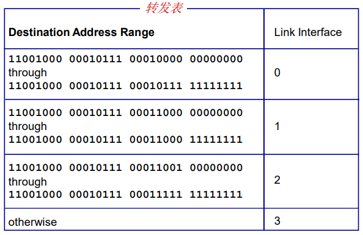
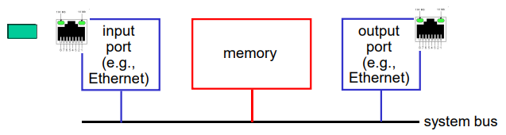
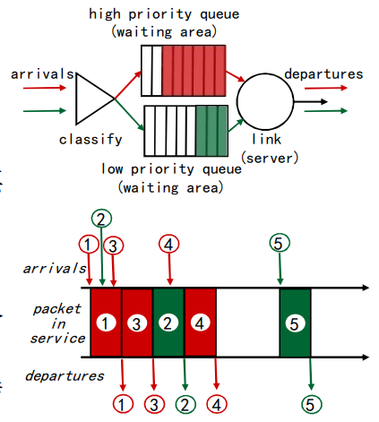
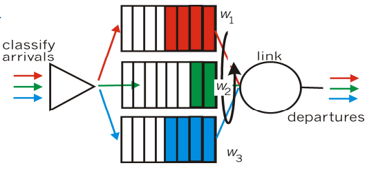
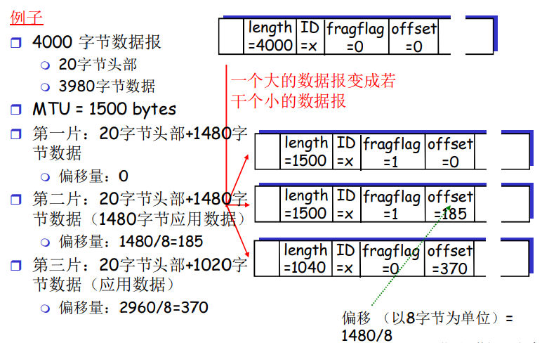
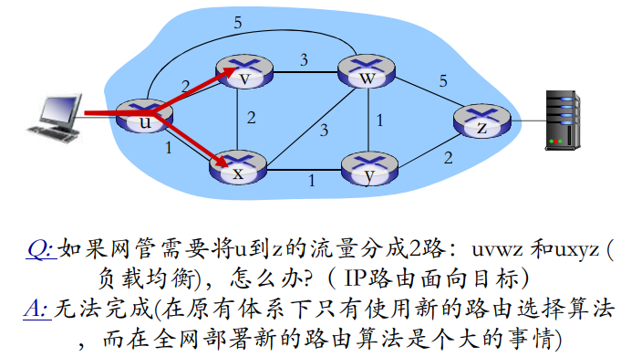
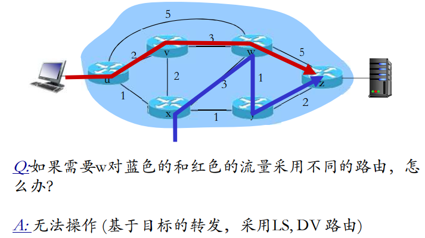
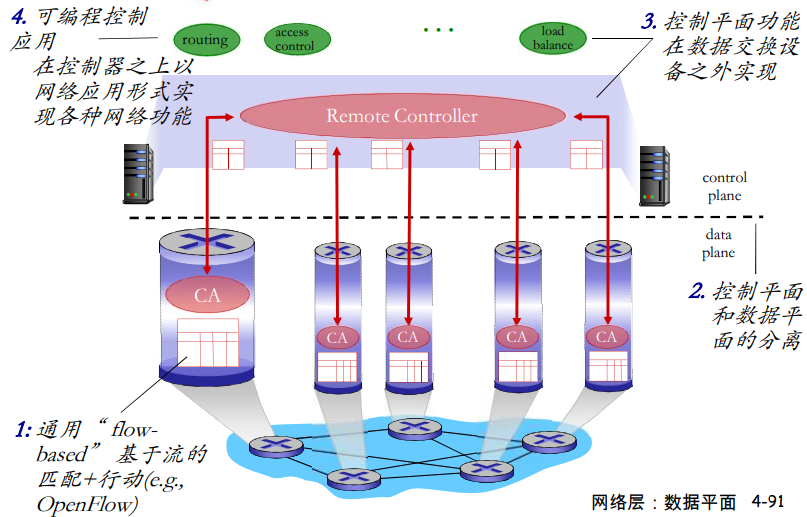

本章目标: 

- 理解网络服务的基本原理，聚焦于其**数据平面**
  - 网络服务模型
  - 转发和路由
  - 路由器工作原理
  - 通用转发
- 互联网中网络层协议的实例和实现

## 导论

### 网络层服务

- 在发送主机和接收主机对之间传送**段（segment）**
- 在发送端将段封装到数据报中
- 在接收端，将段上交给传输层实体
- 网络层协议存在于**每一个**主机和路由器
- 路由器检查每一个经过它的IP 数据报的头部


### 网络层的关键功能

> 网络层功能：

- **转发**: 将分组从路由器的输入接口转发到合适的输出接口（插入不同网络的网卡，接入不同网络ATM、以太网...在不同的网络之间完成解封装，封装成对应物理网络的帧，从不同的端口收到数据，再从合适的端口发送出去）
- **路由**: 使用路由算法来决定分组从发送主机到目标接收主机的路径
  - 路由选择算法
  - 路由选择协议

> 旅行的类比：

- 转发: 通过单个路口的过程
- 路由: 从源到目的的路由路径规划过程

### 网络层：数据平面、控制平面

> 数据平面

- 本地，每个路由器功能
- 决定从路由器输入端口，到达的分组如何转发到 输出端口
- 转发功能：
  - 传统方式：基于目标地址+转发表
  - SDN（软件定义网络）方式：基于多个字段+流表
    - 不仅仅匹配目标地址，源MAC、目标MAC、源IP、目标IP、源端口、目标端口、标志位...等等字段做匹配
    - 如果匹配到对应的流表，动作也不仅仅是转发，还包括block（阻止转发）、泛洪这个分组（一个端口收所有端口发，广播）、修改某些字段（比如ttl减1）
    - 流表是通过操作系统计算出来的

> 控制平面

- 网络范围内的逻辑
- 决定数据报如何在路由器之间路由，决定数据报从源到目标主机之间的端到端路径
- 2个控制平面方法:
  - 传统的路由算法: 在路由器中被实现
  - software-defined networking  (SDN): 在远程的服务器中实现


### 传统方式：每-路由器(Per-router)控制平面

在**每一个路由器**中的单独路由器算法元件，在控制平面进行交互


控制平面和数据平面紧耦合，不利于逻辑修改


### SDN方式：逻辑集中的控制平面

一个不同的（通常是远程的）控制器与本地控制代理（CAs）交互

分组交换机：这里还是路由器的作用，并不是工作在链路层的那个交换机


### 网络服务模型

> **Q: 从发送方主机到接收方主机传输数据报的“通道” ，网络提供什么样的服务模型？**

- **对于单个数据报的服务:**
  - 可靠传送
  - 延迟保证，如：少于40ms的延迟
- **对于数据报流的服务:**
  - 保序数据报传送
  - 保证流的最小带宽
  - 分组之间的延迟


### 连接建立

- 在某些网络架构中是第三个重要的功能
  - ATM, frame relay, X.25
- 在分组传输之前，在两个主机之间，在通过一些路由器所构成的路径上建立一个网络层连接
  - 涉及到路由器
- 网络层和传输层连接服务区别:
  - **网络层:** 在2个主机之间，涉及到路径上的一些路由器
  - **传输层:** 在2个进程之间，很可能只体现在端系统上(TCP连接)

## 路由器组成

### 路由器结构概况

高层面(非常简化的)通用路由器体系架构

- 路由：运行路由选择算法／协议 (RIP, OSPF, BGP)-生成路由表
- 转发：从输入到输出链路交换数据报-根据路由表进行分组的转发


### 输入端口功能


分布式交换：

- 根据数据报头部的信息如：目的地址，在输入端口内存中的转发表中查找合适的输出端口（匹配+行动）
- **基于目标的转发**：仅仅依赖于IP数据报的目标IP地址（传统方法）
- **通用转发**：基于头部字段的任意集合进行转发

### 基于目标的转发



Q: 但是如果地址范围如果没有划分的特别规整，会发生什么？

### 最长前缀匹配


- 我们将会在学习IP地址时，简单**讲解**为什么要 采用最长前缀匹配
- 最长前缀匹配：在路由器中经常采用TCAMs(  ternary content addressable memories)硬 件来完成
  - **内容可寻址：**将地址交给TCAM，它可以在一个时 钟周期内检索出地址，不管表空间有多大
  - Cisco Catalyst系列路由器: 在TCAM中可以存储多达 约为1百万条路由表项

### 输入端口缓存

- 当交换机构的速率小于输入端口的汇聚速率时， 在输入 -> 端口可能要排队
  - **排队延迟以及由于输入缓存溢出造成丢失!**
- **Head-of-the-Line (HOL) blocking:** 排在队头的数据报阻止了队列中其他数据报向前移动


### 交换结构

- 将分组从输入缓冲区传输到合适的输出端口
- 交换速率：分组可以按照该速率从输入传输到输 出
  - 运行速度经常是输入/输出链路速率的若干倍
  - N 个输入端口：交换机构的交换速度是输入线路速度的N倍比较理想，才不会成为瓶颈
- 3种典型的交换机构


### 通过内存交换

第一代路由器：

- 在CPU直接控制下的交换，采用传统的计算机
- 分组被拷贝到系统内存，CPU从分组的头部提取出目标地址，查找转发表，找到对应的输出端口，拷贝到输出 端口
- 转发速率被内存的带宽限制 (数据报通过BUS两遍) 
- 一次只能转发一个分组



### 通过总线交换

- 数据报通过共享总线，从输入端 口转发到输出端口
- **总线竞争**: 交换速度受限于总线带宽
- 1次处理一个分组
- 1 Gbps bus, Cisco 1900； 32  Gbps bus, Cisco 5600；对于接入或企业级路由器，速度足够（ 但不适合区域或骨干网络）


### 通过互联网络(crossbar等)的交换

- 同时并发转发多个分组，克服总线带宽限制
- Banyan（榕树）网络，crossbar(纵横) 和其它的互联网络被开发，将多个处理器连接成多处理器
- 当分组从端口A到达，转给端口Y；控制器短接相应的两个总线
- 高级设计：将数据报分片为固定长度的信元，通过交换网络交换
- Cisco12000：以60Gbps的交换速率通过互联网络

### 输出端口


- 当数据报从交换机构的到达速度比传输速率快就需要输出端口**缓存**
- 由**调度规则**选择排队的数据报进行传输

> 优先权调度-谁会获得最优性能， 网络中立？

一般来说，实时性多媒体的应用分组要比telnet的类型更优先一下

### 输出端口排队


- 假设交换速率Rswitch是Rline的N倍（N：输入端口的数量）
- 当多个输入端口同时向输出端口发送时，缓冲该分组（当通过交换网络到达的速率超过输出速率则缓存）
- **排队带来延迟，由于输出端口缓存溢出则丢弃数据报！**

> 需要多少缓存?


### 调度机制

- **调度:** 选择下一个要通过链路传输的分组

- **FIFO (first in first out) scheduling:** 按照 分组到来的次序发送
  - 现实例子?
  - **丢弃策略:** 如果分组到达一个满的队列，哪个分组将会被抛弃?
    - **tail drop:** 丢弃刚到达的分组
    - **priority:** 根据优先权丢失/移除分组
    - **random:** 随机地丢弃/移除


### 调度策略：优先权

**优先权调度：**发送最高优先权的分组

- 多类，不同类别有不同的优先权
  - 类别可能依赖于标记或者其 他的头部字段, e.g. IP source/dest, port numbers, ds，etc. 
  - 先传高优先级的队列中的分 组，除非没有
  - 高（低）优先权中的分组传 输次序：FIFO
  - 现实生活中的例子?



### 调度策略：其他的

Round Robin (RR) scheduling:

- 多类
- 循环扫描不同类型的队列, 发送完一类的一个分组 ，再发送下一个类的一个分组，循环所有类
- 现实例子?


Weighted Fair Queuing (WFQ):

- 一般化的Round Robin
- 在一段时间内，每个队列得到的服务时间是：Wi /(XIGMA(Wi )) *t，和权重成正比
- 每个类在每一个循环中获得不同权重的服务量
- 现实例子



##  IP: Internet Protocol

### 互联网的网络层

主机,路由器中的网络层功能：


ICMP：

- "信命"协议，报告一些错误，经过哪个节点的往返延迟信息，ttl减为0的时候，相应的路由器会向源主机发送对应的错误报告
- Ping命令，也是基于ICMP的报文，发送方发送一个ICMP的请求报文，接收方也会返回一个对应的ICM响应报文

### IP 数据报格式


type of service：

- 详细介绍：https://www.cnblogs.com/lsgxeva/p/12384641.html
- 字段通过上层的协议设置，指定优先级，不过在有线网络基本抛弃了，因为现在绝大多数都是包月服务，而不是计量收费
- 路由也可以根据这个字段判断分组优先级传输，进行调度，不过在包月服务中，收费都是固定的，大家都会把自己设置成高优先级

upper layer：

- 把数据部分交给上层的哪个协议呢？TCP还是UDP还是其它上层协议呢？（想起了传输层的端口号，指定交给上层的哪个进程）

Internet checksum：

- 用来判断IP报文的头部有没有出问题，头部出问题了很大，说明可能传输就没对

### IP 分片和重组(Fragmentation & Reassembly)

- 网络链路有MTU (最大传输单元) –链路层帧所携带的最大数据长度
  - 不同的链路类型
  - 不同的MTU
- 大的IP数据报在网络上被分片 (“fragmented”)
  - 一个数据报被分割成若干个小的数据报
    - 相同的ID
    - 不同的偏移量
    - 最后一个分片标记为0
  - “重组”只在最终的目标主机进行
  - IP头部的信息被用于标识，排序相关分片


例如入口的数据帧为FDDI协议（MTU等于4000字节），出口的数据帧为以太网协议（MTU等于1500字节），进行转化的话就需要分片，每个分片都是独立的一片，到目标主机再重组

- 分组不能按照整个分组进行划分，因为如果这样划分的结果就是除了第一个分片，后面的分片都没有IP报文头，就不知道怎么传输了，所以不能裸分片
- 怎么区分哪些分片可以组合，通过IP报文段的身份验证ID字段
- 所以分片的时候，每个分片都要包含头部相关信息，并且需要指定偏移量等信息，方便排序
- 分片会在在源主机进行组合
- 假如某个中间分片没到的话，造成空缺现象，就要全扔了
- 要是分片成了四个分组，前三个到达了，是会丢弃的，因为前三个虽然可以组合成有序的数据包，但是fragflag字段可以判断是否分片尾部，从而得到了分组丢失的结果

### IP 分片和重组



### IP 编址: 引论

IP地址：是设备和网络接口接入点的一个标识

- **IP 地址:** 32位标示，对 主机或者路由器的接口 编址
- **接口:** 主机/路由器和物理链路的连接处
  - 路由器通常拥有多个接口
  - 主机也有可能有多个接口
  - IP地址和每一个接口关联
- **一个IP地址和一个接口相关联**


### 子网(Subnets)

- IP地址:
  - 子网部分(高位bits)
  - 主机部分(地位bits)
- 什么是子网(subnet) ?
  - 一个子网内的节点（主机或者路由器）**它们的 IP地址的高位部分相同** ，这些节点构成的网络的一部分叫做子网
  - **无需路由器介入**，子网内各主机可以在物理上 相互直接到达


### IP 地址分类

- Class A：126 networks ，16 million hosts（分完了）
- Class B：16382networks ，64 K hosts（分完了）
- Class C：2 million networks ，254 host
- Class D：multicast
- Class E：reserved for future


- A、B、C类地址为单播地址，D类为组播地址（通过一些协议来维护，IGMP的一些协议），E类为预留的地址（不属于单播地址），通过目标地址的前几位就可以判断是哪类网络了
- 以网络为单位做路由信息的传播和计算

### 特殊的IP地址

- 一些约定：
  - 子网部分: 全为 0---本网络
  - 主机部分: 全为0---本主机
  - 主机部分: 全为1--广播地址，这个网络的所有主机
- 特殊IP地址


127.x.x.x的地址，到达ip层面之后，又会反转到上层，就是本地环回地址

### 内网(专用)IP地址

- 专用地址：地址空间的一部份供专用地址使用
- 永远不会被当做公用地址来分配, 不会与公用地址重复
  - 只在局部网络中有意义，区分不同的设备
- 路由器不对目标地址是专用地址的分组进行转发
- 专用地址范围
  - Class A 10.0.0.0-10.255.255.255 MASK 255.0.0.0
  - Class B 172.16.0.0-172.31.255.255 MASK 255.255.0.0
  - Class C 192.168.0.0-192.168.255.255 MASK 255.255.255.0

### IP 编址: CIDR

CIDR: Classless InterDomain Routing（无类域间路由）

- 子网部分可以在任意的位置
- 地址格式: **a.b.c.d/x**, 其中 x 是 地址中子网号的长度


### 子网掩码(subnet mask)

- 32bits , 0 or 1 in each bit
  - 1: bit位置表示子网部分
  - 0:bit位置表示主机部分
- 原始的A、B、C类网络的子网掩码分别是
  - A：255.0.0.0 ：11111111 00000000 0000000 00000000
  - B：255.255.0.0：11111111 11111111 0000000 00000000
  - C：255.255.255.0：11111111 11111111 11111111 00000000
- CIDR下的子网掩码例子：
  - 11111111 11111111 11111100 00000000
- 另外的一种表示子网掩码的表达方式
  - /#
  - 例：/22：表示前面22个bit为子网部分

### 转发表和转发算法


- 获得IP数据报的目标地址
- 对于转发表中的每一个表项
  - 如 (IP Des addr) & (mask)== destination, 则按照表项对应的接口转发该数据报
  - 如果都没有找到,则使用默认表项转发数据报

### 如何获得一个IP地址

需要配四个信息：

- ip地址
- 子网掩码
- 默认网关
- local name server 本地域名解析系统

Q: 主机如何获得一个IP地址?

- 系统管理员将地址配置在一个文件中
  - Wintel: control-panel->network- >configuration->tcp/ip->properties
  - UNIX: /etc/rc.config
- **DHCP:** Dynamic Host Configuration Protocol: 从服务器中动态获得一个IP地址
  - “plug-and-play”

### DHCP: Dynamic Host Configuration Protocol

目标: 允许主机在加入网络的时候，动态地从服务器那里获得IP地址：

- 可以更新对主机在用IP地址的租用期-租期快到了
- 重新启动时，允许重新使用以前用过的IP地址
- 支持移动用户加入到该网络（短期在网）

DHCP工作概况:

- 主机广播“**DHCP discover**” 报文[可选]
- DHCP 服务器用 “**DHCP offer**”提供报文响应[可选]
- 主机请求IP地址：发送 “**DHCP request**” 报文
- DHCP服务器发送地址：“**DHCP ack**” 报文


- 通过广播的方式去请求DHCP服务器，获取ip


> DHCP: 不仅仅是IP addresses

DHCP 返回:

- IP 地址
- 第一跳路由器的IP地址（默认网关）
- DNS服务器的域名和IP地址
- 子网掩码 (指示地址部分的网络号和主机号)

### DHCP: 实例


- 联网笔记本需要获取自己的IP地址，第一跳路由器地址和DNS服务器：采用DHCP协议 router with DHCP server built into router
- DHCP 请求被封装在UDP段中, 封装在IP数据报中，封装在以太网的帧中
- 以太网帧在局域网范围内广播 (dest: FFFFFFFFFFFF) ， 被运行DHCP服务的路由器收到
- 以太网帧解封装成IP，IP 解封装成UDP，解封装成 DHCP

- DHCP服务器生成DHCP ACK， 包含客户端的IP地址，第一 跳路由器的IP地址和DNS域名服务器的IP地址

- DHCP服务器封装的报文所在的帧转发到客户端，在客户端解封装成DHCP报文

- 客户端知道它自己的IP地 址，DNS服务器的名字和IP 地址，第一跳路由器的IP地址

> Wireshark 输出(home LAN)


### 如何获得一个IP地址

Q: 如何获得一个网络的子网部分?

A: 从ISP获得地址块中分配一个小地址块

从子网掩码为20位的网络号，再拿3位来划分子网，可也划分8个子网，每个子网的子网掩码变成了23位，子网可也再划分...


### 层次编址

> 路由聚集（route aggregation）

层次编址允许路由信息的有效广播:

- IPX划分了8个子网，并且告诉Intenet，可以将目标IP的网络号和我一样的分组数据转发到我这里，然后IPX在根据目标IP地址判断，转发到对应的子网接口
- IPY同理


> 特殊路由信息(more specific routes)

- 比如`200.23.18.0/23`和`199.31.0.0`不能做路由聚集，所以就告诉Internet可以将目标网络号为这两个中的分组数据转发到我这里


### IP 编址: 如何获得一块地址

Q: 一个ISP如何获得一个地址块? A: ICANN: Internet Corporation for Assigned Names and Numbers

- 分配地址
- 管理DNS
- 分配域名，解决冲突

### NAT: Network Address Translation

- 内网地址出去的时候，转化为公网地址
- 内网共用一个IP地址


动机: 本地网络只有一个有效IP地址:

- 不需要从ISP分配一块地址，可用一个IP地址用于所有的（局域网）设备--省钱
- 可以在局域网改变设备的地址情况下而无须通知外界
- 可以改变ISP（地址变化）而不需要改变内部的设备地址
- 局域网内部的设备没有明确的地址，对外是不可见的--安全

实现: NAT 路由器必须:

- **外出数据包：替换源地址和端口号为NAT IP地址和新的端口号，目标IP和端口不变** …远端的C/S将会用NAP IP地址，新端口号作为目标地址
- **记住**每个转换替换对（在NAT转换表中） .. 源IP，端口 vs NAP IP ，新端口
- **进入数据包**：替换**目标IP地址和端口号**，采用存 储在NAT表中的mapping表项，用（源IP，端口）


- nat工作在网络层, 在linux系统中, 是利用NETFILTER框架机制实现的，现在已经不仅仅是网络层了
- 总之能解决端口和ip的映射问题，不必纠结于工作在那一层，还有通过路由器做流量代理等等工作的，可以大致理解为工作在网络层或以上层，关注与具体实现而不关注于在哪一层
- 再说，如果NAT是标准的工作在网络层之上（传输层），那说明如果是TCP的话，还要保证可靠的机制，但是一个路由器下正在使用的用户比较多，那么路由器的负荷不就是特别大了吗（这么多用户的数据都要在路由器保证可靠传输）？所以NAT不会基于一套完整的传输层协议
- 出去没问题，但是外网主动请求内网的主机——内网穿透的问题


- 16-bit端口字段:
  - 6万多个同时连接，一个局域网!
- 对NAT是有争议的:
  - 路由器只应该对第3层做信息处理，而这里对端口号（4层）作了处理
  - 违反了end-to-end 原则
    - 端到端原则：复杂性放到网络边缘
      - 无需借助中转和变换，就可以直接传送到目标主机
    - NAT可能要被一些应用设计者考虑, eg, P2P applications
    - 外网的机器无法主动连接到内网的机器上
  - 地址短缺问题可以被IPv6 解决
  - NAT穿越： 如果客户端需要连接在NAT后面的服务器，如何操作

### NAT 穿越问题

- 客户端需要连接地址为 10.0.0.1的服务器
  - 服务器地址10.0.0.1 LAN本地地 址 (客户端不能够使用其作为目 标地址)
  - 整网只有一个外部可见地址: 138.76.29.7
- **方案1: 静态配置NAT：转发进来的对服务器特定端口连接请求**
  - e.g., (123.76.29.7, port 2500) 总是转发到10.0.0.1 port 25000


- 方案2: `Universal Plug and Play (UPnP)` `Internet Gateway Device (IGD)` 协议. 允许 NATted主机可以:
  - 获知网络的公共 IP地址 (138.76.29.7)  列举存在的端口映射
  - 增/删端口映射 (在租用时间内 )
  - i.e., 自动化静态NAT端口映射配置
  - 内网服务器可以查询/更改NAT主机，内网，让NAT的主机的对应端口来处理我的端口映射


- 方案 3: 中继 (used in Skype)
  - NAT后面的服务器建立和中继的连接
  - 外部的客户端链接到中继
  - 中继在2个连接之间桥接
  - 市面上的一些内网穿透工具就是采用的这种方法


## IPv6

- **初始动机:** 32-bit地址空间将会被很快用完
- 另外的动机:
  - 头部格式改变帮助加速处理和转发
    - TTL-1
    - 头部checksum
    - 分片
  - 头部格式改变帮助QoS

**IPv6 数据报格式:**

- 固定的40 字节头部
- 数据报传输过程中，不允许分片，**对与胖分组报文，直接丢掉，然后向源主机发送一个ICMP报文（IPv6版本）告诉他分组被丢掉，因为分组太大了**（大哥协议...路由器站起来了）
  - 对于网络核心友好，因为网络骨干链路的数据量很大，不考虑分片，可以专注于数据传输
- 能够在地球的每平分米分配上千个地址，在lot时代很好

### IPv6 头部 (Cont)

详细介绍：https://zhuanlan.zhihu.com/p/89688404

- version：ip版本
- **Priority:** 标示流中数据报的优先级

- **Flow Label:** 标示数据报在一个“flow.” ( “flow”的概念没有被严格的定义)，同一个会话的数据，可以使用相同的一个流，试图让网络对于同一个流进行相同的处理，

- payload len: 报文长度

- **Next header:** 标示上层协议，TLV类型数据（类型、长度、值），类似Java的字节码、protobuffer

  IPv6报文头部中的Next Header字段表示“承载上一层的协议类型”或者“扩展头部类型”。**这里的含义与IPv4有很大的差别，需要加以解释**：
  当IPv6数据报文承载的是上层协议ICMPv6、TCP、UDP等的时候，Next Header的值分别为58、6、17，这个时候和IPv4报文头部中的Protocol字段很类似。
  当不是以上3种协议类型的时候，IPv6报文头部紧接的是扩展头部。扩展头部是IPv6引入的一个新的概念，每个IPv6的数据报文可以承载0个或多个扩展头部，扩展头部通过链表的形式组织起来。当IPv6数据报文承载着扩展头部的时候，Next Header的数值为扩展头部的类型值。
  为什么要引入扩展头部这个概念，这里也是IPv6对IPv4改进的一个方面，**用扩展头部取代了IPv4的可选项信息，精简了IPv6的头部，增强了IPv6的扩展性**。有同学会不会有疑问，IPv6的分片数据报文怎么处理？其实就是使用了IPv6扩展头部。我们来抓一个UDP分片报文来看看。

  

- hop limit: 跳数的限制，类似ipv4的ttl

头部信息(8byte)+源ip(16byte)+目标ip(16byte)=40byte


> 和IPv4的其它变化

- **Checksum:** 被移除掉，降低在每一段中的处理速度
- **Options:** 允许，但是在头部之外, 被 “Next Header” 字段标示
- **ICMPv6:** ICMP的新版本
  - 附加了报文类型, e.g. “Packet Too Big”
  - 多播组管理功能

> ipv4升级ipv6

- v4和v4通信，v6和v6通信
- v4和v6通信采用双栈协议，类似隧道的技术，平滑过渡
- v4平滑过渡到v6

## 通用转发和SDN

### 网络层功能为例的数据平面和控制平面

**网络层功能：**

- 转发： 对于从某个端口 到来的分组转发到合适的 输出端口
- 路由： 决定分组从源端 到目标端的路径  路由算法

类比:旅行

- 转发： 一个多岔路口的进入和转出过程
- 路由: 规划从源到目标的旅行路径

### 网络层: 数据平面和控制平面

数据平面

- 本地的、每个路由器的功能
- 决定某个从某个端口进入的分组从从哪个端口输出  转发功能

控制平面

- 网络范围的逻辑
- 决定分组端到端穿行于各个路由器的路径

### 每个路由器(Per Route)的控制平面

每个路由器上都有实现路由算法元件（它们之间需要相互交互）- 形成传统IP实现方式的控制平面


### 数量众多、功能各异的中间盒

- 路由器的网络层功能：
  - IP转发：对于到来的分组按照路由表决定如何转发，数据平面
  - 路由：决定路径，计算**路由表**；处在控制平面
- 还有其他种类繁多网络设备（中间盒）：
  - 交换机；防火墙；NAT；IDS；负载均衡设备
  - 未来：不断增加的需求和相应的网络设备
  - 需要不同的设备去实现不同的网络功能
    - 每台设备集成了控制平面和数据平面的功能
    - 控制平面分布式地实现了各种控制平面功能
    - 升级和部署网络设备非常困难

### 网络设备控制平面的实现方式特点

- 互联网网络设备：传统方式都是通过分布式，每台设备的方法来实现数据平面和控制平面功能
  - **垂直集成**：每台路由器或其他网络设备，包括：
    - 1）硬件、在私有的操作系统；
    - 2）互联网标准协议(IP, RIP, IS-IS, OSPF, BGP)的私有实现
    - 从上到下都由一个厂商提供（代价大、被设备上“绑架”“）
  - 每个设备都实现了数据平面和控制平面的事情  控制平面的功能是分布式实现的
  - **设备基本上只能（分布式升级困难）按照固定方式工作，控制逻辑固化。**不同的网络功能需要不同的 “middleboxes”：防火墙、负载均衡设备、NAT boxes, ..
- （数据+控制平面）集成>（控制逻辑）分布->固化 代价大；升级困难；管理困难等

### 传统方式实现网络功能的问题

- 问题：
  - 垂直集成>昂贵、不便于创新的生态
  - 分布式、固化设备功能==网络设备种类繁多
    - 无法改变路由等工作逻辑，无法实现流量工程等高级 特性
    - 配置错误影响全网运行；升级和维护会涉及到全网设 备：管理困难
    - 要增加新的网络功能，需要设计、实现以及部署新的 特定设备，设备种类繁多
- ~2005: 开始重新思考网络控制平面的处理方式
  - 集中：远程的控制器集中实现控制逻辑
  - 远程：数据平面和控制平面的分离

### SDN：逻辑上集中的控制平面

一个不同的（通常是远程）控制器和CA交互，控制器决定分组转发的逻辑（可编程），CA所在设备执行逻辑。


### SDN的主要思路

- 网络设备数据平面和控制平面分离
- 数据平面-分组交换机
  - 将路由器、交换机和目前大多数网络设备的功能进一步**抽象**成：按照流表（由控制平面设置的控制逻辑）进行PDU （帧、分组）的动作（包括转发、丢弃、拷贝、泛洪、阻 塞）
  - **统一化**设备功能：SDN交换机（分组交换机），执行控制逻辑
- 控制平面-控制器+网络应用
  - 分离、集中
  - 计算和下发控制逻辑：流表

### SDN控制平面和数据平面分离的优势

- **水平集成**控制平面的**开放实现**（而非私有实现），创造出好的产业生态，促进发展
  - 分组交换机、控制器和各种控制逻辑网络应用app可由不同厂商生产，专业化，引入竞争形成良好生态
- **集中**式实现控制逻辑，网络**管理容易**：
  - 集中式控制器了解网络状况，编程简单，传统方式困难
  - 避免路由器的误配置
- 基于流表的匹配+行动的工作方式允许**“可编程的”分组交换机**
  - 实现流量工程等高级特性
  - 在此框架下实现各种新型（未来）的网络设备

> 类比: 主框架到PC的演变


### 流量工程: 传统路由比较困难






### SDN特点



### SDN 架构

> 数据平面交换机

- 快速，简单，商业化交换设备 采用硬件实现通用转发功能
- 流表被控制器计算和安装
- 基于南向API（例如OpenFlow ），SDN控制器访问基于流的 交换机
  - 定义了哪些可以被控制哪些不能
- 也定义了和控制器的协议 (e.g., OpenFlow)


> 网络控制应用

- 控制的大脑： 采用下层提供的服务（SDN控制器提供的 API)，实现网络功能
  - 路由器交换机
  - 接入控制防火墙
  - 负载均衡
  - 其他功能
- 非绑定：可以被第三方提供 ，与控制器厂商以通常上不同，与分组交换机厂商也可以不同

### 通用转发和SDN

每个路由器包含一个**流表**（被逻辑上集中的控制器计算和分发）


### OpenFlow 数据平面抽象

- **流: 由分组（帧）头部字段所定义**
- **通用转发: 简单的分组处理规则**
  - **模式**: 将分组头部字段和流表进行匹配
  - **行动**：对于匹配上的分组，可以是**丢弃、转发、修改、将匹配的分组发送给控制器**
  - **优先权Priority**: 几个模式匹配了，优先采用哪个，消除歧义
  - **计数器Counters**: #bytes 以及 #packets


```
1. src=1.2.*.*, dest=3.4.5.* -> drop
2. src = *.*.*.*, dest=3.4.*.* -> forward(2)
3. src=10.1.2.3, dest=*.*.*.* -> send to controller
```

### OpenFlow: 流表的表项结构


