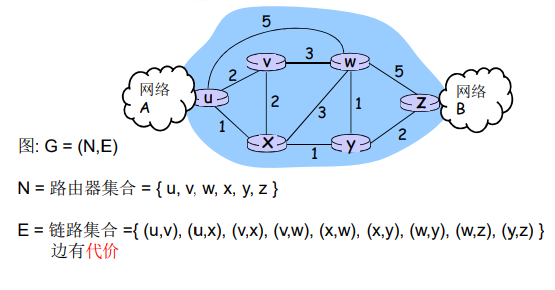
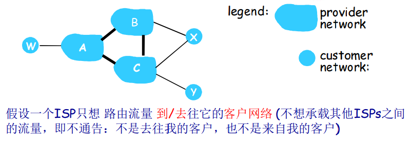
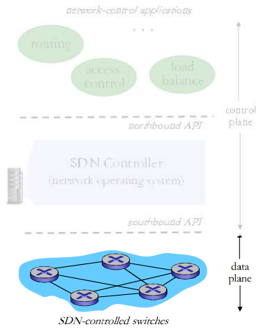

# 导论

## 网络层功能

回顾: 2个网络层功能:

- 转发: 将分组从路由器的一 个输入端口移到合适的输出端口（数据平面）

- 路由: 确定分组从源到目标的路径（控制平面）

2种构建网络控制平面功能的方法:

- 每个路由器控制功能实现（传统）
- 逻辑上集中的控制功能实现(software defined networking)

> 传统方式：每-路由器(Per-router)控制平面

在每一个路由器中的单独路由器算法元件，在控制平面进行交互

> SDN方式：逻辑上集中的控制平面

一个不同的（通常是远程的）控制器与本地控制代理（CAs） 交互

# 路由选择算法

- link state链路状态算法
- distance vector距离矢量算法

## 路由(route)的概念

- 路由:按照某种指标(传输延迟,所经过的站点数目等)找到一条从源节点到目标节点的较好路径
  - 较好路径: 按照某种指标较小的路径
  - 指标:站数, 延迟,费用,队列长度等, 或者是一些单纯指标的加权平均
  - 采用什么样的指标（跳数、延迟、省钱）,表示网络使用者希望网络在什么方面表现突出,什 么指标网络使用者比较重视
- 以**网络**为单位进行路由（路由信息通告+路由计算）
  - 网络为单位进行路由，路由信息传输、计算和匹配的代价低
  - 前提条件是：一个网络所有节点地址前缀相同，且物理上聚集
  - 路由就是：计算网络到其他网络如何走的问题

- 网络到网络的路由= 路由器-路由器之间路由
  - 网络对应的路由器到其他网络对应的路由器的路由
  - 在一个网络中：路由器-主机之间的通信，链路层解决
  - 到了这个路由器就是到了这个网络
- 路由选择算法(routing algorithm):网络层软件的一部分,完成路由功能

> 网络的图抽象

## 最优化原则(optimality principle)

汇集树(sink tree)

- 此节点到所有其它节点的最优路径形成的树
- 路由选择算法就是为所有路由器**找到**并**使用**汇集树

## 路由的原则

只能做到较优，不能做到最优，因为最优会花费很大的传输代价和计算代价

以交警工作为例子，为了更好的维护道路秩序，而增加大量的交警，显然是不合理的

- 路由选择算法的原则
  - 正确性(correctness):算法必须是**正确**的和**完整**的,使分组一站一站接力，正确发向目标站；完整：目标所有的 站地址，在路由表中都能找到相应的表项；没有处理不 了的目标站地址；
  - 简单性(simplicity):算法在计算机上应简单：最优但复杂 的算法，时间上延迟很大，不实用，不应为了获取路由 信息增加很多的通信量；
  - 健壮性(robustness):算法应能适应**通信量**和**网络拓扑**的变化：通信量变化，网络拓扑的变化算法能很快适应； 不向很拥挤的链路发数据，不向断了的链路发送数据；
- 路由选择算法的原则
  - 稳定性(stability)：产生的路由不应该摇摆
  - 公平性(fairness)：对每一个站点都公平
  - 最优性(optimality)：某一个指标的最优，时间上，费用上，等指标，或综合指标；实际上，获取最优的结果代价较高，可以是次优的

## 路由算法分类

全局或者局部路由信息? 

全局:

- 所有的路由器拥有完整的拓扑和边的代价的信息
- **“link state” 算法**

分布式:

- 路由器只知道与它有物理连接关系的邻居路由器，和到相应 邻居路由器的代价值
- 叠代地与邻居交换路由信息、 计算路由信息 
- **“distance vector” 算法**

## LS路由的工作过程

- 配置LS路由选择算法的路由工作过程
  - 各点通过各种渠道获得**整个网络拓扑**, 网络中所有链路**代价**等信息（这部分和算法没关系，属于协议和实现）
  - 使用**LS路由算法**,计算本站点到其它站点的最优路径(汇 集树),得到路由表
  - 按照此路由表转发分组(datagram方式)
    - 严格意义上说不是路由的一个步骤
    - 分发到输入端口的网络层

## 链路状态路由选择(link state routing)

LS路由的基本工作过程

1. 发现相邻节点,获知对方网络地址
2. 测量到相邻节点的代价(延迟,开销)
3. 组装一个LS分组,描述它到相邻节点的代价情况
4. 将分组通过扩散的方法发到所有其它路由器（以上4步**让每个路由器获得拓扑和边代价**）
5. 通过Dijkstra算法找出最短路径（这才是路由算法）
   1. 每个节点独立算出来到其他节点（路由器=网络）的最短路径
   2. 迭代算法：第k步能够知道本节点到k个其他节点的最短路径

> 1. 发现相邻节点,获知对方网络地址

- 一个路由器上电之后,向所有线路发送HELLO分组
- 其它路由器收到HELLO分组,回送应答,在应答分组中,告 知自己的名字(全局唯一)
- 在LAN中,通过广播HELLO分组,获得其它路由器的信息, 可以认为引入一个人工节点

> 2. 测量到相邻节点的代价(延迟,开销)

- 实测法,发送一个分组要求对方立即响应
- 回送一个ECHO分组
- 通过测量时间可以估算出延迟情况

> 3. 组装一个分组,描述相邻节点的情况

- 发送者名称
- 序号,年龄
- 列表: 给出它相邻节点,和它到相邻节点的延迟

> 4. 将分组通过扩散的方法发到所有其它路由器

- 顺序号:用于控制无穷的扩散,每个路由器都记录( 源路由器,顺序号),发现重复的或老的就不扩散
  - 具体问题1: 循环使用问题
  - 具体问题2: 路由器崩溃之后序号从0开始
  - 具体问题3:序号出现错误
- 解决问题的办法:年龄字段(age)
  - 生成一个分组时,年龄字段不为0
  - 每个一个时间段,AGE字段减1
  - AGE字段为0的分组将被抛弃
- 关于扩散分组的数据结构
  - Source :从哪个节点收到LS分组
  - Seq,Age:序号,年龄
  - Send flags:发送标记,必须向指定的哪些相邻站点转发LS分组
  - ACK flags:本站点必须向哪些相邻站点发送应答
  - DATA:来自source站点的LS分组
  - 节点B的数据结构

> 5. 通过Dijkstra算法找出最短路径

- 路由器获得各站点LS分组和整个网络的拓扑
- 通过Dijkstra算法计算出到其它各路由器的最短 路径(汇集树)
- 将计算结果安装到路由表中

> LS的应用情况

- OSPF协议是一种LS协议,被用于Internet上
- IS-IS(intermediate system- intermediate system): 被用于Internet主干中, Netware

> 符号标记:

- **c(i,j)**: 从节点i 到j链路代价(初始状态下非相邻节点之间的 链路代价为∞)
- **D(v)**: 从源节点到节点V的当前路径代价(节点的代价) 
- **p(v)**: 从源到节点V的路径前序节点
- **N’**: 当前已经知道最优路径的的节点集合(永久节点的集合)

> LS路由选择算法的工作原理

- 节点标记: 每一个节点使用(D(v),p(v)) 如： (3,B)标记
  - D(v)从源节点由已知最优路径到达本节点的距离 
  - P(v)前序节点来标注
- 2类节点
  - 临时节点(tentative node) :还没有找到从源 节点到此节点的最优路径的节点
  - 永久节点(permanent node) **N’**:已经找到了从 源节点到此节点的最优路径的节点

> 执行流程，结合了BFS+动态+贪心的思想

- 初始化
  - 除了源节点外,所有节点都为临时节点
  - 节点**代价**除了与源节点代价相邻的节点外,都为∞
- 从所有临时节点中找到一个**节点代价最小**的临时节点,将之变成永久节点(当前节点)W
- 对此节点的**所有在临时节点集合中的邻节点(V)**
  - 如 D(v)>D(w) + c(w,v), 则重新标注此点, (D(W)+C(W,V), W)
  - 否则，不重新标注
- 开始一个新的循环

> 例子

> Dijkstra算法的例子

https://docs-lemon.view6view.club/#/src/Algorithm/105?id=%e8%bf%aa%e6%9d%b0%e6%96%af%e7%89%b9%e6%8b%89%e7%ae%97%e6%b3%95dijkstra

## Dijkstra算法的讨论

算法复杂度: n节点

- 每一次迭代: 需要检查所有不在永久集合N中节点
- n(n+1)/2 次比较: O(n2 )
- 有很有效的实现: O(nlogn)

可能的震荡：

- e.g.,链路代价=链路承载的流量:

## 距离矢量路由选择(distance vector routing)

动态路由算法之一

- DV算法历史及应用情况
  - 1957 Bellman, 1962 Ford Fulkerson
  - 用于ARPANET, Internet(RIP) DECnet , Novell, ApplTalk
- 距离矢量路由选择的基本思想
  - 各路由器维护一张路由表,结构如图(其它代价)
  - 各路由器与相邻路由器交换路由表
  - 根据获得的路由信息,更新路由表

- 代价及相邻节点间代价的获得
  - 跳数(hops), 延迟(delay),队列长度
  - 相邻节点间代价的获得：通过实测
- 路由信息的更新
  - 根据实测 得到本节点A到相邻站点的代价（如:延迟）
  - 根据各相邻站点声称它们到目标站点B的代价
  - 计算出本站点A经过各相邻站点到目标站点B的代价
  - **找到一个最小的代价，和相应的下一个节点Z，到达节点B经过此节点Z，并且代价为A-Z-B的代价**
  - 其它所有的目标节点一个计算法

> 距离矢量路由：例子1

- 以当前节点J为例,相邻节点 A,I,H,K
- J测得到A,I,H,K的延迟为 8ms,10ms,12ms,6ms
- 通过交换DV, 从A,I,H,K获得到 它们到G的延迟为 18ms,31ms,6ms,31ms
- 因此从J经过A,I,H,K到G的延迟为26ms,41ms,**18ms**, 37ms
- 将到G的路由表项更新为18ms, 下一跳为：H
- 其它目标一样，除了本节点J

> Bellman-Ford例子

## 距离矢量算法

- Dx (y) = 节点x到y代价最小值的估计
  - x 节点维护距离矢量**Dx = [Dx (y): y є N ]**
- 节点x:
  - 知道到所有邻居v的代价: c(x,v)
  - 收到并维护一个它邻居的距离矢量集
  - 对于每个邻居, x 维护 **Dv = [Dv (y): y є N ]**

核心思路:

- 每个节点都将自己的距离矢量估计值传送给邻居，定时或者 DV有变化时，让对方去算

- 当x从邻居收到DV时，自己运算，更新它自己的距离矢量

  - 采用B-F equation: 

  

- Dx (y)估计值最终收敛于实际的最小代价值dx (y)  分布式、迭代算法

异步式,迭代:每次本地迭代被以下事件触发:

- 本地链路代价变化了
- 从邻居来了DV的更新消息

分布式:

- 每个节点只是在自己的DV改变之后向邻居通告
- 然后邻居们在有必要的时候通知他们的邻居

每个节点:

- DV的无穷计算问题

  - DV的特点

    - 好消息传的快 坏消息传的慢

  - 好消息的传播以每一个交换周期前进一个路由器的速度进行

    - 好消息:某个路由器接入或有更短的路径
    - 举例

    

  - 坏消息的传播速度非常慢(无穷计算问题)例子:

    - 第一次交换之后, B从C处获得信息,C可以到达A(C-A, 要经过B本身),但是路径是2,因此B变成3,从C处走
    - 第二次交换,C从B处获得消息, B可以到达A,路径为3, 因此,C到A从B走,代价为3
    - 无限此之后, 到A的距离变成INF,不可达

    

- 水平分裂(split horizon)算法

  - 一种对无穷计算问题的解决办法

    - C知道要经过B才能到达A，所以C向B报告它到A的距离为INF；C 告诉D它到A的真实距离
    - D告诉E,它到A的距离,但D告诉C它通向A的距离为INF 
    - 第一次交换: B通过测试发现到A的路径为INF,而C也告 诉B到A的距离为INF,因此,B到A的距离为INF
    - 第二次交换: C从B和D那里获知,到A的距离为INF,因此 将它到A的距离为INF
    - ……坏消息以一次交换一个节点的速度传播

    

    

  - 水平分裂的问题:在某些拓扑形式下会失败（存在环路） 

  - 例子:

    - A,B到D的距离为2, C到D的距离为1
    - 如果C-D路径失败
    - C获知到D为INF,从A,B获知到D的距离为INF,因此C认为D不可达
    - A从C获知D的距离为INF,但从B处获 知它到D的距离为2,因此A到B的距离 为3,从B走
    - B也有类似的问题
    - 经过无限次之后,A和B都知道到D的距离为INF

    

## LS 和 DV 算法的比较

消息复杂度（DV胜出）

- LS: 有 n 节点, E 条链路,发送报文O(nE)个
  - 局部的路由信息；全局传播泛洪
- DV: 只和邻居交换信息
  - 全局的路由信息，局部传播

收敛时间（LS胜出）

- LS: O(n2) 算法
  - 有可能震荡
- DV: 收敛较慢
  - 可能存在路由环路
  - count-to-infinity 问题

健壮性: 路由器故障会发生什么 （LS胜出）

LS:

- 节点会通告不正确的链路代价
- 每个节点只计算自己的路由表
- 错误信息影响较小，局部，路由较健壮

DV: 

- DV 节点可能通告对全网所有节点的不正确路径代价
  - 距离矢量
- 每一个节点的路由表可能被其它节点使用
  - 错误可以扩散到全网

**2种路由选择算法都有其优缺点，而且在互联网上都有应用**

# 因特网中自治系统内部的路由选择

## RIP ( Routing Information Protocol)

- 在 1982年发布的BSD-UNIX 中实现
- Distance vector 算法
  - 距离矢量:每条链路cost=1，# of hops (max = 15 hops) 跳数
  - DV每隔30秒和邻居交换DV，**通告**
  - 每个通告包括：最多25个目标**子网**

> RIP 通告（advertisements）

- DV: 在邻居之间每30秒交换通告报文
  - 定期，而且在改变路由的时候发送通告报文
  - 在对方的请求下可以发送通告报文
- 每一个通告: 至多AS内部的25个目标网络的 DV 
  - 目标网络+跳数（一次公告最多25个 子网 最大跳数为16）

> RIP: 例子

> RIP: 链路失效和恢复

如果180秒没有收到通告信息-->邻居或者链路失效

- 发现经过这个邻居的路由已失效
- 新的通告报文会传递给邻居
- 邻居因此发出新的通告 (如果路由变化的话)
- 链路失效快速(?)地在整网中传输
- 使用**毒性逆转（poison reverse）**阻止ping-pong回路 (不可达的距离：跳数无限 = 16 段)

> RIP 进程处理

- RIP 以应用进程的方式实现：route-d (daemon)
- 通告报文通过UDP报文传送，周期性重复
- 网络层的协议使用了传输层的服务，以应用层实体的方式实现

## OSPF (Open Shortest Path First)

- “open”: 标准可公开获得
- 使用LS算法
  - LS 分组在网络中（一个AS内部）分发
  - 全局网络拓扑、代价在每一个节点中都保持
  - 路由计算采用Dijkstra算法
- OSPF通告信息中携带：每一个邻居路由器一个表项
- 通告信息会传遍AS全部（通过泛洪）
  - 在IP数据报上直接传送OSPF报文 (而不是通过UDP和TCP)
- IS-IS路由协议：几乎和OSPF一样

> OSPF “高级” 特性(在RIP中的没有的)

- **安全**: 所有的OSPF报文都是经过认证的 (防止恶意的攻击)
- 允许有**多个代价相同**的路径存在 (在RIP协议中只有一个)
- 对于每一个链路，对于不同的TOS有**多重代价矩阵**
  - 例如：卫星链路代价对于尽力而为的服务代价设置比较低，对实 时服务代价设置的比较高
  - 支持按照不同的代价计算最优路径，如：按照时间和延迟分别计 算最优路径
- 对单播和多播的集成支持:
  - Multicast OSPF (MOSPF) 使用相同的拓扑数据库， 就像在OSPF中一样
- 在大型网络中支持**层次性OSPF**

> 层次化的OSPF路由

> 层次性的OSPF路由

- **2个级别的层次性:** 本地, 骨干
  - 链路状态通告仅仅在本地区域Area范围内进行
  - 每一个节点拥有本地区域的拓扑信息；
    - 关于其他区域，知道去它的方向，通过区域边界路 由器（最短路径）
- **区域边界路由器:** “汇总（聚集）”到自己区域内网络的距离, 向其它区域边界路由器通告. 
- **骨干路由器:** 仅仅在骨干区域内，运行OSPF路由
- **边界路由器:** 连接其它的AS’s.

# ISP之间的路由选择: BGP

## 层次路由

- 一个平面的路由
  - 一个网络中的所有路由器的地位一样
  - 通过LS, DV，或者其他路由算法，所有路由器都要知道其他所有路由器（子网）如何走
  - 所有路由器在一个平面
- 平面路由的问题
  - **规模**巨大的网络中，路由信息的存储、传输和计算代价巨大
    - DV: 距离矢量很大，且不能够收敛
    - LS：几百万个节点的LS分组的泛洪传输，存储以及最短路径算法的计算
  - **管理**问题：
    - 不同的网络所有者希望按照自 己的方式管理网络
    - 希望对外隐藏自己网络的细节
    - 当然，还希望和其它网络互联

- 层次路由：将互联网 分成一个个AS(路由器 区域)
  - 某个区域内的路由器集 合，自治系统 **“autonomous systems” (AS)**
  - 一个AS用AS Number （ASN)唯一标示
  - 一个ISP可能包括1个或者多个AS
- 路由变成了: 2个层次路由
  - AS内部路由：在同一个AS内路由器运行相同的路由协议
    - **“intra-AS” routing protocol：**内部网关协议
    - 不同的AS可能运行着不同的 内部网关协议
    - 能够解决规模和管理问题
    - 如：RIP,OSPF,IGRP（AS内部网络节点较多推荐OSPF协议、内部网络节点较少使用RIP协议较好）
    - **网关路由器：**AS边缘路由器 ，可以连接到其他AS
- AS间运行AS间路由协议
  - **“inter-AS” routing protocol：**外部网关协议
  - 解决AS之间的路由问题，完 成AS之间的互联互通

> 层次路由的优点

- 解决了规模问题
  - 内部网关协议解决：AS内部**数量有限**的路由器相互到达的 问题, AS内部规模可控
    - 如AS节点太多，可分割AS，使 得AS内部的节点数量有限
  - AS之间的路由的规模问题
    - 增加一个AS，对于AS之间的路 由从**总体**上来说，只是增加了一 个节点=子网（每个AS可以用一 个点来表示）
    - 对于其他AS来说只是增加了一 个表项，就是这个新增的AS如 何走的问题
    - 扩展性强：规模增大，性能不会 减得太多
- 解决了管理问题
  - 各个AS可以运行不同的内部网关协议
  - 可以使自己网络的细节不向外透露

## 互联网AS间路由：BGP

- **BGP (Border Gateway Protocol):** 自治区域间路由协议“事实上的”标准
  - “将互联网各个AS粘在一起的胶水”
- BGP 提供给每个AS以以下方法：
  - **eBGP:** 从相邻的ASes那里获得子网可达信息
  - **iBGP:** 将获得的子网可达信息传遍到AS内部的所有路由器
  - 根据子网可达信息和**策略**来决定到达子网的“好”路径
- 允许子网向互联网其他网络通告“**我在这里**”
- 基于距离矢量算法（路径矢量）
  - 不仅仅是距离矢量，还包括到达各个目标网络的详细路径（AS 序号的列表）能够避免简单DV算法的路由环路问题

> eBGP, iBGP 连接

## BGP基础

- **BGP 会话:** 2个BGP路由器(“peers”)在一个半永久的TCP连接上 交换BGP报文:
  - 通告向不同目标子网前缀的“路径”（BGP是一个“路径矢量”协议）
- 当AS3网关路由器3a向AS2的网关路由器2c通告路径： **AS3,X**
  - 3a参与AS内路由运算，知道本AS所有子网X信息
  - 语义上：AS3向AS2**承诺**，它可以向子网X转发数据报
  - 3a是2c关于X的下一跳（next hop）

## 路径的属性& BGP 路由

- 当通告一个子网前缀时，通告包括 BGP 属性
  - prefix + attributes = “route”
- 2个重要的属性:
  - **AS-PATH:** 前缀的通告所经过的AS列表: AS 67 AS 17
    - 检测环路；多路径选择\
    - 在向其它AS转发时，需要将自己的AS号加在路径上
  - **NEXT-HOP:** 从当前AS到下一跳AS有多个链路，在NETX-HOP属性中，告诉对方通过那个 I 转发.
  - 其它属性：路由偏好指标，如何被插入的属性
- 基于**策略**的路由：
  - 当一个**网关路由器**接收到了一个路由通告, 使用**输入策略**来接受 或过滤（accept/decline.）
    - 过滤原因例1：不想经过某个AS，转发某些前缀的分组
    - 过滤原因例2：已经有了一条往某前缀的偏好路径
  - 策略也决定了是否向它别的邻居通告收到的这个路由信息

## BGP 路径通告

- 路由器AS2.2c从AS3.3a接收到的**AS3,X**路由通告 (通过 eBGP) 
- 基于AS2的输入策略，AS2.2c决定接收AS3,X的通告，而且通过 iBGP）向AS2的所有路由器进行通告
- 基于AS2的策略，AS2路由器2a通过eBGP向AS1.1c路由器通告 **AS2,AS3,X** 路由信息
  - 路径上加上了 AS2自己作为AS序列的一跳

网关路由器可能获取有关一个子网X的多条路径，从多个eBGP 会话上：

- AS1 网关路由器1c从2a学习到路径：**AS2,AS3,X**
- AS1网关路由器1c从3a处学习到路径AS3,X 
- 基于策略，AS1路由器1c选择了路径：**AS3,X，而且通过iBGP 告诉所有AS1内部的路由器**

## BGP报文

- 使用TCP协议交换BGP报文.
- BGP 报文:
  - **OPEN**: 打开TCP连接，认证发送方
  - **UPDATE**: 通告新路径 (或者撤销原路径)
  - **KEEPALIVE**：在没有更新时保持连接，也用于对 OPEN 请求确认
  - **NOTIFICATION**: 报告以前消息的错误，也用来关闭 连接

## BGP, OSPF, 转发表表项

Q:路由器是如何设置到这些远程子网前缀的转发表表项的？

## BGP 路径选择

- 路由器可能获得一个网络前缀的多个路径，路由 器必须进行路径的选择，路由选择可以基于：

  - 本地偏好值属性: 偏好策略决定

  - 最短AS-PATH ：AS的跳数

  - 最近的NEXT-HOP路由器:热土豆路由

  - 附加的判据：使用BGP标示

- 一个前缀对应着多种路径，采用消除规则(子网掩码)直到留下一条路径

## 热土豆路由

- 2d通过iBGP获知，它可以通过2a或者2c到达X
- **热土豆策略：**选择具备最小内部区域代价的网关作为往X 的出口（如：2d选择2a，即使往X可能有比较多的AS跳数）：不要操心域间的代价！

## BGP: 通过路径通告执行策略

- A 向B和C通告路径Aw
- **B选择不向C通告BAw：**
  - B从CBAw的路由上无法获得收益，因为C,A,w都不是B的客户
  - C从而无法获知 CBAw路径的存在：每个ISP感知到的 网络和真实不一致
- C可能会通过 CAw (而不是使用B)最终路由到w

- A,B,C 是 提供商网络：
- X,W,Y 是桩网络（stub networks）或者叫端网络
- X 是**双重接入的，多宿桩网络，**接入了2个网络
- 策略强制让X:
  - X不想路由从B通过X到C的分组
  - 因而X就不通告给B，它实际上可以路由到C

## 为什么内部网关协议和外部网关协议如此不同?

策略:

- Inter-AS: 管理员需要控制通信路径，谁在使用它的网络 进行数据传输；
- Intra-AS: 一个管理者，所以无需策略;
  - AS内部的各子网的主机尽可能地利用资源进行快速路由

规模:

- AS间路由必须考虑规模问题，以便支持全网的数据转发
- AS内部路由规模不是一个大的问题
  - 如果AS 太大，可将此AS分成小的AS；规模可控
  - AS之间只不过多了一个点而已
  - 或者AS内部路由支持层次性，层次性路由节约了表空间, 降低了 更新的数据流量

性能:

- Intra-AS: 关注性能
- Inter-AS: 策略可能比性能更重要

# SDN控制平面

## Software defined networking (SDN)

- 互联网络网络层：历史上都是通过分布式、每个 路由器的实现
  - **单个**路由器包含了：交换设备硬件、私有路由器OS（ 如：思科IOS）和其上运行的互联网标准协议(IP, RIP, IS-IS, OSPF, BGP)的私有实现
  - 需要不同的中间盒来实现不同网络层功能：防火墙， 负载均衡设备和NAT…
- ~2005: 点燃重新思考互联网控制平面的兴趣

> 传统方式：每-路由器(Per-router)控制平面

在每一个路由器中的单独路由器算法元件，在控制平面进行 交互

> SDN方式：逻辑上集中的控制平面

一个不同的（通常是远程的）控制器与本地控制代理（CAs） 交互

为什么需要一个**逻辑上集中**的控制平面?

- 网络**管理更加容易：**避免路由器的错误配置，对 于通信流的弹性更好
- 基于流表的转发（回顾一下OpenFlow API)，允许“**可编程**”的路由器
  - 集中式“编程”更加容易：集中计算流表然后分发
  - 传统方式分布式“编程”困难：在每个单独的路由器 上分别运行分布式的算法，得到转发表（部署和升级代价低）
    - 而且要求各分布式计算出的转发表都得基本正确
- 控制平面的开放实现（非私有）
  - 新的竞争生态

> 类比: 主框架到PC的演变

## 流量工程: 传统路由比较困难

## SDN特点

## SDN 架构

> 数据平面交换机

- 快速，简单，商业化交换设备 采用硬件实现通用转发功能
- 流表被控制器计算和安装
- 基于南向API（例如OpenFlow ），SDN控制器访问基于流的 交换机
  - 定义了哪些可以被控制哪些不能
- 也定义了和控制器的协议 (e.g., OpenFlow)

> SDN 控制器(网络OS):

- 维护网络状态信息
- 通过上面的北向API和网络控制应用交互
- 通过下面的南向API和网络 交换机交互
- 逻辑上集中，但是在实现上 通常由于性能、可扩展性、 容错性以及鲁棒性采用分布式方法实现

> 网络控制应用

- 控制的大脑： 采用下层提供的服务（SDN控制器提供的 API)，实现网络功能
  - 路由器交换机
  - 接入控制防火墙
  - 负载均衡
  - 其他功能
- 非绑定：可以被第三方提供 ，与控制器厂商以通常上不同，与分组交换机厂商也可以不同

## SDN控制器里的元件

## OpenFlow 协议

> OpenFlow: 控制器-交换机报文

> OpenFlow: 交换机到控制器的报文

## SDN: 控制/数据平面交互的例子

## OpenDaylight (ODL) 控制器

## SDN: 面临的挑战

- 强化控制平面：可信、可靠、性能可扩展性、安全的分布式系统
  - 对于失效的鲁棒性： 利用为控制平面可靠分布式系统的强大理论
  - 可信任，安全：从开始就进行铸造
- 网络、协议满足特殊任务的需求
  - e.g., 实时性，超高可靠性、超高安全性
- 互联网络范围内的扩展性
  - 而不是仅仅在一个AS的内部部署，全网部署

# ICMP: 因特网控制报文协议

## ICMP: Internet Control Message Protocol

- 由主机、路由器、网关用于传达网络层控制信息
  - 错误报告：主机不可到达、 网络、端口、协议
  - Echo 请求和回复（ping）
- ICMP处在网络层，但是是 在IP协议的上面
  - ICMP消息由IP数据报承载
- **ICMP 报文:**
  - 类型
  - 编码
  - 加上IP数据报的头8B
    - 第一个导致该ICMP报文的 IP数据报

## Traceroute and ICMP

- 源主机发送一系列UDP 段给目标主机
  - 第一个：TTL =1
  - 第二个： TTL=2, etc.
  - 一个不可达的端口号
- 当nth数据报到达nth路由器
  - 路由器抛弃数据报
  - 然后发送一个给源的ICMP 报文 (type 11, code 0)
  - 报文包括了路由器的名字和IP地址
  - 当 ICMP报文到达，源端计算RTT
  - 对于一个nTraceroute 做3次
- 停止的判据
  - UDP 段最终到达目标主机
  - 目标返回给源主机 ICMP “端口不可达” 报文 (type 3, code 3)
  - 当源主机获得这个报文时，停止

# 网络管理和SNMP

## 什么是网络管理?

- 自治系统（autonomous systems, aka “network”): 1000多个 相互的软件和硬件部件
- 其他复杂系统也需要被监视和控制:
  - 喷气飞机
  - 核电站
  - 其他例子？

“网络管理”包括了硬件、软件和人类元素的设置，综合和协调，以便监测，测试，轮询，配置，分析，评价和控制网络和网元资源，用合理的成本满足实时性，运行能和服务质量的要求；

## 网络管理的5大功能

- **性能管理：**
  - 性能(利用率、吞吐量)量化、测量、报告、分析和控制不同网络部件的性能
  - 涉及到的部件：单独部件（网卡，协议实体），端到端的路径
- **故障管理：**记录、检测和响应故障；
  - 性能管理为长期监测设备性能
  - 故障管理：突然发生的强度大的性能降低，强调对故障的响应
- **配置管理：**跟踪设备的配置，管理设备配置信息
- **账户管理：**定义、记录和控制用户和设备访问网络资源
  - 限额使用、给予使用的收费，以及分配资源访问权限
- **安全管理：**定义安全策略，控制对网络资源的使用

## 网络管理架构

## SNMP协议

> 报文类型

# 总结

- 网络层控制平面的方法
  - 每个路由器控制（传统方法）
  - 逻辑上集中的控制 (software defined networking)
- 传统路由选择算法
  - 在互联网上的实现：RIP , OSPF, BGP
- SDN控制器
  - 实际中的实现：ODL, ONOS
  - Internet Control Message Protocol
  - 网络管理和SNMP协议